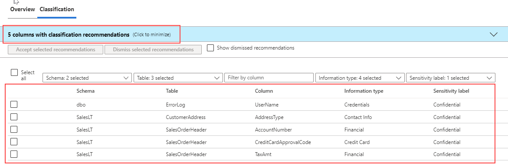

Confidential data stored within a Microsoft SQL Server, Azure SQL Database or Azure SQL Managed Instance should be classified within the database. This classification allows users as well as other applications to know the sensitivity of the data that is being stored. 

Data classification with the database is done on a column by column basis. It is possible for a single table to have some columns be public, some columns be confidential, and some columns be highly confidential.

Data classification was first introduced into SQL Server Management Studio and used extended properties of objects to store its data classification information. Starting with SQL Server 2019 this metadata is now stored in a catalog view called `sys.sensitivity_classifications`, and it is also supported by Azure SQL Database and Azure SQL Managed Instance.

The Azure portal provides a management pane for data classification of your Azure SQL Database as shown below. You can access this feature by selecting **Data Discovery and Classification**, which is in the **Security** section of the main blade for your Azure SQL Database.

> [!div class="mx-imgBorder"]
> [](../media/module-33-security-final-16.png#lightbox)

In both the Azure portal and SQL Server Management Studio, you can configure data classification. The classification engine scans your database and locates columns with names that indicate that the column could have sensitive information. For example, a column named *email* would be recommended by default as containing sensitive personal information.

> [!div class="mx-imgBorder"]
> [](../media/module-33-security-final-18.png#lightbox)

In the example above, there are five columns recommended for classification. The **Information Type** and **Sensitivity label** properties seem consistent with the column name and overall purpose. However, since the recommendations are based on the column name, a column named *column1* that contains email addresses would not be recommended as sensitive personal information.

Columns can also be classified using the sensitivity wizard in SQL Server Management Studio, or by using the `ADD SENSITIVITY CLASSFICATION` T-SQL command as shown below:

```sql
ADD SENSITIVITY CLASSIFICATION TO
    [Application].[People].[EmailAddress]
WITH (LABEL='PII', INFORMATION_TYPE='Email')

GO
```

Classification of data allows you to easily identify the sensitivity of data within the database. Knowing what columns contain sensitive data allows for easier audits and allows you to more easily identity which columns are good choices for data encryption. Classification will allow other employees within the company to make better decisions on how to handle the data which is available within the database.

## Customize classification taxonomy

Data Discovery & Classification is part of Microsoft Defender for Cloud. You can customize the taxonomy of sensitivity labels and define a set of classification rules specifically for your environment.

You can create and manage sensitivity labels as part of policy management by selecting **Data Discovery and Classification** of the main blade for your Azure SQL Database, and then **Configure**.

:::image type="content" source="../media/module-33-security-final-19.png" alt-text="Screenshot of how to customize classification taxonomy from Azure portal.":::

On the **Information Protection** page you can define labels, rank them, and link them with a set of information types.

:::image type="content" source="../media/module-33-security-final-20.png" alt-text="Screenshot of the Information Protection page from Azure portal.":::

Once you define the patterns, they are added automatically to the discovery logic for identifying this type of data in your databases, and are immediately available.

> [!NOTE]
> Only users with administrative rights on the organization's root management group can create and manage sensitivity labels.
