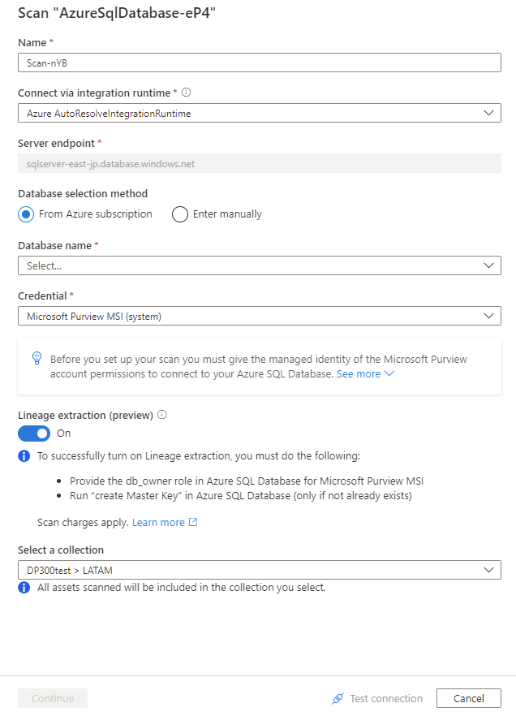
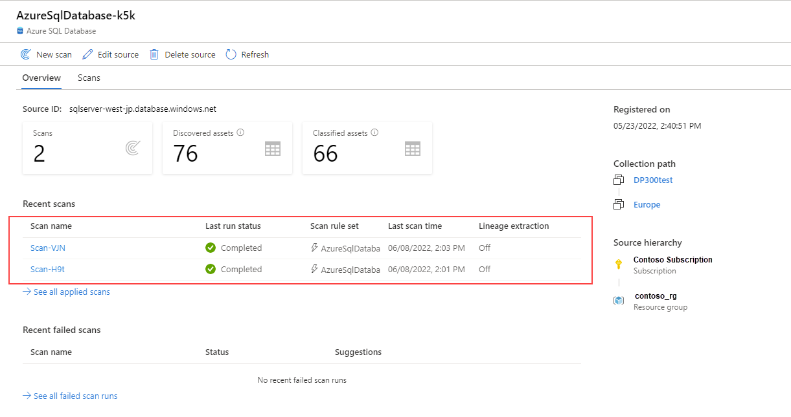
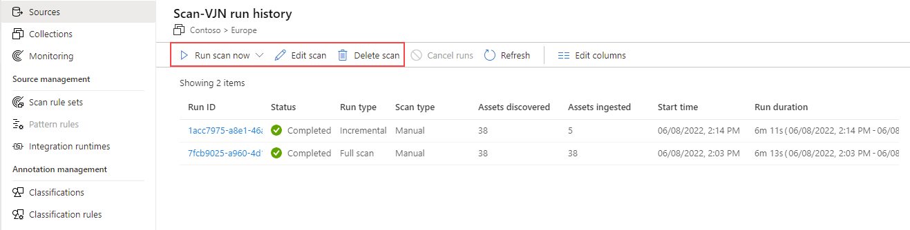
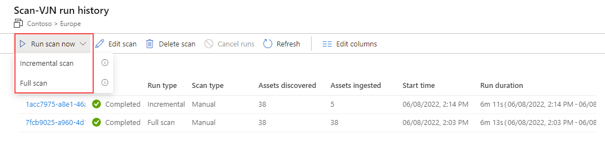
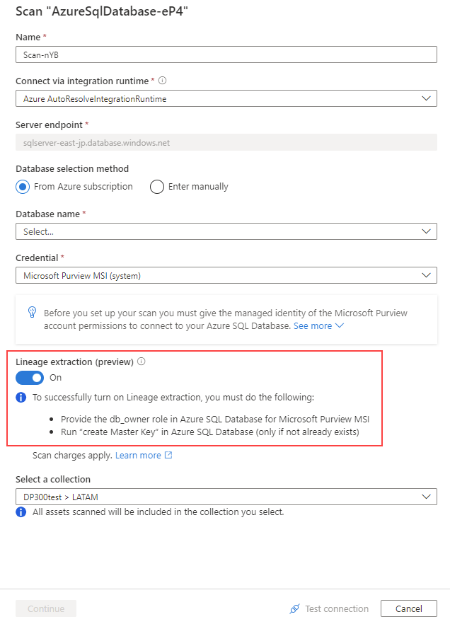
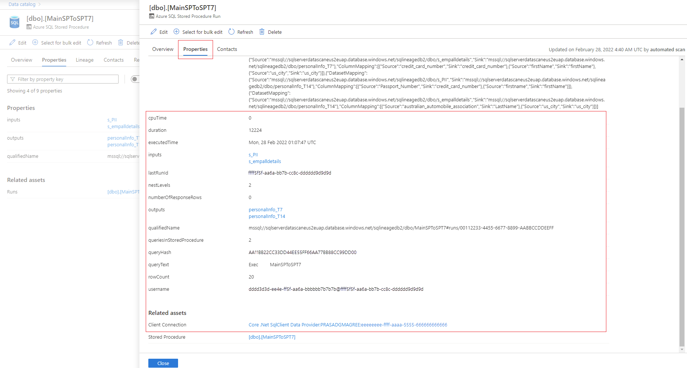

Microsoft Purview is a unified data governance service that helps you manage and govern your on-premises, multi-cloud, and software-as-a-service (SaaS) data. Create a holistic, up-to-date map of your data landscape with automated data discovery, sensitive data classification, and end-to-end data lineage. Enable data curators to manage and secure your data estate. Empower data consumers to find valuable, trustworthy data.

## How it works

Microsoft Purview automates data discovery by providing data scanning and classification as a service for assets across your data estate. Metadata and descriptions of discovered data assets are integrated into a holistic map of your data estate. Atop this map, there are purpose-built apps that create environments for data discovery, access management, and insights about your data landscape.

:::image type="content" source="../media/dp-3300-module-33-lab-39.png" alt-text="Screenshot of a high-level architecture of Microsoft Purview, showing multi-cloud and on premises sources flowing into Microsoft Purview, and Microsoft Purview's apps.":::

## Supported capabilities

Understanding the location and movement of sensitive data across the entire data domain is one of the main features of Azure Purview for Azure SQL Database.

### Create a unified map of data across the entire data domain

Azure Purview helps you lay the foundation for effective data management, including the following capabilities:

- Automate and manage hybrid resource metadata.
- Classify data using integrated and custom classifications and information protection sensitivity labels.
- Ensure consistent labeling of sensitive data across SQL Server, Azure, Microsoft 365, and Power BI.
- Easily integrate all your data systems using Apache Atlas APIs.

:::image type="content" source="../media/dp-3300-module-33-lab-40.png" alt-text="Screenshot of the unified map of data across the entire data domain on Microsoft Purview.":::

### Make data easy to find

Make data easy to find using familiar business and technical search terms, including the following capabilities:

- Ensure optimal business value for your data users' data with Microsoft Purview Data Catalog.
- Eliminate the need for data dictionaries in Excel with a business-level business dictionary.
- Gain insight into the origin of your data with interactive visualization of data origin.
- Provide data scientists, engineers, and analysts with the data they need for BI, analytics, AI, and machine learning.

:::image type="content" source="../media/dp-3300-module-33-lab-41.png" alt-text="Screenshot of the search bar showing asset suggestions based on the term provided.":::

### Get an overview of sensitive data

Microsoft Purview provides a comprehensive view of your data management operations with Data Insights (in preview), including the following capabilities:

- View your entire data domain and its distribution by asset dimension, such as source type, classification, and file size.
- Receive status updates on the number of scans that passed, failed, or canceled.
- Get key insights to add or redistribute glossary terms for better search results.

:::image type="content" source="../media/dp-3300-module-33-lab-42.png" alt-text="Screenshot of the Azure Purview classification insights page showing different classification charts.":::

## Requirements

Before you get started with Microsoft Purview, ensure the following requirements are met:

- Access to Microsoft Azure with a development or production subscription.
- Ability to create Azure resources including Microsoft Purview.
- Access to data sources such as Azure Data Lake Storage or Azure SQL in test, development, or production environments.
    - For Data Lake Storage, the required role to scan is **Reader**.
    - For Azure SQL, the identity must be able to query tables for sampling of classifications.
- Access to Microsoft Defender for Cloud or ability to collaborate with Defender for Cloud Admin for data labeling.
- An active Microsoft Purview account.
- You'll need to be a **Data Source Administrator** and **Data Reader** to register a source and manage it in the Microsoft Purview governance portal.

## Security considerations

Let's review some important security capabilities when scanning a SQL Database using Microsoft Purview.

### Firewall settings

If your database server has a firewall enabled, you'll need to update the firewall to allow access in one of two ways:

- **Allow Azure connections through the firewall –** A straightforward option to route traffic through Azure networking, without needing to manage virtual machines.

- **Install a self-hosted integration runtime –** Install a self-hosted integration runtime on a machine in your network and give it access through the firewall. If you have a private VNet set up within Azure, or have any other closed network set up, using a self-hosted integration runtime on a machine within that network will allow you to fully manage traffic flow and utilize your existing network.

- **Use a managed virtual network –** You can use the Azure integration runtime in a closed network by setting up a managed virtual network using your Microsoft Purview account to connect to Azure SQL.

### Authentication

To scan your data source, you'll need to configure an authentication method in the Azure SQL Database. The following authentication options are supported when preparing for a scan:

- **System-assigned managed identity (recommended) –** This is an identity associated directly with your Microsoft Purview account that allows you to authenticate directly with other Azure resources without needing to manage a go-between user or credential set. The system-assigned managed identity is created when your Microsoft Purview resource is created, is managed by Azure, and uses your Microsoft Purview account's name. The system-assigned managed identity can't currently be used with a self-hosted integration runtime for Azure SQL.

- **User-assigned managed identity (preview) –** Similar to system-assigned managed identity, a user-assigned managed identity is a credential resource that allows Microsoft Purview to authenticate against Azure Active Directory. The user-assigned managed by users in Azure, rather than by Azure itself, which gives you more control over security. The user-assigned managed identity can't currently be used with a self-hosted integration runtime for Azure SQL. For more information, see our guide for user-assigned managed identities.

- **Service Principal –** A service principal is an application that can be assigned permissions like any other group or user, without being associated directly with a person. Their authentication has an expiration date, and so can be useful for temporary projects.

- **SQL Authentication –** Connect to the SQL database with a username and password.

>[!NOTE]
>If you are using a self-hosted integration runtime to connect to your resource, system-assigned and user-assigned managed identities will not work. You need to use service principal authentication or SQL authentication.

## Register and scan SQL Database using Azure Purview

This section will enable you to register the Azure SQL Database data source and set up a scan. 

### Register the data source

It's required to register the data source in Microsoft Purview before setting up a scan.

1. Open your Microsoft Purview account, and select **Open Microsoft Purview Governance Portal**.

    :::image type="content" source="../media/dp-3300-module-33-lab-55-1.png" alt-text="Screenshot of the Open Microsoft Purview governance portal.":::

1. Select **Data Map** > **Collections** from the left pane to open collection management page. Create the collection hierarchy using the **Collections** menu, and assign permissions to individual sub-collections, as required.
 
    :::image type="content" source="../media/dp-3300-module-33-lab-44.png" alt-text="Screenshot that shows the collection menu to assign access control permissions to the collection hierarchy.":::

1. Navigate to the appropriate collection under the **Sources** menu, and then select **Register** to register a new SQL Database.
 
    :::image type="content" source="../media/dp-3300-module-33-lab-45.png" alt-text="Screenshot that shows the collection used to register the data source.":::

1. Select the Azure SQL Database data source, and then select **Continue**.

    :::image type="content" source="../media/dp-3300-module-33-lab-46.png" alt-text="Screenshot that allows selection of the data source.":::

1. Provide a name for the data source, select an Azure subscription, select the SQL Database server name, and then select **Apply**.

    :::image type="content" source="../media/dp-3300-module-33-lab-47.png" alt-text="Screenshot that shows the details to be entered in order to register the data source.":::

1. The Azure SQL Database will appear under the selected collection.

    :::image type="content" source="../media/dp-3300-module-33-lab-48.png" alt-text="Screenshot that shows the data source mapped to the collection to initiate scanning.":::

### Create a scan

To create and set up a scan, follow these steps:

1. Open your Microsoft Purview account and select the **Open Microsoft Purview** governance portal.

    :::image type="content" source="../media/dp-3300-module-33-lab-55-1.png" alt-text="Screenshot of the Open Microsoft Purview governance portal.":::

1. Select the **Data map** icon, then **Sources** to view the collection hierarchy.

    :::image type="content" source="../media/dp-3300-module-33-lab-55-2.png" alt-text="Screenshot of the Sources page under the Data map section.":::

1. Select the **New Scan** icon under the Azure SQL Database registered earlier.

    > [!div class="mx-imgBorder"]
    > [](../media/dp-3300-module-33-lab-55.png#lightbox)

1. Provide a name for the scan, select **Enter manually** for **Database selection method** property, enter the **Database name**, and select the **Credential**. Choose the appropriate collection for the scan, and select **Test connection** to validate the connection. If the connection is successful, select **Continue**.

    :::image type="content" source="../media/dp-3300-module-33-lab-56.png" alt-text="Screenshot that shows the SQL Authentication option for scanning.":::

### Scope and run the scan

To scope and run the scan, follow these steps:

1. You can scope your scan to specific database objects by choosing the appropriate items in the list.

    :::image type="content" source="../media/dp-3300-module-33-lab-57.png" alt-text="Screenshot of the database objects list when scoping your scan.":::

1. Select a scan rule set. You can choose between the system default, existing custom rule sets, or create a new rule set inline.
 
    :::image type="content" source="../media/dp-3300-module-33-lab-58.png" alt-text="Screenshot of the select a scan rule set page.":::

1. Select **New scan rule set**, and provide a new scan rule set name.
 
    :::image type="content" source="../media/dp-3300-module-33-lab-59.png" alt-text="Screenshot of the new scan rule set page.":::

1. You can then select the classification rules to be included in the scan rule, and then select **Create**.
 
    :::image type="content" source="../media/dp-3300-module-33-lab-60.png" alt-text="Screenshot of the scan rule set classification rules for Azure Purview.":::
 
1. The **Select a scan rule set** page will the scan rule set you've created. 

    :::image type="content" source="../media/dp-3300-module-33-lab-61.png" alt-text="Screenshot of the scan rule set selection for Azure Purview.":::

1. On the **Set a scan trigger** page, configure your scan trigger. Select **Continue**.
 
    :::image type="content" source="../media/dp-3300-module-33-lab-62.png" alt-text="Screenshot of the scan trigger option for Azure Purview.":::

1. Review your scan, and then select **Save and run**.
 
    :::image type="content" source="../media/dp-3300-module-33-lab-63.png" alt-text="Screenshot of review scan page for Azure Purview.":::

### View a scan

To view a scan, follow these steps:

1. Navigate to the data source in the collection, and then select **View Details** to check the status of the scan.

    :::image type="content" source="../media/dp-3300-module-33-lab-64.png" alt-text="Screenshot of the view details for a Microsoft Purview scan.":::

1. The scan details indicate the progress of the scan in the **Last run status** and the number of assets scanned and classified. The **Last run status** will be updated to **In progress** and then **Completed** once the entire scan has run successfully.

    > [!div class="mx-imgBorder"]
    > [](../media/dp-3300-module-33-lab-65.png#lightbox)

### Manage Scan

Scans can be managed or run again on completion:

1. Select your scan name to manage the scan.

    :::image type="content" source="../media/dp-3300-module-33-lab-66.png" alt-text="Screenshot of the recent scans list for Microsoft Purview.":::

1. From the scan history page, you can run the scan again, edit the scan, or delete the scan.

    > [!div class="mx-imgBorder"]
    > [](../media/dp-3300-module-33-lab-67.png#lightbox)

1. You can also run an incremental scan or a full scan again.

    > [!div class="mx-imgBorder"]
    > [](../media/dp-3300-module-33-lab-68.png#lightbox)

## Data lineage

Generally, data lineage represents the journey the data takes from its origin to where it moves across the data estate over time. Among its many uses are troubleshooting, tracing the root cause in data pipelines, and debugging.

Microsoft Purview Data Catalog connects with other data storage, processing, and analytics platforms to collect lineage information. As a result, the Catalog contains a generic, scenario-specific lineage experience.

Microsoft Purview supports data lineage from Azure SQL Database. At the time of setting up a scan, you can enable lineage extraction toggle button to extract lineage information.

### Prerequisites for setting up scan with Lineage extraction

1. Follow steps under authentication for a scan using Managed Identity section to authorize Microsoft Purview scan your Azure SQL Database.

1. Sign in to Azure SQL Database with Azure AD account and assign proper permission (for example: **db_owner**) to Purview Managed identity. Use below example SQL syntax to create user and grant permission by replacing *purview-account* with your account name.

    ```sql
    CREATE user <purview-account> FROM EXTERNAL PROVIDER
    GO
    EXEC sp_addrolemember 'db_owner', <purview-account> 
    GO
    ```

1. Run below command on your Azure SQL Database to create a master key.

    ```sql
    CREATE MASTER KEY
    GO
    ```

### Create scan with lineage extraction toggle turned on

1. Enable lineage extraction toggle in the scan screen.

    > [!div class="mx-imgBorder"]
    > [](../media/dp-3300-module-33-lab-69.png#lightbox)

1. Select your method of authentication by following steps in the scan section.

1. Once the scan is successfully set up from previous step, a new scan type called Lineage extraction will run incremental scans every 6 hours to extract lineage from Azure SQL Database. Lineage is extracted based on the actual stored procedure runs in the Azure SQL Database.

### Search Azure SQL Database assets and view runtime lineage

You can browse the data catalog or search the data catalog to view asset details for Azure SQL Database following the steps below:

1.	Go to asset -> lineage tab, you can see the asset lineage when applicable. Refer to the supported capabilities section on the supported Azure SQL Database lineage scenarios. For more information about lineage in general, see data lineage and lineage user guide

    > [!div class="mx-imgBorder"]
    > [](../media/dp-3300-module-33-lab-71.png#lightbox)

2.	Go to stored procedure asset -> Properties -> Related assets to see the latest run details of stored procedures

    :::image type="content" source="../media/dp-3300-module-33-lab-72.png" alt-text="Screenshot that shows the screen with stored procedure properties containing runs.":::

3.	Select the stored procedure hyperlink next to Runs to see Azure SQL Stored Procedure Run Overview. Go to properties tab to see enhanced run time information from stored procedure. For example: executedTime, rowcount, Client Connection, and so on

    > [!div class="mx-imgBorder"]
    > [](../media/dp-3300-module-33-lab-73-1.png#lightbox)
