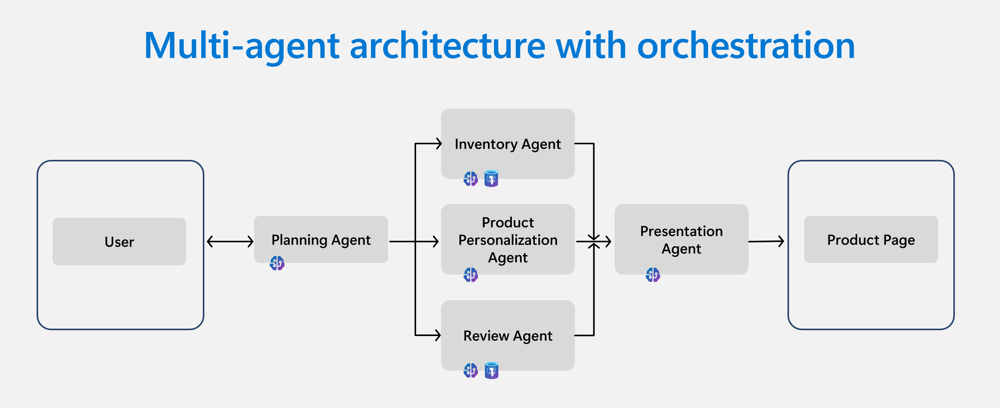

Many modern applications use AI agents to automate tasks, answer questions, and create personalized experiences. Before looking at a specific example, it’s helpful to understand how agentic architectures work and why Azure Database for PostgreSQL is a strong fit for these systems.

## Explain agentic architecture with PostgreSQL

At the core of an agentic architecture are three capabilities: information retrieval, reasoning, and memory. *Azure Database for PostgreSQL* supports all three through its native extensions and scalable infrastructure.

- **Information retrieval:** Agents can query embedded vectors stored in PostgreSQL to retrieve facts such as property details or guest preferences. The `pgvector` extension allows for high-dimensional vector storage and similarity search, powering features like "chat with your data" and contextual recommendations.
- **Reasoning:** Agents use PostgreSQL’s semantic operators and `azure_ai` functions to interpret natural language, reformulate it into SQL, and decide which queries to run. This feature can be enabled via Model Context Protocol (MCP) and plays a critical role in true "chat with your data" scenarios that go beyond vector search.
- **Agent memory:** PostgreSQL serves as a memory store for agents, capturing conversation history, user profiles, and intermediate results. This persistent memory enables agents to maintain context across multi-step workflows and deliver more coherent, personalized responses.  

Consider Margie’s Travel, a company that manages thousands of vacation rentals and guest interactions. They use Azure Database for PostgreSQL to support retrieval, reasoning, and memory, enabling agents to respond with relevant, personalized information.

## Describe multi-agent architecture and orchestration

Some tasks are too complex for a single agent. Multi-agent systems let agents specialize and coordinate, improving accuracy and scale. Think of multi-agent architectures as a team of experts, each handling a specific part of the workflow. Azure Database for PostgreSQL provides a unified data layer that all agents can access for information retrieval and memory. Orchestration frameworks manage how these agents interact, share context, and combine their outputs.

Let’s look at how Margie’s Travel orchestrates multiple agents to deliver personalized property recommendations.

*Multi-agent architecture showing how a planning agent orchestrates specialized agents that access Azure Database for PostgreSQL and Azure OpenAI to deliver personalized results.*

When a guest requests a personalized property recommendation, Margie's Travel orchestrates several agents:

- A planning agent determines which agents to engage based on the user's query.  
- An inventory agent checks property availability and pricing.  
- A review agent analyzes guest feedback for sentiment and relevance.  
- A personalization agent tailors recommendations using data from inventory and reviews.  
- A presentation agent formats the final output for the user interface.  

Each agent interacts with Azure Database for PostgreSQL to access structured data, vector embeddings, and historical context. This orchestration ensures modularity and responsiveness at scale.

## Identify the advantages of Azure Database for PostgreSQL for agents

*Azure Database for PostgreSQL* has several features that make it a strong choice for agentic architectures. *Azure Database for PostgreSQL* is fully managed, scalable, and AI-ready. It supports large data volumes and complex queries without requiring manual intervention. Native vector search and semantic operators support advanced information retrieval and reasoning directly within SQL workflows. The platform also integrates with frameworks such as *Microsoft Agent Framework*, *LangGraph*, *LlamaIndex*, and *Microsoft Foundry*, making it easier to design and orchestrate agents.

## Summarize key takeaways

AI agents rely on data retrieval and memory to work effectively. *Azure Database for PostgreSQL* supports both, giving agents a place to find information and keep track of context. These capabilities make it a practical choice for building systems that can manage complex tasks and continue to perform well as they scale.
