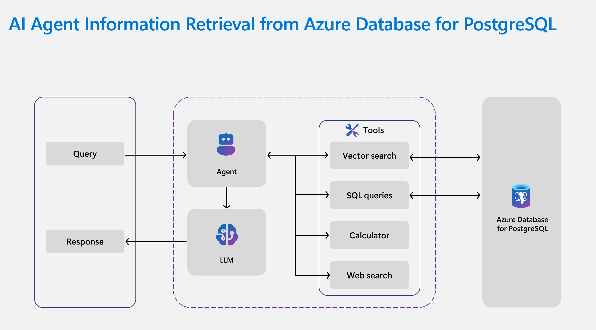

AI agents depend on reliable information retrieval to give useful answers, recommendations, and support. As data grows, they need search methods that move beyond simple keyword matching. When semantic understanding is combined with scalable indexing, agents can deliver results that reflect both the query and the data behind it. *Azure Database for PostgreSQL* enables these capabilities through features such as vector search, semantic operators, and graph-based retrieval.

*AI agent architecture showing how agents use tools to retrieve information from Azure Database for PostgreSQL through vector search and SQL queries.*

## Understand vector search and the azure_ai extension  

Vector search matches information by meaning instead of exact wording. Text, reviews, or documents are stored as numeric embeddings in the database. When a query arrives, the system compares the meaning of the query to these embeddings and returns the closest matches.  

The `azure_ai` extension adds built-in AI functions for PostgreSQL. You can generate embeddings, apply semantic analysis, and even call large language models directly from SQL. These features enable better search results, content summaries, and fact extraction without leaving the database.  

For example, at Margie’s Travel, when a guest asks *"Which properties are quiet and close to the city center?"*, the agent uses vector search to connect the intent of the question with property descriptions and guest reviews. It retrieves the most relevant listings even when the same words aren't used.  

## Optimize for scale and accuracy  

Large knowledge bases require efficient indexing to keep searches fast. Azure Database for PostgreSQL supports methods such as `DiskANN`, which performs similarity search across millions of vectors while keeping memory use low. This feature ensures the agent responds quickly, even with a large dataset.

Accuracy is as important as speed. Semantic operators in the `azure_ai` extension let agents better rank results and surface more relevant results higher in the list. GraphRAG can then connect related facts across documents to provide a fuller answer.  

Take another Margie’s Travel scenario: when a guest asks for *"family-friendly apartments with great reviews about cleanliness,"* the agent uses semantic operators to filter and rank properties, then applies GraphRAG to link reviews and property data. The result is a recommendation that is both precise and trustworthy.  

## Apply concepts in a scenario  

Suppose a guest asks: *"I’m looking for a pet-friendly apartment near the city center with positive reviews about cleanliness."* The agent:  
1. Generates an embedding for the query and uses vector search to locate similar property descriptions.  
2. Applies semantic operators to filter for "pet-friendly" and "cleanliness," even if those terms are implied.  
3. Uses DiskANN indexing to search efficiently across a large dataset.  
4. Reranks results by review sentiment and returns a shortlist of properties, each with a summary of relevant feedback.  

## Summarize key takeaways  

With vector search, semantic operators, and scalable indexing, agents can respond with answers that are both fast and relevant. These tools help users find what they need while keeping results grounded in the underlying data.  
