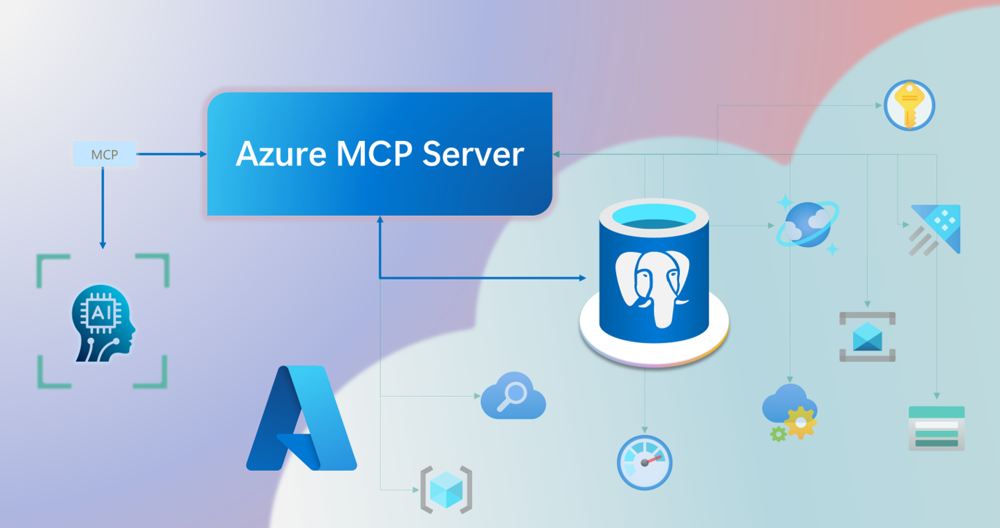

Modern AI agents often need to interact with a wide range of tools and data sources. The *Model Context Protocol* (MCP) provides a standardized way for agents to discover, connect to, and invoke external tools and services. MCP acts as a universal adapter, enabling seamless integration with platforms like *GitHub* and *Azure services*.

## Define MCP and its key components

MCP consists of two main parts:

- **MCP Server**: Hosts tools and exposes them to agents via a standardized interface. It supports asynchronous tool invocation and can be registered with orchestration frameworks like *Foundry Agent Service*.
- **MCP Client**: Allows agents to discover and call tools hosted on the MCP Server. It handles communication, tool registration, and runtime execution.

Together, these components allow agents to dynamically access tools during runtime, improving flexibility and modularity.

## Describe Azure MCP Server support for Azure Database for PostgreSQL

*Azure MCP Server* can be configured to expose tools that interact with *Azure Database for PostgreSQL*. For example, agents can use MCP-wrapped tools to:

- Query structured data using SQL.
- Perform vector search using the `pgvector` extension.
- Retrieve embeddings stored in PostgreSQL via the `azure_ai` extension.

With this setup, agents use PostgreSQL to store information and retrieve it when needed. MCP connects the agent and the database so they can work together.

## Position MCP in agentic architecture

In a typical agentic architecture, MCP fits between the orchestration layer and the tool layer. Agents use orchestration frameworks like Azure *AI Agent Service* to manage workflows and reasoning. When a task requires external data or computation, the agent calls tools hosted on the MCP Server.

*MCP architecture showing how agents use Azure MCP Server to access Azure Database for PostgreSQL and other Azure services.*

For example, at Margie’s Travel, agents use MCP to access tools that query property databases, analyze guest reviews, and generate summaries. This modular approach allows the team to update tools independently and scale agent capabilities without rewriting core logic.

## Key takeaways

MCP and *Azure MCP Server* give AI agents a reliable way to connect with external tools and data sources. When used with *Azure Database for PostgreSQL*, they allow agents to query structured and semantic data as part of their workflow. This combination helps create systems that are flexible, consistent, and easier to scale.