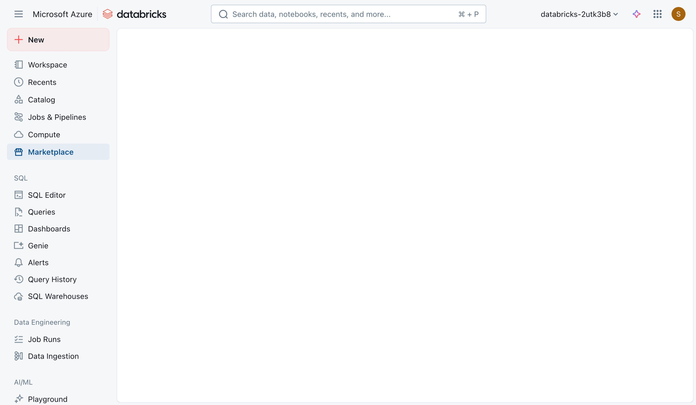
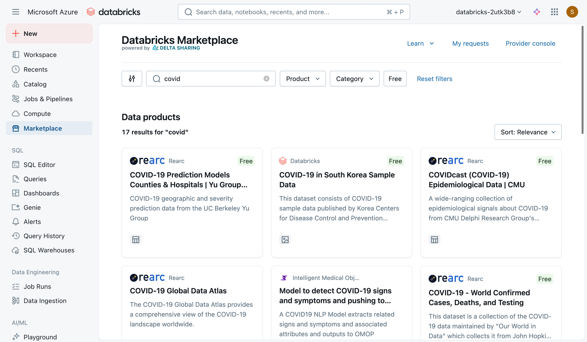
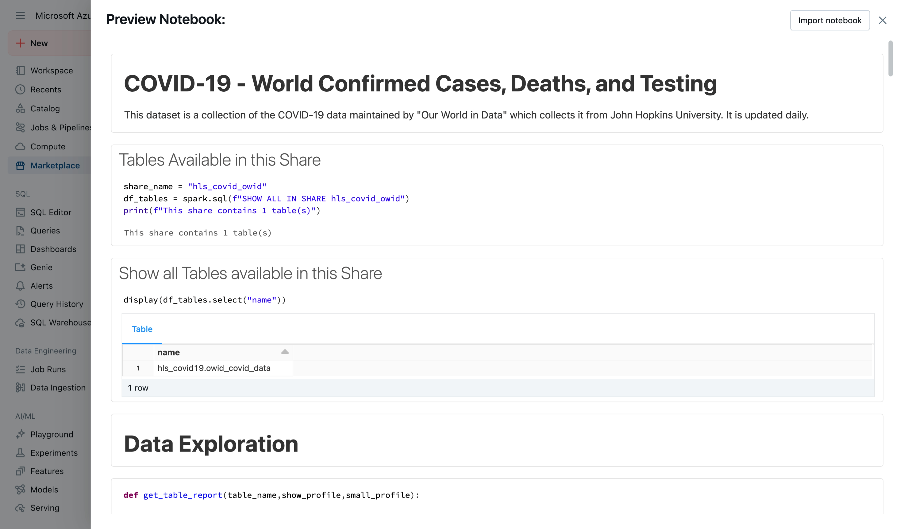
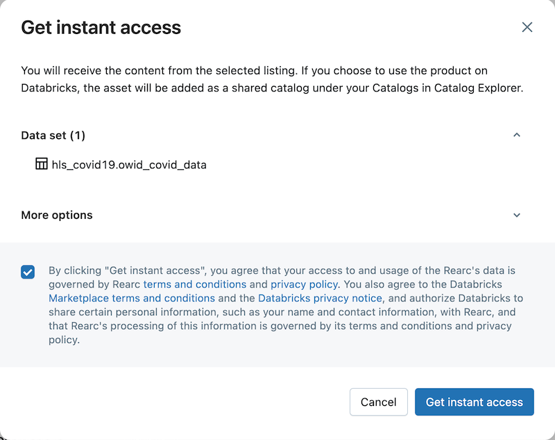
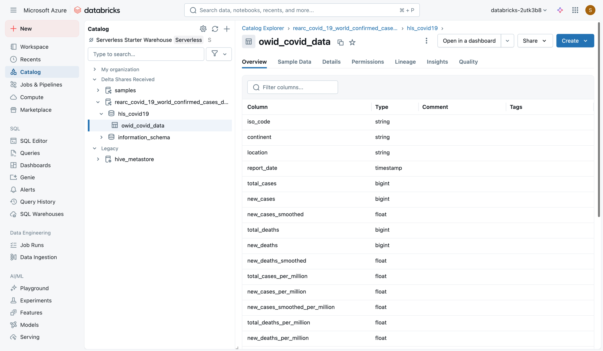
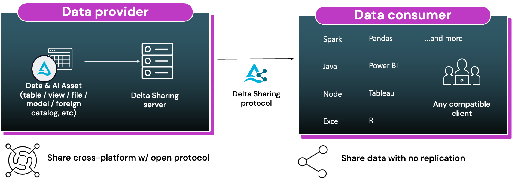

The Databricks Marketplace is a platform for discovering and sharing data, analytics, and AI products. It enables both providers and consumers to exchange assets such as datasets, notebooks, dashboards, and machine learning models. The marketplace is powered by the open-source **Delta Sharing** standard, which allows data products to be accessed and used across different platforms, even outside of Azure Databricks.

By removing vendor lock-in, the marketplace promotes openness and flexibility. Providers can distribute and monetize their data assets, while consumers can quickly evaluate and use external resources within their own workflows. This streamlined exchange supports faster progress in analytics and AI initiatives.

## What You Can Find in the Marketplace

The marketplace contains a wide range of assets:

* **Datasets**: Structured data collections available for exploration and analysis.
* **Notebooks**: Prebuilt notebooks that help users understand and apply the data.
* **Dashboards**: Visual tools for monitoring and reporting.
* **Machine Learning Models**: Ready-to-use models that can be integrated into your workflows.
* **Solution Accelerators**: Additional resources that support experimentation and innovation.

These assets might be available for free or at a set price, depending on the provider. You can browse, preview, and, if appropriate, download the resources into their environment.

## Navigating the Marketplace in Azure Databricks

Inside the Azure Databricks workspace, the **Marketplace** appears alongside other key features such as Partner Connect. The interface highlights featured providers, staff picks, and popular resources. Assets are organized into categories such as financial data, healthcare, media, and life sciences.

Users can search for specific topics. For example, searching for "COVID" may return datasets and models related to pandemic research, prediction models, or healthcare analytics. Each listing typically includes metadata describing the dataset or model, as well as preview options for associated notebooks.

## Previewing and Accessing Assets

Before accessing an asset, you can **preview** its associated notebook. This allows you to examine:

* Metadata, such as the number of variables and observations.
* Data quality details (for example, duplicates).
* Example visualizations, including charts, bar graphs, heat maps, and correlation matrices.

Previewing ensures the asset aligns with your needs before integrating it into your workspace. You can also **import** the notebook into your workspace to extend the analysis and customize it further to your needs.

When you decide to use an asset, you **accept a disclaimer** and request access. 

The asset is then delivered as a **shared catalog** within your Databricks Catalog Explorer. This catalog contains schemas and tables that you can query, visualize, and analyze just like your own data.

Within the catalog, you can open tables and create visualizations and build dashboards.

## About Delta Sharing

Delta Sharing is an **open protocol for sharing data securely** between different organizations and platforms. It was developed by Databricks but is open source, which means it can be used outside of Azure Databricks as well. The protocol is designed to make it easier to exchange data without moving large files or setting up custom connections for each partner.

One important aspect of Delta Sharing is that it provides access to **current data** rather than fixed snapshots. This allows consumers to work with the most recent version of a dataset, while providers keep control over what is made available. Access is managed with authentication and permissions, so only authorized users can view or query the shared data.

Delta Sharing works across **multiple clouds and tools**, including Azure, AWS, Google Cloud, Apache Spark, pandas, Power BI, and Tableau. This makes it possible for different teams to use the same shared data, even if they work in different technical environments.

The process is straightforward. Providers select tables to share, generate a profile with access details, and distribute it to consumers. Consumers then connect through a compatible client and query the data directly, without needing to copy it into their own systems.

In the **Databricks Marketplace**, Delta Sharing is the method used to deliver datasets and other assets. When a user selects an item, it appears as a shared catalog in their workspace, ready for analysis. Because the protocol is open, the same data can also be accessed from outside Azure Databricks using supported tools.