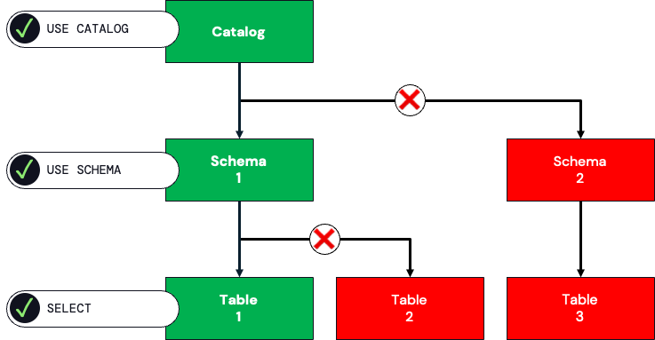
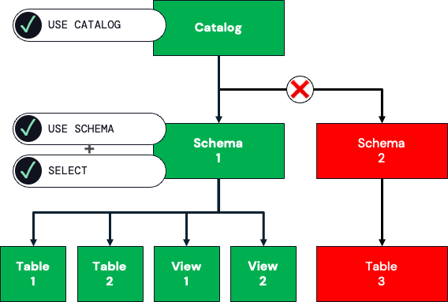
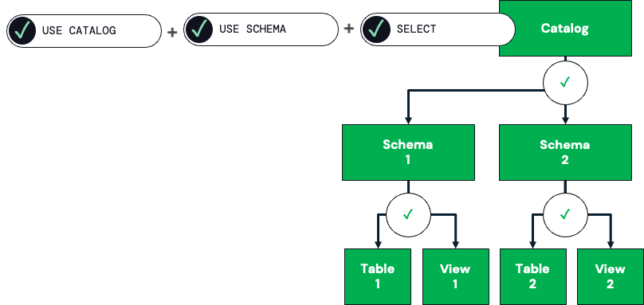
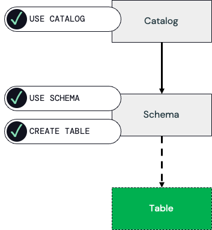
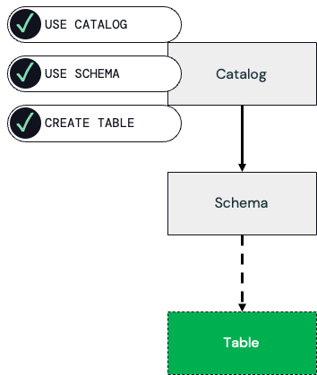
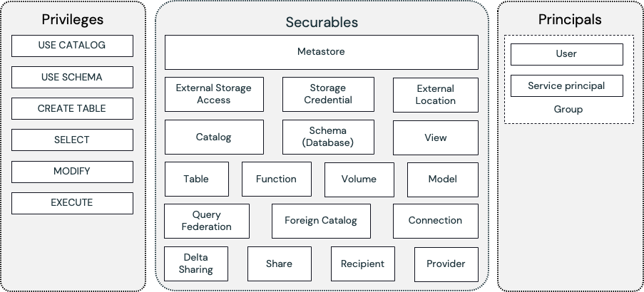

Unity Catalog uses a privilege model to control access to securable objects such as catalogs, schemas, tables, and views. Grants define *who* (the principal, such as a group or user) can perform *what action* (a privilege like SELECT, MODIFY, or CREATE) on *which object* (such as a table). Privileges can be assigned explicitly at each level of containment or inherited from higher levels like schemas or catalogs. Understanding these patterns is key to designing secure and maintainable permission structures.

On Azure, a Unity Catalog **metastore** is a top-level container for all securable objects and is tightly integrated with Azure Databricks workspaces:

- **Region Bound**: A metastore is created in a specific Azure region and can only be assigned to workspaces in the same region.
- **One per Workspace**: Each Azure Databricks workspace can be linked to only one metastore at a time.

Because of this region binding, organizations often create multiple metastores (one per region) if they operate across different Azure geographies. Data governance policies should account for this boundary.

## Querying a Table with Explicit Permissions at Each Level

When a user or group needs to query a table, it isn't enough to grant SELECT directly on the table. Unity Catalog requires permissions at all levels of containment. That means the grantee needs:

1. **USE CATALOG** on the catalog that contains the schema,
2. **USE SCHEMA** on the schema that contains the table, and
3. **SELECT** on the table itself.



If any of these privileges are missing, the user can't successfully query the table. This approach is called as the *explicit privilege model* because permissions are granted individually at each level. It's inherently secure because access to other objects is never granted unintentionally, but it requires more administrative effort. For example, if there are thousands of tables in a schema, each table must be explicitly granted, which is time-consuming to maintain.

## Querying a Table with Inherited Permissions from Schema

Privilege inheritance reduces administrative overhead by granting permissions at a higher level. Instead of assigning SELECT on each table individually, an administrator can grant **SELECT on the schema**. Combined with **USE SCHEMA** and **USE CATALOG** privileges, this automatically gives the grantee SELECT on all tables and views within that schema, including any created in the future.



This approach simplifies management, especially when large numbers of tables exist. However, it's less restrictive than the explicit model because all current and future objects within the schema become accessible. Access is still limited to that schema, though—other schemas remain inaccessible unless granted separately.

## Querying a Table with Inherited Permissions from Catalog

Inheritance can also extend from the catalog level. By granting **USE CATALOG** and **ALL PRIVILEGES** (or SELECT) on the catalog, the grantee automatically inherits the necessary permissions on all schemas, tables, and views within that catalog. This includes any schemas or objects created in the future.



This model is the most permissive because it opens access across the entire catalog. It's convenient when broad access is desired, such as giving a group of analysts the ability to query everything within a specific catalog. However, administrators need to carefully assess whether all objects in the catalog should be exposed in this way, since there's no granularity at the schema or table level when inheriting from the catalog.

## Creating a Table: Explicit at Schema

Creating new tables requires more than SELECT permissions. At a minimum, the grantee must have:

1. **USE CATALOG** on the containing catalog,
2. **USE SCHEMA** on the target schema, and
3. **CREATE TABLE** on that schema.



With these permissions, the grantee can create new tables in that specific schema. This explicit setup restricts table creation to one schema and avoids granting unnecessary privileges elsewhere. It's a common choice when only certain schemas should allow new object creation.

## Creating a Table: Inherited from Catalog

In more permissive environments, table creation rights can be inherited from the catalog level. By granting **USE CATALOG**, **USE SCHEMA**, and **CREATE TABLE** at the catalog, the grantee automatically has the ability to create tables in any schema within that catalog, including schemas that may be added later.



This approach is easier to maintain but comes with greater risk, since it enables table creation everywhere within the catalog. It's best suited for catalogs designed for collaborative or exploratory work, where unrestricted creation is acceptable.

### Granting Permissions with ANSI SQL

Unity Catalog follows the ANSI SQL Data Control Language (DCL) standard for granting and revoking privileges. This means you can manage permissions with familiar statements like **GRANT** and **REVOKE**. For example, if you want to allow the group *analysts* to query a specific table, you can issue:

```sql
GRANT SELECT ON TABLE sales TO `analysts`;
```

If you want that same group to traverse the containing schema and catalog, you would also need:

```sql
GRANT USE SCHEMA ON SCHEMA finance TO `analysts`;
GRANT USE CATALOG ON CATALOG corpdata TO `analysts`;
```

To permit table creation within a schema, you can grant:

```sql
GRANT CREATE TABLE ON SCHEMA finance TO `analysts`;
```

Permissions can be revoked in a similar way:

```sql
REVOKE SELECT ON TABLE sales FROM `analysts`;
```

These SQL statements can be run from a Databricks notebook, the SQL editor in the workspace, or in Databricks SQL.

### Granting Permissions with the Azure Databricks User Interface

For those people who prefer a graphical approach, Unity Catalog permissions can also be managed directly in the Azure Databricks UI. In **Catalog Explorer** (previously referred to as Data Explorer), you can navigate through catalogs, schemas, and tables. Each object has a **Permissions** tab where you can add users, groups, or service principals as principals, and assign privileges like SELECT, USE SCHEMA, or ALL PRIVILEGES.

For example, to grant SELECT on a table through the UI:

1. Open **Catalog Explorer**.
2. Navigate to the catalog and schema that contain the target table.
3. Select the table, then go to the **Permissions** tab.
4. Add the group (for example, *analysts*) and assign the **SELECT** privilege.


You can repeat the same process at the schema or catalog level to assign broader permissions. The UI also clearly shows inherited privileges, making it easier to audit access across levels.

## Understand Access Control Lists (ACLs)

Access Control Lists (ACLs) are the backbone of Unity Catalog’s authorization model: they explicitly associate a *principal* with a *privilege* on a *securable object*. To understand how ACLs work, we can break down those three pieces—privileges, securables, principals—and then see how they interact in a typical grant.



### Privileges

Privileges are the specific operations or actions that can be performed on securable objects. In Unity Catalog, different kinds of objects support different privilege sets. For example, for a **table** the allowed privileges include `SELECT`, `MODIFY`, `MANAGE`, `ALL PRIVILEGES` (which expands to all applicable privileges) among others. For a **schema**, privileges like `USE SCHEMA`, `CREATE TABLE`, `ALL PRIVILEGES`, and `MANAGE` apply. At the **catalog** level, you see privileges such as `USE CATALOG`, `CREATE SCHEMA`, `BROWSE`, `ALL PRIVILEGES`, and more. 

Because not every privilege makes sense for every object (for example, `MODIFY` on a view is meaningless), Unity Catalog limits which privileges are valid on which securable types. The `ALL PRIVILEGES` shorthand is powerful in that it gives "every applicable privilege" on an object, and as new privileges are added over time, the `ALL PRIVILEGES` grant automatically covers those new privileges as well. 

### Securables

Securables are the objects to which you can grant or revoke privileges. In Unity Catalog, securables are hierarchical: the metastore (or catalog) is at the top, followed by catalogs, then schemas, then tables/views, and other object types such as functions, volumes, external locations, etc.

Because of this hierarchy, privileges can be inherited (if permitted) from higher levels down to lower levels. 

### Principals

Principals are the "who" in an ACL—the identity to which privileges are granted. In Unity Catalog / Azure Databricks, a principal can be a **user**, a **service principal** (for programmatic identities), or a **group**. Groups are often preferred for manageability: you assign privileges to groups, and then users inherit those privileges by membership, rather than granting to each individual.

The syntax for naming principals in SQL uses backticks when special characters exist (for example, an "@" in a user name or dashes in a service principal ID). For instance:

```sql
GRANT SELECT ON TABLE t TO `alice@company.com`;
```

Or

```sql
GRANT SELECT ON TABLE t TO `123e4567-e89b-12d3-a456-426614174000`;  -- service principal  
```

Also worth noting: `account users` is a built-in principal representing all users of the account; you can grant privileges to `account users` (though not to the `users` workspace-local group) in Unity Catalog. 

When you put these pieces together, the ACL is simply a statement like: *grant this privilege to that principal on this securable object*. At runtime, when a user tries to perform an operation (say select from a table), the system checks the ACLs along the hierarchy (catalog, schema, table) and evaluates whether the user (via group membership, explicit grants, or inherited grants) has the required combination of permissions to succeed.

### Microsoft Entra ID Integration

On Azure Databricks, Unity Catalog identities are managed through **Microsoft Entra ID**. This means that all users, service principals, and groups referenced in grants must exist in Microsoft Entra ID. Key points include:

- **Users and Groups**: Unity Catalog does not support workspace-local users or groups. You must provision and manage them in Microsoft Entra ID, and Unity Catalog syncs them into the Azure Databricks account.
- **Service Principals**: Programmatic identities are registered as Microsoft Entra applications and can be granted privileges in Unity Catalog. Credentials are typically stored in Azure Key Vault or accessed through managed identities. 
- **Account Users**: The special built-in principal `account users` represents all Microsoft Entra ID users in the Azure Databricks account, and can be used when broad access is acceptable.

Because Unity Catalog relies on Microsoft Entra ID, administrators should coordinate closely with their Microsoft Entra ID administrators to ensure that group memberships and role assignments remain accurate.
