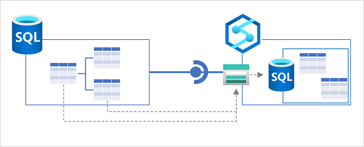

Microsoft SQL Server is one of the world's most commonly used relational database systems. SQL Server 2022 is the latest release, and includes many enhancements and new features; including the ability to be used as a source for Azure Synapse Link.

Azure Synapse Link for SQL Server uses a *link connection* to map one or more tables in an Azure SQL Database instance to tables in a dedicated SQL pool in Azure Synapse Analytics. When the link connection is started, the tables are initialized by copying a .parquet file for each source table to a *landing zone* in Azure Data Lake Storage Gen2; from where the data is imported into tables in the dedicated SQL pool. Subsequently, the change feed process copies all changes as .csv files to the landing zone where they're applied to the target tables.



Synchronization between SQL Server (which can be on-premises or in a private network) and Azure Synapse Analytics is achieved through a self-hosted integration runtime. An integration runtime is a software agent that handles secure connectivity when using Azure Data Factory or Azure Synapse Analytics to transfer data across networks. It must be installed on a Microsoft Windows computer with direct access to your SQL Server instance.

> [!TIP]
> For more information about using a self-hosted integration runtime to work with Azure Synapse Analytics, see [Create and configure a self-hosted integration runtime](/azure/data-factory/create-self-hosted-integration-runtime?tabs=synapse-analytics&azure-portal=true).

## Implementing Azure Synapse Link for SQL Server 2022

To use Azure Synapse Link for SQL Server 2022, you need to create storage for the landing zone in Azure and configure your SQL Server instance before creating a link connection in Azure Synapse Analytics.

### Create landing zone storage

You need to create an Azure Data Lake Storage Gen2 account in your Azure subscription to use as a landing zone. You can't use the default storage for your Azure Synapse Analytics workspace.

> [!TIP]
> For more information about provisioning an Azure Data Lake Storage Gen2 account, see [Create a storage account to use with Azure Data Lake Storage Gen2](/azure/storage/blobs/create-data-lake-storage-account?azure-portal-true).

### Create a master key in the SQL Server database

To support Azure Synapse Link, your SQL Server database must contain a master key. You can use a `CREATE MASTER KEY` SQL statement like the following example to create one:

```sql
CREATE MASTER KEY ENCRYPTION BY PASSWORD = 'my$ecretPa$$w0rd';
```

### Create a dedicated SQL pool in Azure Synapse Analytics

In your Azure Synapse Analytics workspace, you need to create a dedicated SQL pool where the target tables will be created. You also need to create master key in this database by using the following SQL statement:

```sql
CREATE MASTER KEY
```

### Create a linked service for the SQL Server source database

Next, in Azure Synapse Analytics, create a linked service for your SQL Server database. When you do this, you need to specify the self-hosted integration runtime to be used for connectivity between SQL Server and Azure Synapse Analytics. If you haven't already configured a self-hosted integration runtime, you can create one now, and then download and install the agent onto a Windows machine in the network where your SQL Server instance is located.

### Create a linked service for your Data Lake Storage Gen2 account

In addition to the linked service for SQL Server, you need a linked service for the Data Lake Storage Gen2 account that will be used as a landing zone. To support this, you need to add the managed identity of your Azure Synapse Analytics Workspace to the **Storage Blob Data Contributor** role for your storage account and configure the linked service to use the managed identity for authentication.

### Create a link connection for Azure Synapse Link

Finally, you're ready to create a link connection for Azure Synapse Link data synchronization. As you do so, you'll specify the service link for the SQL Server source database, the individual tables to be replicated, the number of CPU cores to be used for the synchronization process, and the Azure Data Lake Storage Gen2 linked service and folder location for the  landing zone.

After the link connection is created, you can start it to initialize synchronization. After a short time, the tables will be available to query in the dedicated SQL pool, and will be kept in sync with modifications in the source database by the change feed process.

> [!TIP]
> Learn more:
> 
> - For more information about Synapse Link for SQL Server 2022, see [Azure Synapse Link for SQL Server 2022](/azure/synapse-analytics/synapse-link/sql-server-2022-synapse-link?azure-portal=true).
> - To learn about limitations and restrictions that apply to Synapse Link for Azure SQL Database, see [Known limitations and issues with Azure Synapse Link for SQL](/azure/synapse-analytics/synapse-link/synapse-link-for-sql-known-issues?azure-portal=true).
> - For a step-by-step guide to setting up Synapse Link for SQL Server 2022, see [Get started with Azure Synapse Link for SQL Server 2022](/azure/synapse-analytics/synapse-link/connect-synapse-link-sql-server-2022?azure-portal=true).
