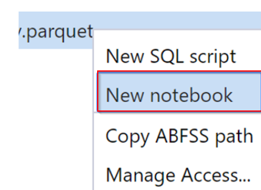

In order to bring data to a notebook, you have several options.
Currently it is possible to load data from Azure Blob Storage, Azure Data Lake Store Gen 2, and SQL pool. 
Some examples that we're going to show you are:
* Read a CSV from Azure Data Lake Store Gen2 as a Spark DataFrame
* Read a CSV from Azure Blob Storage as a Spark DataFrame
* Read data from the primary storage account


The first possibility is to read a CSV from Azure Data Lake Store Gen2 as a Spark DataFrame.
The way you could set it up is as follows:

```python
from pyspark.sql import SparkSession
from pyspark.sql.types import *
account_name = "Your account name"
container_name = "Your container name"
relative_path = "Your path"
adls_path = 'abfss://%s@%s.dfs.core.windows.net/%s' % (container_name, account_name, relative_path)

spark.conf.set("fs.azure.account.auth.type.%s.dfs.core.windows.net" %account_name, "SharedKey")
spark.conf.set("fs.azure.account.key.%s.dfs.core.windows.net" %account_name ,"Your ADLS Gen2 Primary Key")

df1 = spark.read.option('header', 'true') \
                .option('delimiter', ',') \
                .csv(adls_path + '/Testfile.csv')

```
The variables that you create are:
* account_name
This is your storage account name
* container_name
This is the name of your storage container
* relative_path 
The relative path of the file
* adls_path
Will be created by passing through the above parameters. 

The second possibility is to read a CSV from Azure Blob Storage as a Spark DataFrame.
The way you could set it up is as follows:

```python

from pyspark.sql import SparkSession
from pyspark.sql.types import *

blob_account_name = "Your blob account name"
blob_container_name = "Your blob container name"
blob_relative_path = "Your blob relative path"
blob_sas_token = "Your blob sas token"

wasbs_path = 'wasbs://%s@%s.blob.core.windows.net/%s' % (blob_container_name, blob_account_name, blob_relative_path)
spark.conf.set('fs.azure.sas.%s.%s.blob.core.windows.net' % (blob_container_name, blob_account_name), blob_sas_token)

df = spark.read.option("header", "true") \
            .option("delimiter","|") \
            .schema(schema) \
            .csv(wasbs_path)

```
The parameters that it takes into account are:
* blob_account_name
This is the name of your blob account.
* blob_container_name
This is the name of the blob container the file is in. 
* blob_relative_path
This is the relative path pointing to the csv you want to read. 
* blob_sas_token
Your blob sas token. 

The third possibility is to read data from the primary storage account through using the Data tab in the synapse studio environment. 
If you right-click on a file and select **New notebook** to see a new notebook with data extractor autogenerated.

