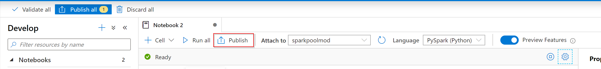
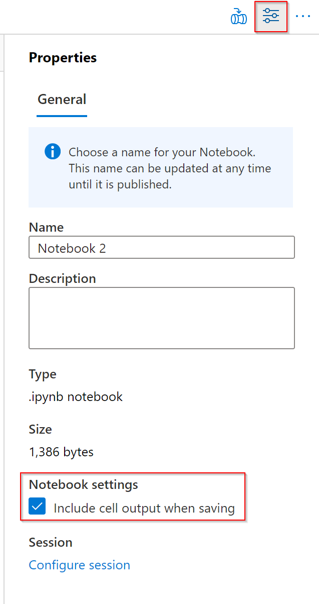

When you have finished with your work in the notebooks, it is possible to save a single notebook or all of notebooks that you've created within Azure Synapse Studio notebooks.

* To save changes you made to a single notebook, select the **Publish** button on the notebook command bar.

   

* To save all notebooks in your workspace, select the **Publish all** button on the workspace command bar. 

   

   In the notebook properties, you can configure whether to include the cell output when saving.

   