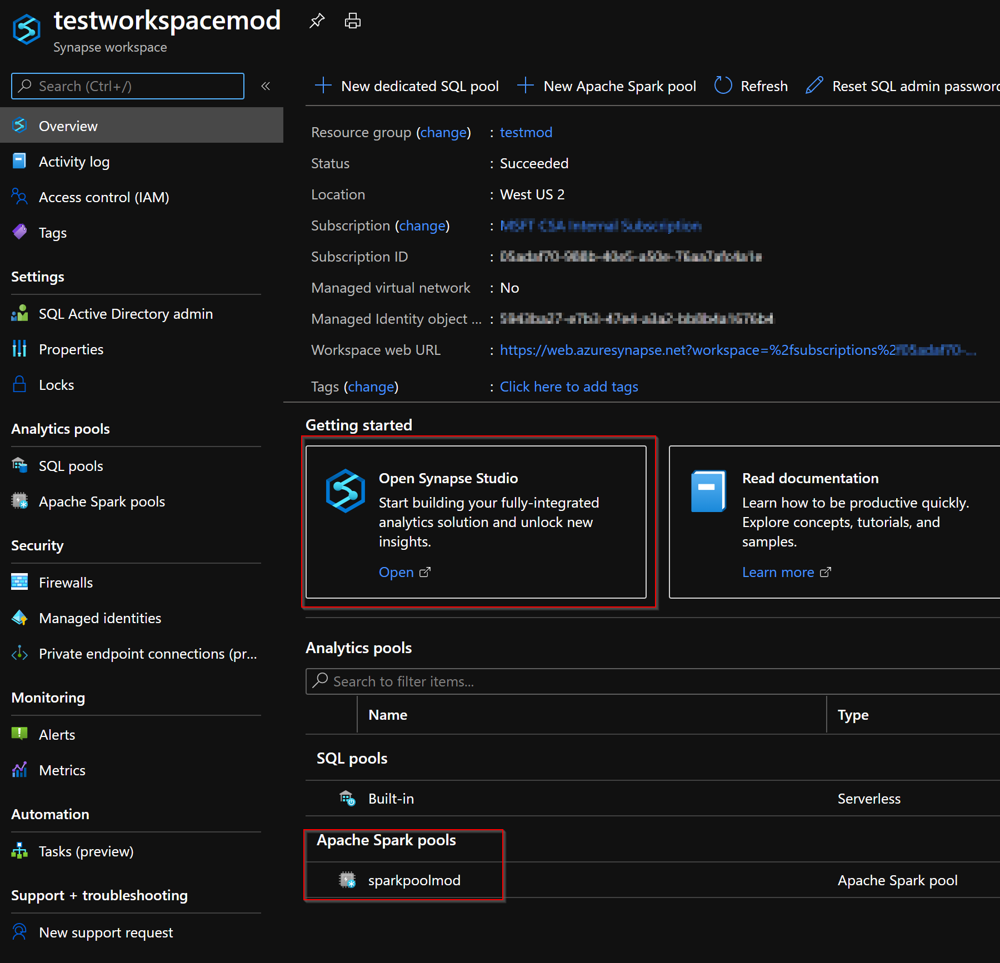
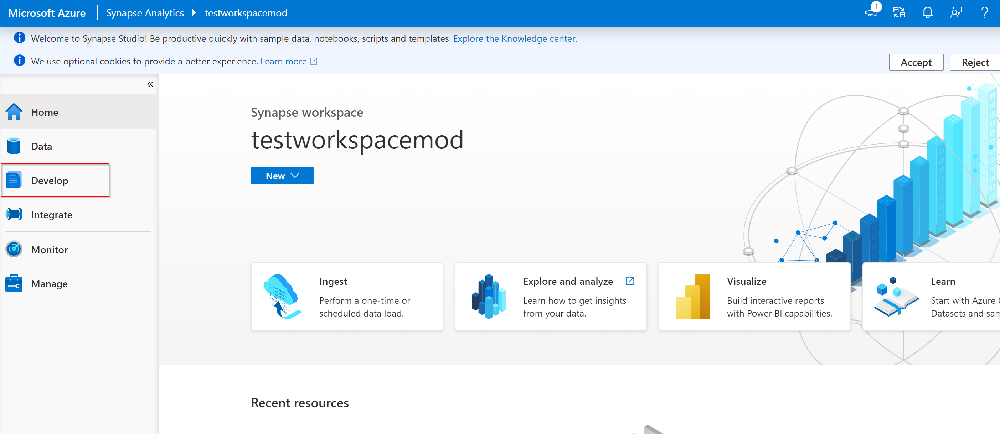
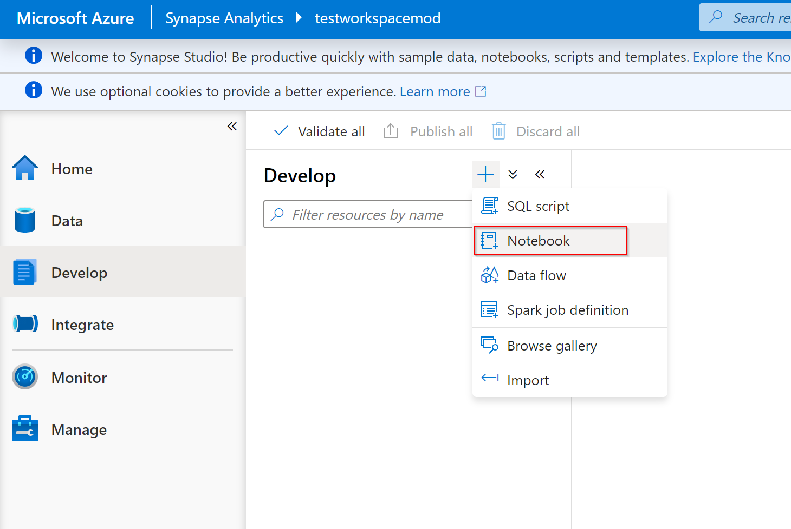
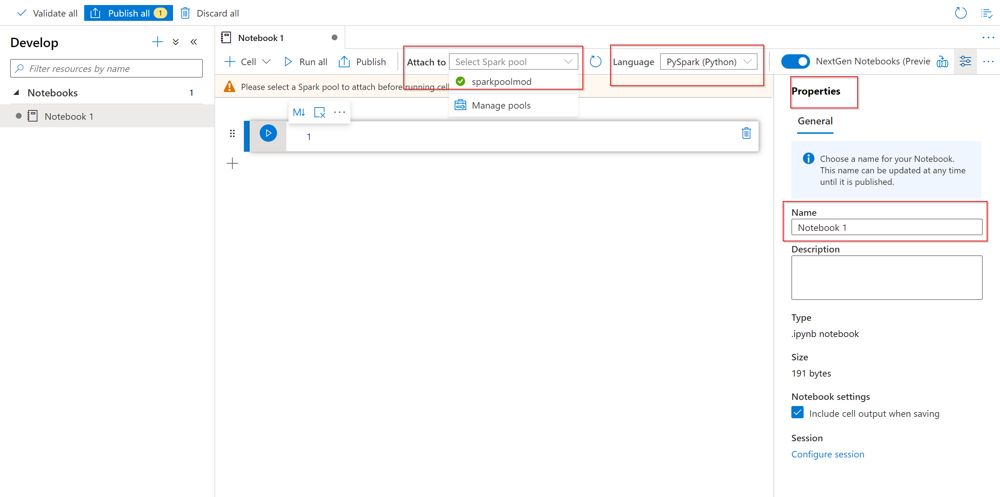
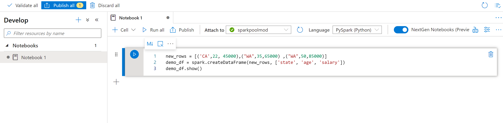

A notebook is an interactive environment that supports various programming languages. 
The notebook allows you to interact with your data, combine code with markdown, text, and perform simple visualizations.

From the Azure portal view for the Azure Synapse workspace you want to use, select Launch Synapse Studio.



Once Synapse Studio has launched, select Develop. Then, select the "+" icon to add a new resource.


From there, select Notebook. A new notebook is created and opened with an automatically generated name.



In the Properties window, provide a name for the notebook.



On the toolbar, click Publish.

If there is only one Apache Spark pool in your workspace, then it's selected by default. Use the drop-down to select the correct Apache Spark pool if none is selected.

Click Add code. The default language is Pyspark. You are going to use a mix of Pyspark and Spark SQL, so the default choice is fine. Other supported languages are Scala and .NET for Spark.

   ```python
   new_rows = [('CA',22, 45000),("WA",35,65000) ,("WA",50,85000)]
   demo_df = spark.createDataFrame(new_rows, ['state', 'age', 'salary'])
   demo_df.show()
   ```

When you want to run a cell, you can use the following methods:

* Press SHIFT + ENTER.
* Select the blue play icon to the left of the cell.
* Select the Run all button on the toolbar.



You can see the Apache Spark pool instance status below the cell you are running and also on the status panel at the bottom of the notebook.
In the output cell, you see the output.


