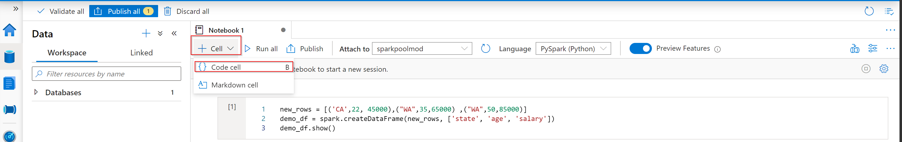
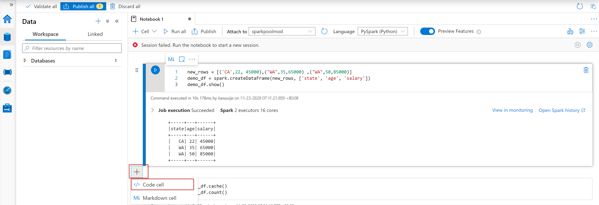
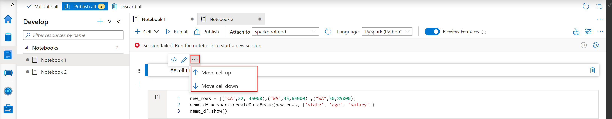
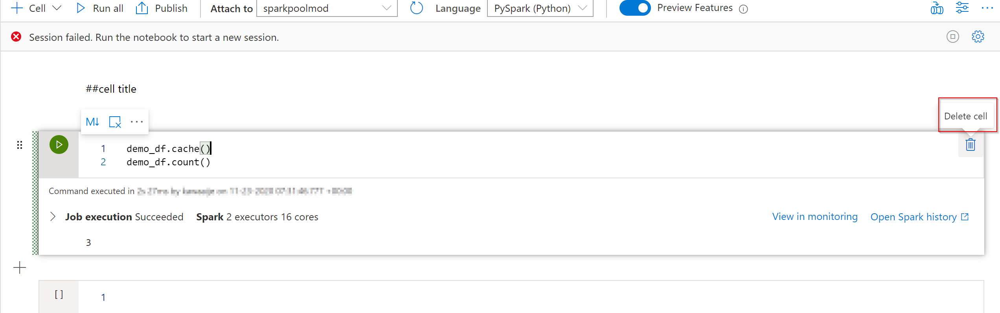
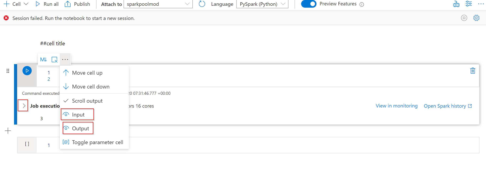

In this exercise, we are walking you through the following development of notebook features:

* Adding cells to notebooks
* Undo Cell operations
* Move a cell
* Delete a cell
* Collapse Cell in and output

**Adding cells to notebooks**

1. Expand the upper left **+ Cell** button, and select **Add code cell** or **Add Markdown Cell**.

    

2. Hover over the space between two cells and select the **+** button where you have the option to **Add Code cell** or **Add Markdown Cell**.

    

3. Use [Shortcut keys under command mode](https://docs.microsoft.com/azure/synapse-analytics/spark/apache-spark-development-using-notebooks#shortcut-keys-under-command-mode). Press **A** to insert a cell above the current cell. Press **B** to insert a cell below the current cell.

**Undo cell operations**
Press **Ctrl+Z** to revoke the most recent cell operation. 

**Move a cell**

Select the ellipses (...) when you hover over the cell you want to move. Select **Move cell up** or **Move cell down** to move the current cell. 

You can also use [shortcut keys under command mode](https://docs.microsoft.com/azure/synapse-analytics/spark/apache-spark-development-using-notebooks#shortcut-keys-under-command-mode). Press **Ctrl+Alt+↑** to move up the current cell. Press **Ctrl+Alt+↓** to move the current cell down.

**Delete a cell**

To delete a cell, hover over the far right-side of the cell and a garbage bin icon will appear. Select **Delete cell**. 

You can also use [shortcut keys under command mode](https://docs.microsoft.com/azure/synapse-analytics/spark/apache-spark-development-using-notebooks#shortcut-keys-under-command-mode). Press **D,D** to delete the current cell.

**Collapse a cell input and output**
Hover over the cell you want to see the input or output from. 
Select the ellipses (...) and you'll find here the input and output option. 
If you select the eye icon, you can hide the input or output. If you unselect, you'll see the input and output. 
If you want to see details of the job execution, please select the ">" icon. 

