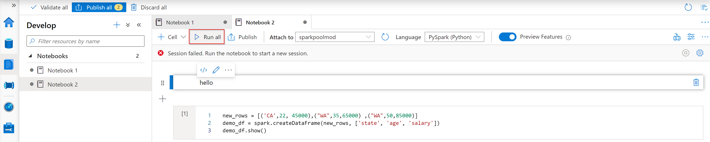
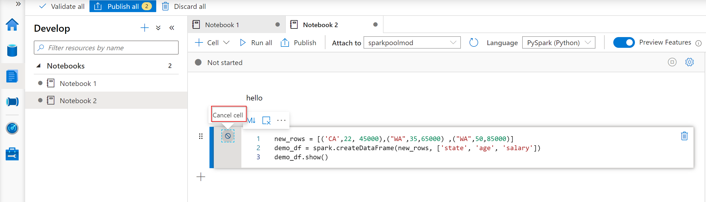
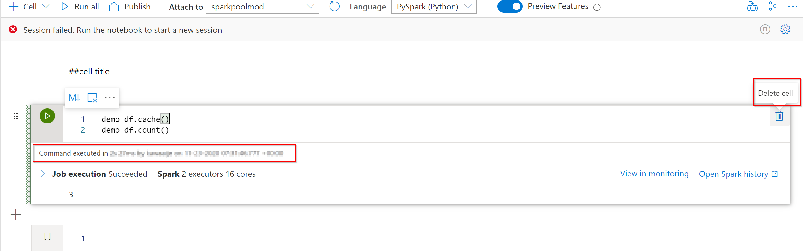
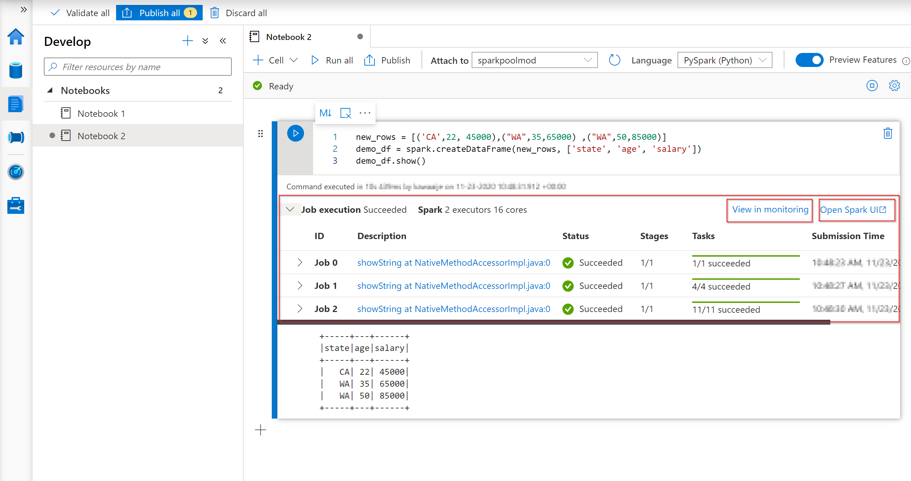
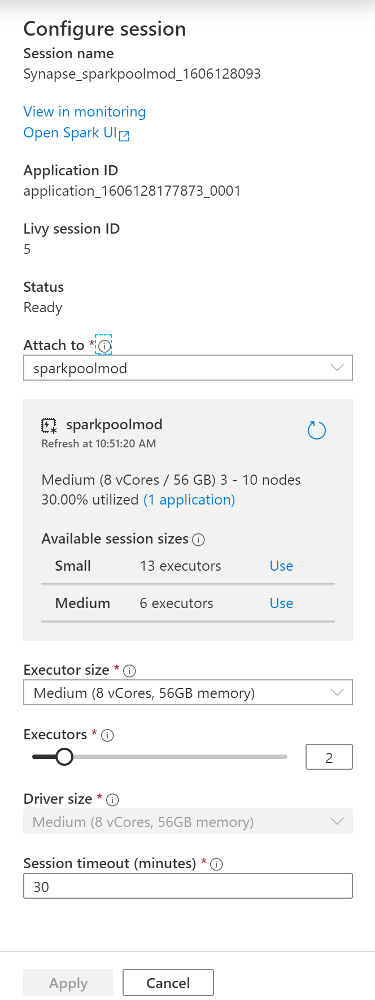

In this exercise, we are walking you through the following run features of a notebook.
You'll understand the following features:

* Run a Cell
* Run all cells
* Cancel a running cell
* Cell Status indicator
* Spark progress indicator

**Run a cell**

There are several ways to run the code in a cell.

* Hover on the cell you want to run and select the **Run Cell** button or press **Ctrl+Enter**.

   
   
* Use [Shortcut keys under command mode](https://docs.microsoft.com/azure/synapse-analytics/spark/apache-spark-development-using-notebooks#shortcut-keys-under-command-mode). Press **Shift+Enter** to run the current cell and select the cell below. Press **Alt+Enter** to run the current cell and insert a new cell below.

**Run all cells**
Select the **Run All** button to run all the cells in current notebook in sequence.

   

**Cancel a running cell**
In order to cancel a running cell you need to hover over the cell that is running on the left side while it's running and select "cancel cell". 

**Cell status indicator**

A step-by-step cell execution status is displayed beneath the cell to help you see its current progress. Once the cell run is complete, an execution summary with the total duration and end time are shown and kept there for future reference.

**Spark progress indicator**

Azure Synapse Studio notebook is purely Spark based. 
Remotely, the code cells that are executed, are executed on the serverless Apache Spark pool. If you want to see the progress of a spark job, you can see in real time the job execution status below a cell. 
The number of tasks per each job or stage help you to identify the parallel level of your spark job. You can also drill deeper to the Spark UI of a specific job (or stage) via selecting the link on the job (or stage) name.

**Spark session config**

You can specify the timeout duration, the number, and the size of executors to give to the current Spark session in **Configure session**. Restart the Spark session is for configuration changes to take effect. All cached notebook variables are cleared.

