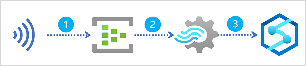

Suppose a retail company captures real-time sales transaction data from an e-commerce website, and wants to analyze this data along with more static data related to products, customers, and employees. A common way to approach this problem is to ingest the stream of real-time data into a data lake or data warehouse, where it can be queried together with data that is loaded using batch processing techniques.

Microsoft Azure Synapse Analytics provides a comprehensive enterprise data analytics platform, into which real-time data captured in Azure Event Hubs or Azure IoT Hub, and processed by Azure Stream Analytics can be loaded.

A typical pattern for real-time data ingestion in Azure consists of the following sequence of service integrations:

1. A real-time source of data is captured in an event ingestor, such as Azure Event Hubs or Azure IoT Hub.
2. The captured data is perpetually filtered and aggregated by an Azure Stream Analytics query.
3. The results of the query are loaded into a data lake or data warehouse in Azure Synapse Analytics for subsequent analysis.

In this module, you'll explore multiple ways in which you can use Azure Stream Analytics to ingest real-time data into Azure Synapse Analytics.
