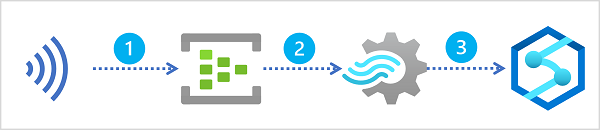

Suppose a manufacturing company captures real-time telemetry data from factory floor sensors, and wants to monitor equipment performance, detect anomalies, and archive event data for long-term analysis. A common approach is to use a stream processing engine to continuously filter and aggregate the flow of sensor events, and route the results to one or more destinations—such as a data lake for storage, a relational database for operational reporting, or a message hub for downstream alerting systems.

Azure Stream Analytics is a fully managed, cloud-based stream processing service that enables you to build real-time analytics pipelines. It connects to streaming data sources such as Azure Event Hubs, Azure IoT Hub, and Azure Data Lake Storage, processes data using a SQL-based query language, and writes results to a wide range of output destinations.

A typical pattern for real-time data processing in Azure consists of the following sequence:

1. A real-time source of data is captured in an event ingestor, such as Azure Event Hubs or Azure IoT Hub.
2. The captured data is perpetually filtered, aggregated, or enriched by an Azure Stream Analytics query.
3. The results of the query are written to one or more output destinations—such as a data lake, a relational database, another event hub, or a real-time dashboard.

In this module, you'll learn how to configure Azure Stream Analytics jobs to process streaming data and route the results to a variety of output destinations.
