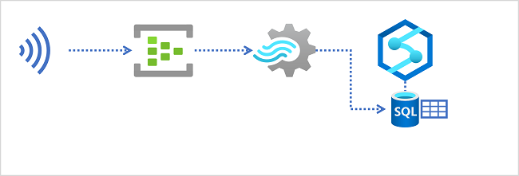
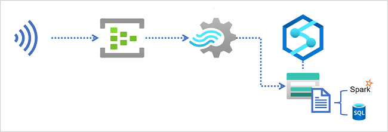

Azure Synapse Analytics provides multiple ways to analyze large volumes of data. Two of the most common approaches to large-scale data analytics are:

- **Data warehouses** - relational databases, optimized for distributed storage and query processing. Data is stored in  tables and queried using SQL.
- **Data lakes** - distributed file storage in which data is stored as files that can be processed and queried using multiple runtimes, including Apache Spark and SQL.

## Data warehouses in Azure Synapse Analytics

Azure Synapse Analytics provides dedicated SQL pools that you can use to implement enterprise-scale relational data warehouses. Dedicated SQL pools are based on a *massively parallel processing* (MPP) instance of the Microsoft SQL Server relational database engine in which data is stored and queried in tables.

To ingest real-time data into a relational data warehouse, your Azure Stream Analytics query must write its results to an output that references the table into which you want to load the data.

## Data lakes in Azure Synapse Analytics

An Azure Synapse Analytics workspace typically includes at least one storage service that is used as a data lake. Most commonly, the data lake is hosted in an Azure Storage account using a container configured to support Azure Data Lake Storage Gen2. Files in the data lake are organized hierarchically in directories (folders), and can be stored in multiple file formats, including delimited text (such as comma-separated values, or CSV), Parquet, and JSON.

When ingesting real-time data into a data lake, your Azure Stream Analytics query must write its results to an output that references the location in the Azure Data Lake Gen2 storage container where you want to save the data files. Data analysts, engineers, and scientists can then process and query the files in the data lake by running code in an Apache Spark pool, or by running SQL queries using a serverless SQL pool.

