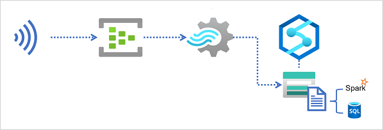
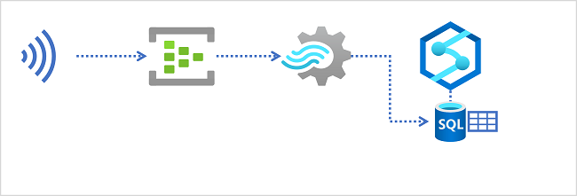

Azure Stream Analytics can route the results of stream processing to multiple types of output destinations, depending on whether you need to store, analyze, forward, or visualize the data.

## Data lake storage

A common use case is to write stream processing results to a data lake hosted in Azure Data Lake Storage Gen2. Data stored in a data lake can later be processed and queried using batch analytics tools such as Apache Spark or serverless SQL engines. This approach is well suited to scenarios where you want to retain raw or lightly processed event data for historical analysis, compliance, or machine learning workloads.

## Relational database storage

When streaming results need to be available to applications or reporting tools that rely on relational data, you can write the output of a Stream Analytics job to a table in Azure SQL Database or Azure Synapse Analytics dedicated SQL pool. This approach enables dashboards and reports to query the most recently ingested data using standard SQL.

## Real-time dashboards

For scenarios that require live visualization of streaming metrics—such as monitoring sensor readings or tracking website activity in real time—Azure Stream Analytics can write output directly to a Power BI streaming dataset. Power BI then renders the data in near real time without requiring a scheduled data refresh.

## Event forwarding

Azure Stream Analytics can also write filtered or enriched events to another Azure Event Hubs instance. This pattern is used to build multi-stage streaming pipelines, where one Stream Analytics job performs initial filtering or enrichment and forwards the results to a downstream consumer such as another job, an Azure Function, or a custom application.
