Suppose you work in the analytics department of a large retail warehouse. Your organization's IT infrastructure is cloud-based, and all data, including customer orders and product information, is stored in Azure Synapse Analytics. Your department analyzes customer shopping trends and proposes promotions based on your findings. You've heard about the robust machine learning and deep learning functions of Azure Databricks, but you don't know if it's compatible with Azure Synapse Analytics. Your manager asks you explore Azure Synapse Analytics and Azure Databricks connectivity options.

Azure Databricks is an Apache Spark–based analytics platform that supports SQL analytics and can be integrated with Azure Synapse to run high-performance analytics. It allows faster interactive processing of batch and streaming data and has built-in functions for machine learning and big data processing.

## Learning objectives 

In this module, you will:

- Access Azure Synapse Analytics from Azure Databricks by using the SQL Data Warehouse connector.

## Prerequisites

None

## Setup the environment

You understand that using Azure Databricks to connect to your Azure Synapse Analytics instance is the best way forward. Now you want to try to establish connections to sample databases so you completely understand all the required steps. In this module, you'll work through the procedures for end-to-end connectivity.

Let's start by setting up the environment. Setup includes provisioning a sample Azure Synapse Analytics instance and setting up resources.

## Set up Azure Synapse Analytics

1. In the [Azure portal](https://portal.azure.com), select **Create a resource**, enter **Synapse Analytics** in the **Search the Marketplace** box, select **Azure Synapse Analytics** in the results, and then select **Create**.

    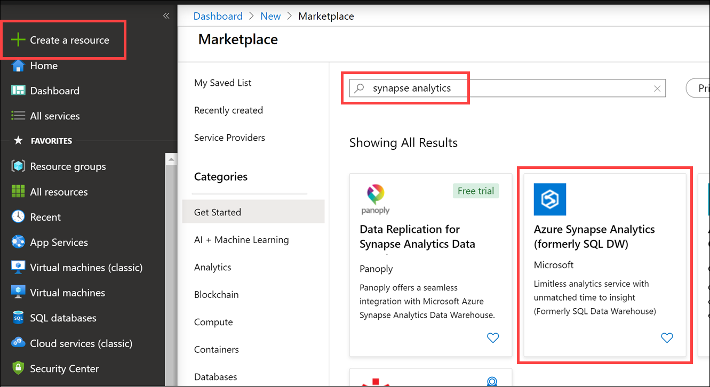

1. On the **Create Azure Synapse Analytics** pane, enter this information in the **Basics** tab:

   - _Subscription_: Select the subscription you're using for this module.  ***The subscription you use will incur charges, this is not a free exercise. Pricing is shown on New Server pane.***
   - _Resource group_: Select the resource group you're using for this module.
   - _SQL pool name_: Enter a unique name such as `Customers`. (Make sure you see a green check mark.)

      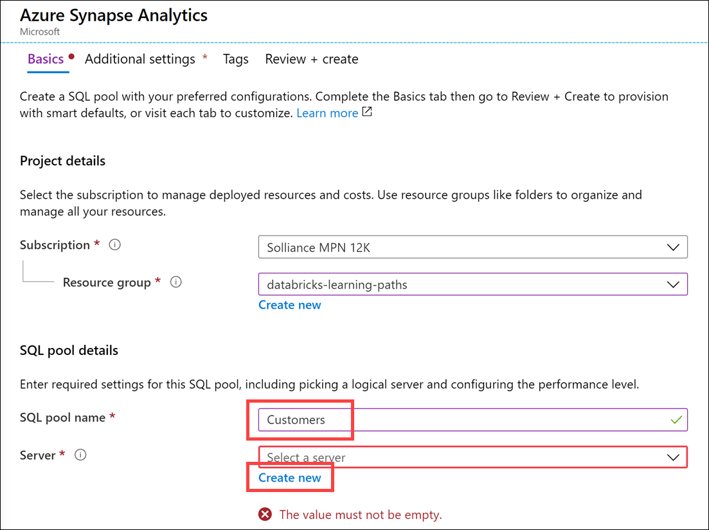

1. Select **Create New** in the Server field to open the **New Server** pane and enter the following:

     - _Server name_: Enter a unique name. (Make sure you see a green check mark.)
     - _Server admin login_: Enter **dwlab**.
     - _Password_: Enter a valid password, and then confirm the password.
     - _Location_: Select the location you're using for resources in this module.
     - _Allow Azure services to access server_: Select the check box.
     - Select **OK**.
   
       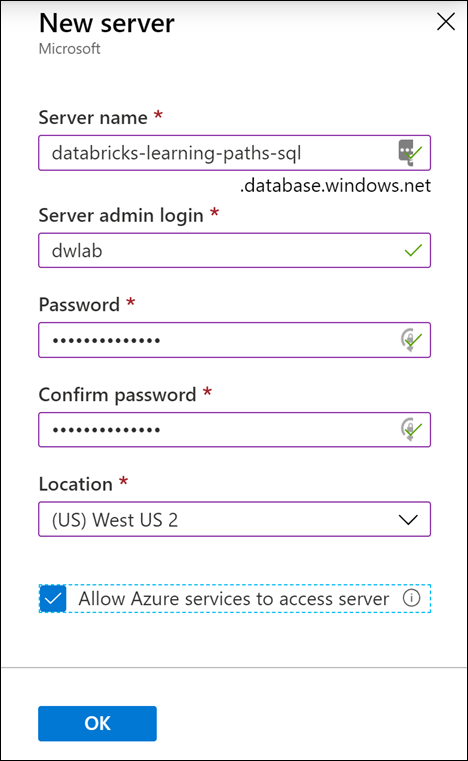

       > [!Note]
       > Remember the user name and password for SQL Server. You'll need them.

1. Select **Select Performance level** to open the Configure performance pane and select **Gen2 DW100c**.

    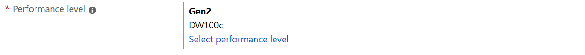

1. In the **Additional settings** tab, select **Sample** under data source.

    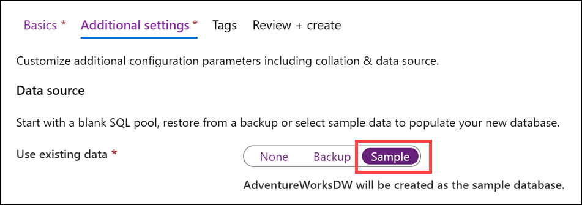

1. Select **Review +Create**, then select **Create**.

## Configure JDBC Connection to Azure Synapse Analytics

Interfacing with Azure Synapse Analytics requires a connection string. This can be retrieved from the Azure Portal.

1. After the Azure Synapse Analytics instance is provisioned, open it by selecting **Go to resource** under notifications in Azure.

    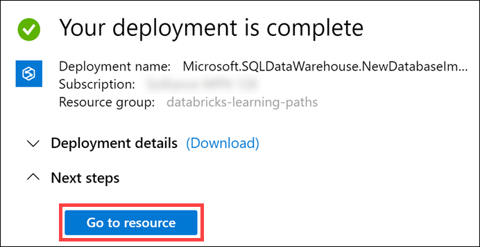

1. At the top of the **Overview** pane, select the **Show database connection strings** link.

    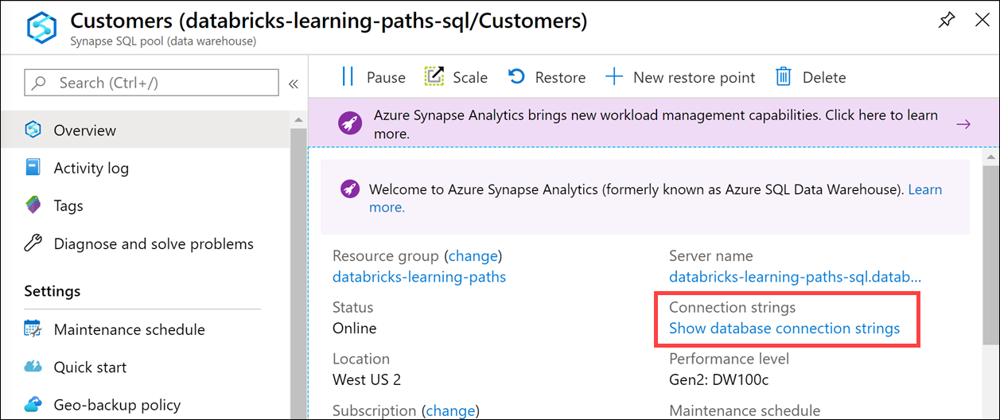

1. On the page for connection strings (1) select the **JDBC** tab, then (2) copy this string to be used below.

    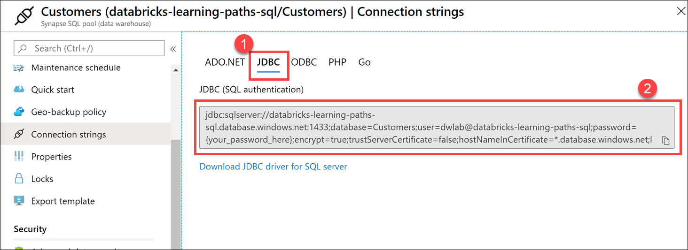

1. *Paste the JDBC connection string to a text editor for later*. Replace **`{your-password_here}`** with your SQL Server password.

## Create a Master Key and table in Azure Synapse Analytics

In this step, we create a Master Key and a new table. However, before we use the query editor, we must first add the client IP address to the server firewall.

1. In Azure Synapse Analytics, select **Firewalls and virtual networks** on the left-hand menu. Within the Firewalls and virtual networks blade, select **+ Add client IP** and then **Save**.

    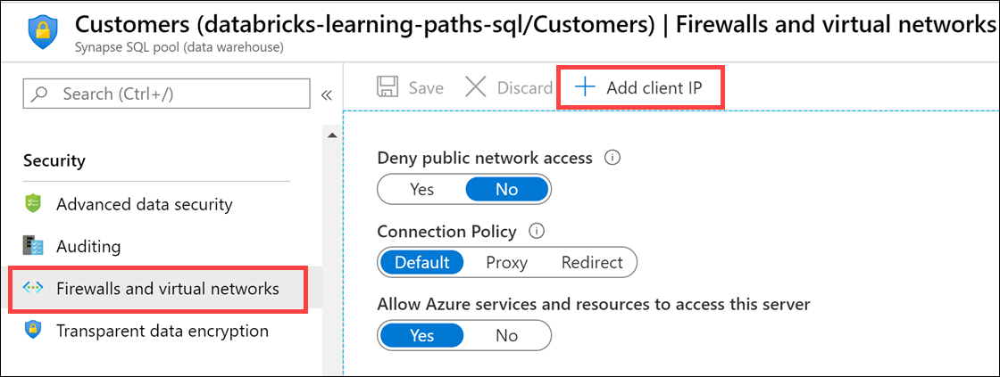

1. In Azure Synapse Analytics, select **Query editor** on the left-hand menu. Log in with the SQL credentials.

    

1. Execute the following query to create a Master Key in Azure Synapse Analytics. This facilitates the connection from Azure Databricks:

    ```sql
    CREATE MASTER KEY ENCRYPTION BY PASSWORD = 'CORRECT-horse-battery-staple';
    ```

1. Execute the following query to create a staging table for the Customer table. This query creates an empty table with the same schema as the Customer table:

    ```sql
    CREATE TABLE dbo.DimCustomerStaging
    WITH
    ( DISTRIBUTION = ROUND_ROBIN, CLUSTERED COLUMNSTORE INDEX )
    AS
    SELECT *
    FROM dbo.DimCustomer
    WHERE 1 = 2
    ;
    ```

## Create Azure Blob Storage account

1. In the [Azure portal](https://portal.azure.com), select **Create a resource**, enter **storage account** in the **Search the Marketplace** box, select **Storage account - blob, file, table, queue** in the results, and then select **Create**.

    

1. On the **Create storage account** pane, enter this information in the **Basics** tab:

   - _Subscription_: Select the subscription you're using for this module.
   - _Resource group_: Select the resource group you're using for this module.
   - _Storage account name_: Enter a unique name. (Make sure you see a green check mark.)
   - _Location_: Select the same location as the other resources in this module.
   - _Performance_: Select **StandardV2 (general purpose v2)**.
   - _Replication_: Select **Locally-redundant storage (LRS)**.
   - _Access tier (default)_: Select **Hot**.

        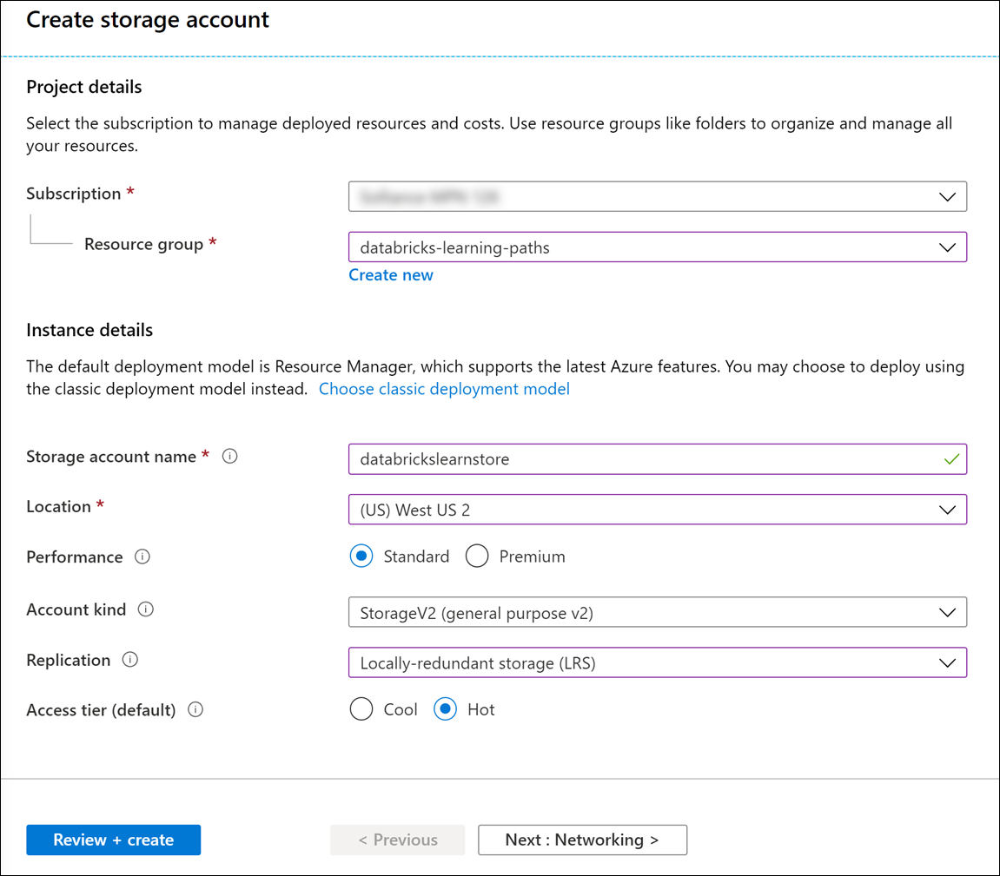

1. Select **Review + create**, then select **Create**.

1. After the storage account is provisioned, open it by selecting **Go to resource** under notifications in Azure.

    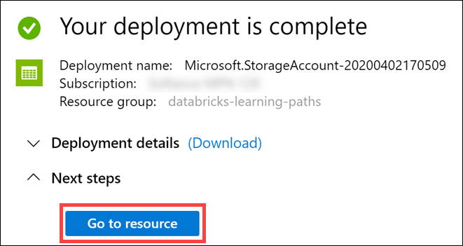

1. Within the new storage account, select **Containers** in the left-hand menu. In the Containers blade, select **+ Container** to add a new container. In the New Container form, enter **data** for the name and set the public access level to **Private**. Select **Create**.

    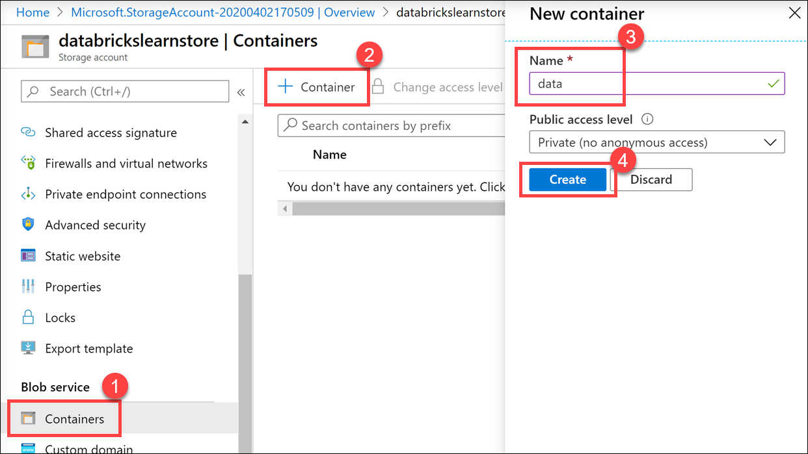

1. Select **Access keys** in the left-hand menu. In the Access keys blade, copy the **Storage account name** and **Key** under `key1`. *Save these values in a text editor for later*.

    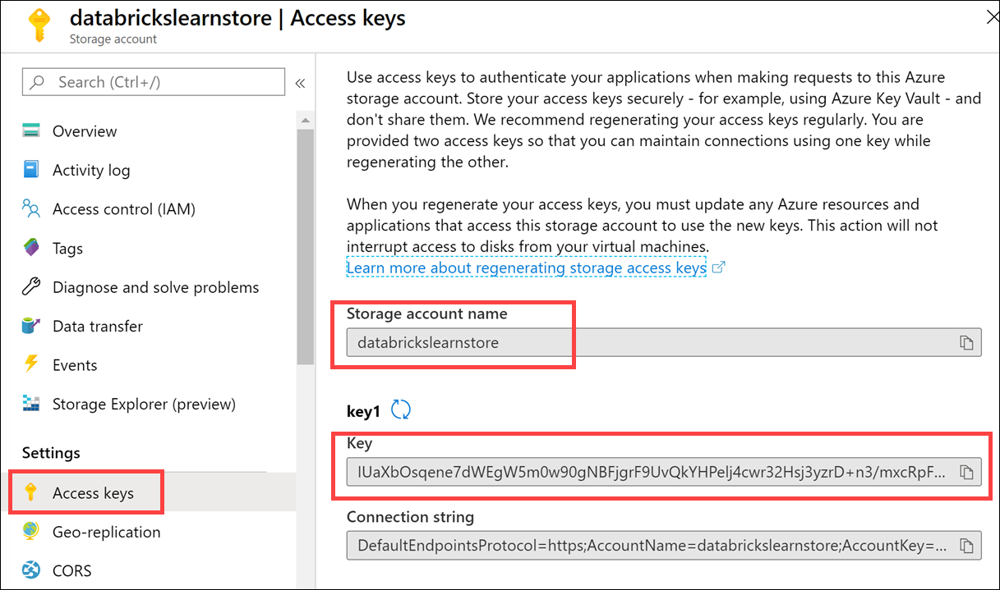