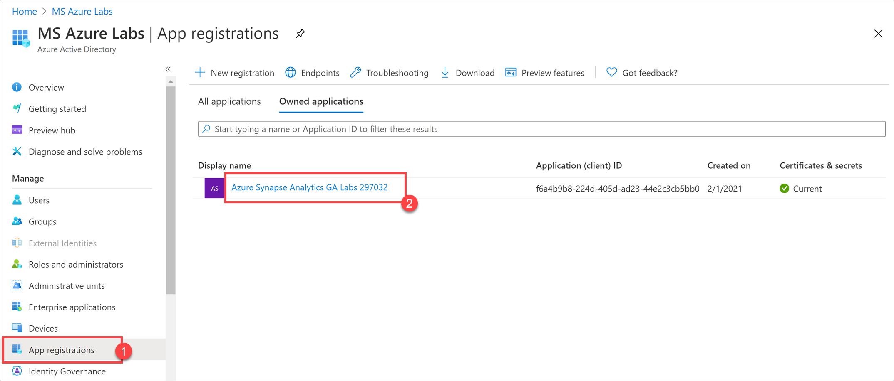
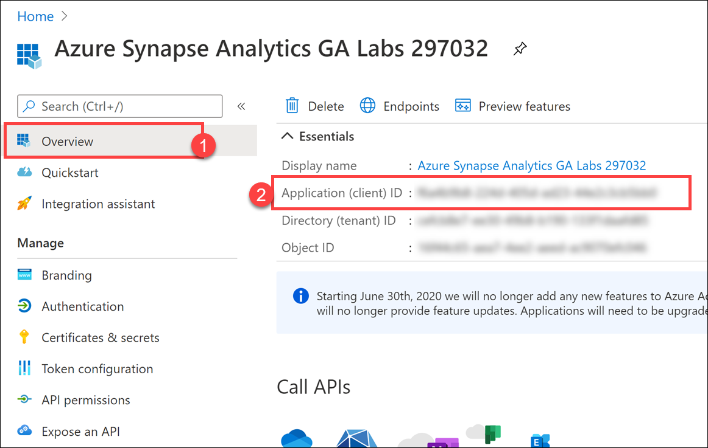
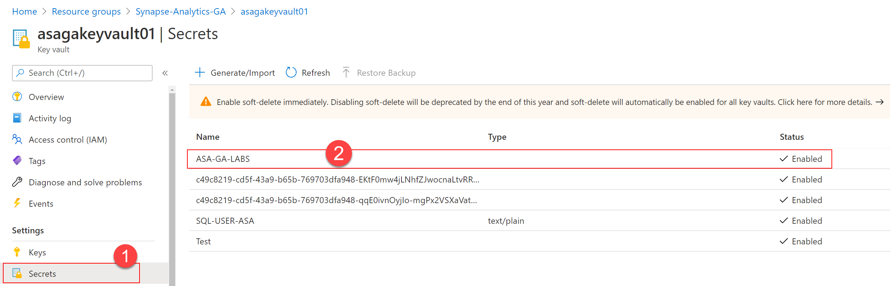
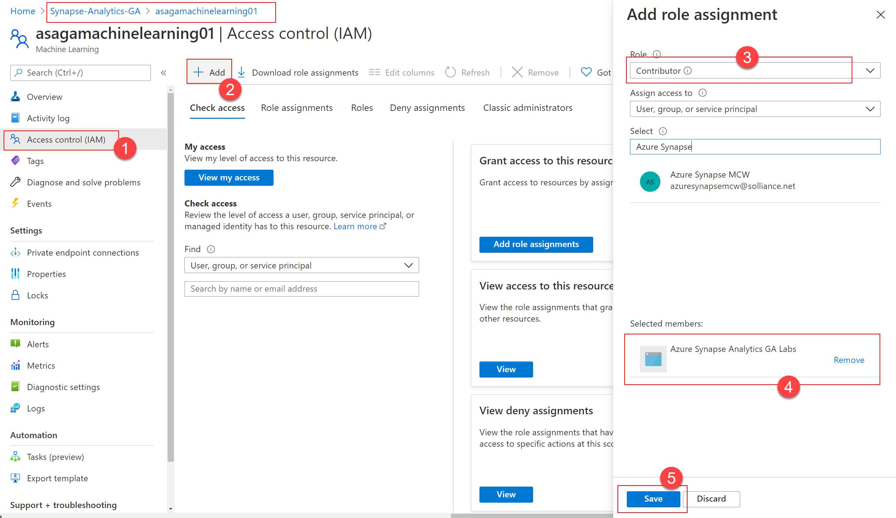
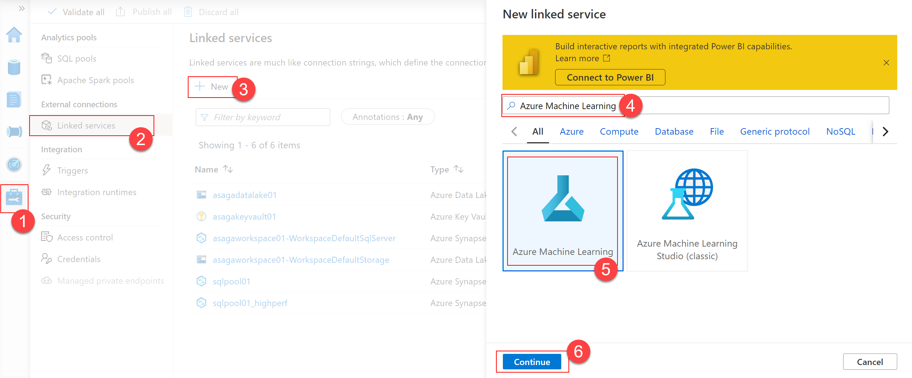
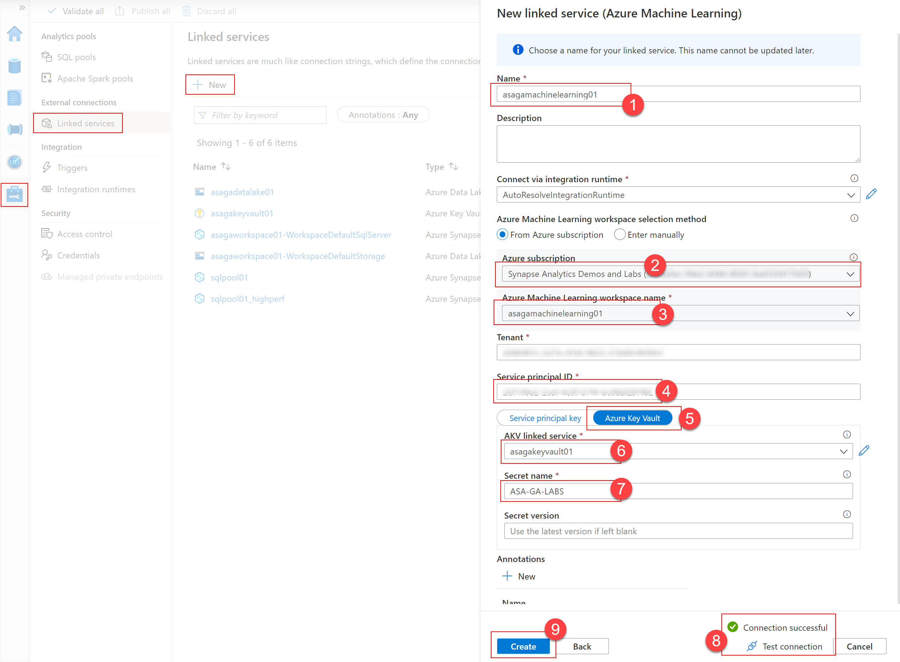
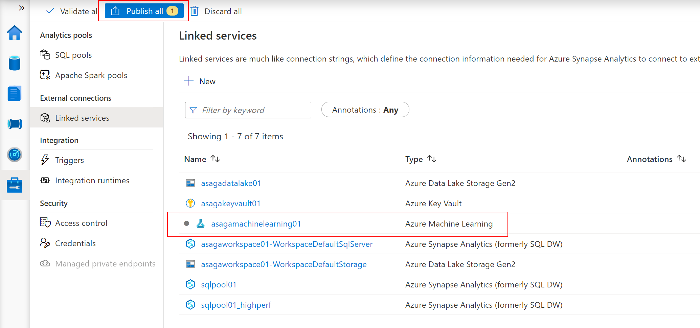
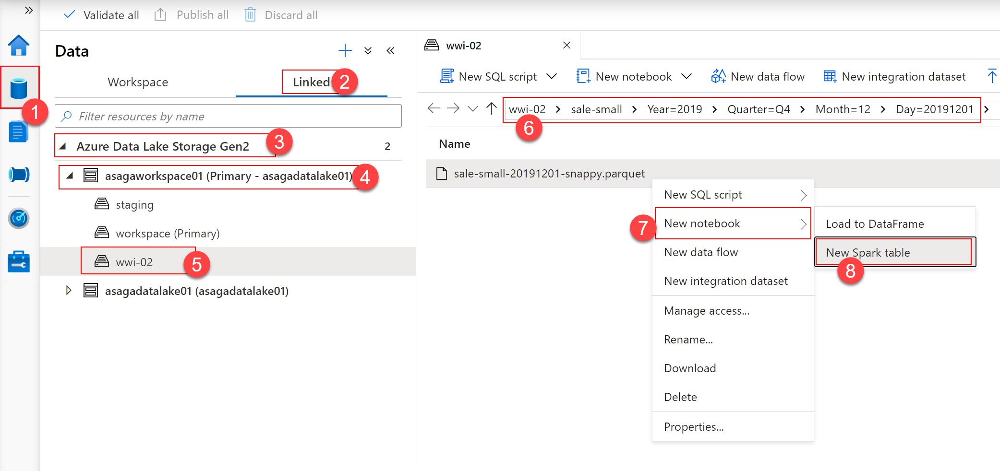
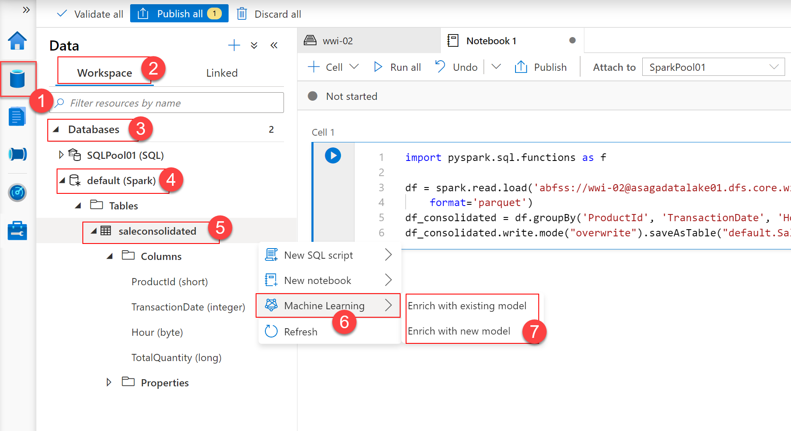

The Synapse Analytics linked service authenticates with Azure Machine Learning using a service principal. The service principal is based on a Microsoft Entra application named `Azure Synapse Analytics GA Labs` and has already been created for you by the deployment procedure. The secret associated with the service principal has also been created and saved in the Azure Key Vault instance, under the `ASA-GA-LABS` name.

> [!NOTE]
> In this example, the Microsoft Entra application is used in a single Microsoft Entra tenant, which means it has precisely one service principal associated with it. Consequently, we will use the terms Microsoft Entra application and service principal interchangeably. For a detailed explanation of Microsoft Entra applications and security principles, see [Application and service principal objects in Microsoft Entra ID](/azure/active-directory/develop/app-objects-and-service-principals).

To view the service principal, open the Azure portal and navigate to your instance of the Microsoft Entra ID. Select the `App registrations` **(1)** section, and you should see the `Azure Synapse Analytics GA Labs SUFFIX` **(2)** (`SUFFIX` in this example is 297032) application under the `Owned applications` tab.



Select the application to view its properties and copy the value of the `Application (client) ID` **(2)** property (you will need it in a moment to configure the linked service).



To view the secret, open the Azure portal and navigate to the Azure Key Vault instance that has been created in your resource group. Select the `Secrets` **(1)** section, and you should see the `ASA-GA-LABS` **(2)** secret:

[](../media/keyvault-secret.png#lightbox)

First, you need to make sure the service principal has permission to work with the Azure Machine Learning workspace. Open the Azure portal and navigate to the Azure Machine Learning workspace that has been created in your resource group. Select the `Access control (IAM)` **(1)** section on the left, then select `+ Add` **(2)** and `Add role assignment`. In the `Add role assignment` dialog, select the `Contributor` **(3)** role, select `Azure Synapse Analytics GA Labs SUFFIX` **(4)** (where `SUFFIX` is your unique suffix used during lab deployment) service principal, and then select `Save` (5).

[](../media/mlworkspace-permissions.png#lightbox)

You are now ready to create the Azure Machine Learning linked service.

To create a new linked service, open your Synapse workspace, open Synapse Studio, select the `Manage` hub **(1)**, select `Linked services` **(2)**, and then select `+ New` **(3)**. In the search field from the `New linked service` dialog, enter `Azure Machine Learning` **(4)**. Select the `Azure Machine Learning` **(5)** option and then select `Continue` **(6)**.

[](../media/new-linked-service.png#lightbox)

In the `New linked service (Azure Machine Learning)` dialog, provide the following properties:

- Name **(1)**: enter `asagamachinelearning01`.
- Azure subscription **(2)**: make sure the Azure subscription containing your resource group is selected.
- Azure Machine Learning workspace name **(3)**: make sure your Azure Machine Learning workspace is selected.
- Notice how the `Tenant identifier` has already been filled in for you.
- Service principal ID **(4)**: enter the application client ID that you copied earlier.
- Select the `Azure Key Vault` **(5)** option.
- AKV linked service **(6)**: make sure your Azure Key Vault service is selected.
- Secret name: enter `ASA-GA-LABS` **(7)**.

[](../media/configure-linked-service.png#lightbox)

Next, select `Test connection` **(8)** to make sure all settings are correct and select `Create` **(9)**. The Azure Machine Learning linked service will now be created in the Synapse Analytics workspace.

>[!IMPORTANT]
>
>The linked service is not complete until you publish it to the workspace. Notice the indicator near your Azure Machine Learning linked service. To publish it, select `Publish all` and then `Publish`.



Now that we connected our Azure Machine Learning resource to our Synapse workspace, we need to create a Spark table as a starting point for the Machine Learning model training process. In Synapse Studio, select the `Data` **(1)** hub and then the `Linked` **(2)** section. In the primary `Azure Data Lake Storage Gen 2` **(3)** account, select the `wwi-02` **(5)** file system, and then select the `sale-small-20191201-snappy.parquet` file under `wwi-02\sale-small\Year=2019\Quarter=Q4\Month=12\Day=20191201` **(6)**. Right-click the file and select `New notebook -> New Spark table` **(7-8)**.



Replace the content of the notebook cell with the following code and then run the cell:

```python
import pyspark.sql.functions as f

df = spark.read.load('abfss://wwi-02@<data_lake_account_name>.dfs.core.windows.net/sale-small/Year=2019/Quarter=Q4/Month=12/*/*.parquet',
    format='parquet')
df_consolidated = df.groupBy('ProductId', 'TransactionDate', 'Hour').agg(f.sum('Quantity').alias('TotalQuantity'))
df_consolidated.write.mode("overwrite").saveAsTable("default.SaleConsolidated")
```

>[!NOTE]
>
>Replace `<data_lake_account_name>` with the actual name of your Synapse Analytics primary data lake account.

The code takes all data available for December 2019 and aggregates it at the `ProductId`, `TransactionDate`, and `Hour` level, calculating the total product quantities sold as `TotalQuantity`. The result is then saved as a Spark table named `SaleConsolidated`. To view the table in the `Data` hub, expand the `default (Spark)` **(4)** database in the `Workspace` **(2)** section. Your table will show up in the `Tables` folder. Select the three dots at the right of the table name **(5)** to view the `Machine Learning` **(6)** option in the context menu.



The following options are available in the `Machine Learning` **(7)** section:

- Enrich with a new model: allows you to start an AutoML experiment to train a new model.
- Enrich with existing model: enables you to use a current Azure Cognitive Services model.
