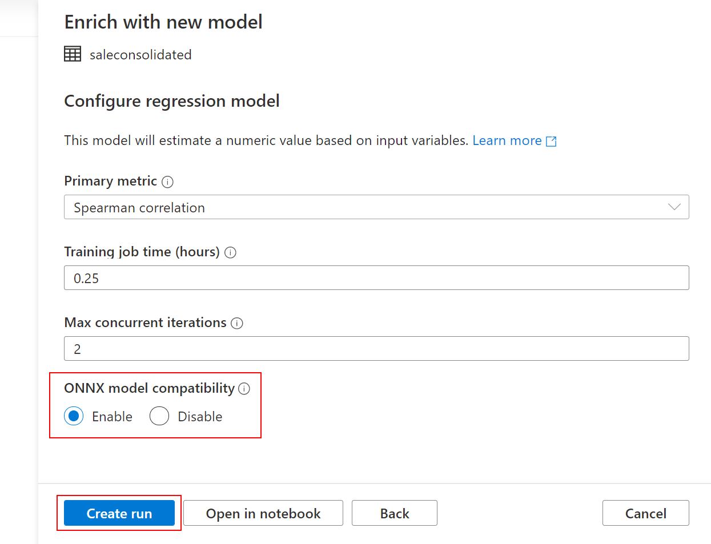

Dedicated SQL pool provides you the capability to score machine learning models using the familiar T-SQL language. With T-SQL [PREDICT](https://docs.microsoft.com/sql/t-sql/queries/predict-transact-sql?preserve-view=true&view=azure-sqldw-latest), you can bring your existing machine learning models trained with historical data and score them within the secure boundaries of your data warehouse. PREDICT function takes an [ONNX (Open Neural Network Exchange)](https://onnx.ai/) model and data as inputs. This feature eliminates the step of moving valuable data outside the data warehouse for scoring. It aims to empower data professionals to quickly deploy machine learning models with the familiar T-SQL interface and collaborate seamlessly with data scientists working with the right framework for their task.

The functionality requires that the model is trained outside of Synapse SQL. After building the model, you can load it into the data warehouse and score it with the T-SQL Predict syntax to get insights from the data.


## Training the Model

Dedicated SQL pool expects a pre-trained model and only supports ONNX format models. ONNX is an open-source model format that allows you to exchange models between various frameworks to enable interoperability. When using Automated ML for training, make sure to set the *enable_onnx_compatible_models* parameter to TRUE to produce an ONNX format model.

```python
automl_config = AutoMLConfig(task = 'classification',
                             debug_log = 'automl_errors.log',
                             compute_target=compute_target,
                             experiment_exit_score = 0.9984,
                             blocked_models = ['KNN','LinearSVM'],
                             enable_onnx_compatible_models=True,
                             training_data = train_data,
                             label_column_name = label,
                             validation_data = validation_dataset,
                             **automl_settings
                            )
```

When we previously created models through AutoML we picked **Enable** for ONNX model compatibility.



## Loading the model

The model is stored in a dedicated SQL pool user table as a hexadecimal string. Additional columns such as ID and description may be added in the model table to identify the model. Use varbinary(max) as the data type of the model column. Here is a code example for a table that can be used for storing models:

```sql
-- Sample table schema for storing a model and related data
CREATE TABLE [dbo].[Models]
(
    [Id] [int] IDENTITY(1,1) NOT NULL,
    [Model] [varbinary](max) NULL,
    [Description] [varchar](200) NULL
)
WITH
(
    DISTRIBUTION = ROUND_ROBIN,
    HEAP
)
GO

```

Once the model is converted to a hexadecimal string and the table definition specified, use the [COPY command](https://docs.microsoft.com/sql/t-sql/statements/copy-into-transact-sql?preserve-view=true&view=azure-sqldw-latest) or Polybase to load the model in the dedicated SQL pool table. The following code sample uses the Copy command to load the model.

```sql
-- Copy command to load hexadecimal string of the model from Azure Data Lake storage location
COPY INTO [Models] (Model)
FROM '<enter your storage location>'
WITH (
    FILE_TYPE = 'CSV',
    CREDENTIAL=(IDENTITY= 'Shared Access Signature', SECRET='<enter your storage key here>')
)
```

## Scoring the model

Once the model and data are loaded in the data warehouse, use the **T-SQL PREDICT** function to score the model. Ensure that the new input data is in the same format as the training data used for building the model. T-SQL PREDICT takes two inputs: model and new scoring input data, and generates new columns for the output. The model can be specified as a variable, a literal, or a scalar sub_query. Use [WITH common_table_expression](https://docs.microsoft.com/sql/t-sql/queries/with-common-table-expression-transact-sql?preserve-view=true&view=azure-sqldw-latest) to specify a named result set for the data parameter.

The example below shows a sample query using the prediction function. An additional column with the name *Score* and data type *float* is created containing the prediction results. All the input data columns and output prediction columns are available to display with the select statement. For more details, see [PREDICT (Transact-SQL)](https://docs.microsoft.com/sql/t-sql/queries/predict-transact-sql?preserve-view=true&view=azure-sqldw-latest).

```sql
-- Query for ML predictions
SELECT d.*, p.Score
FROM PREDICT(MODEL = (SELECT Model FROM Models WHERE Id = 1),
DATA = dbo.mytable AS d, RUNTIME = ONNX) WITH (Score float) AS p;
```
