In this exercise, you will use existing trained models to perform predictions on data. Task 1 uses a trained model from Azure Machine Learning services, while Task 2 uses one from Azure Cognitive Services. 

### Task 1 - Enrich data in a SQL pool table using a trained model from Azure Machine Learning

In Synapse Studio, select the `Data` **(1)** hub, then select the `Workspace` **(2)** tab, and then locate the `wwi.ProductQuantityForecast` **(5)** table in the `SQLPool01 (SQL)` **(4)** database (under `Databases` **(3)**). Activate the context menu by selecting `...` **(6)** from the right side of the table name, and then select `New SQL script > Select TOP 100 rows`. The table contains the following columns:

* **ProductId**: the identifier of the product for which we want to predict
* **TransactionDate**: the future date for which we want to predict
* **Hour**: the hour from the future date for which we want to predict
* **TotalQuantity**: the value we want to predict for the specified product, day, and hour.

[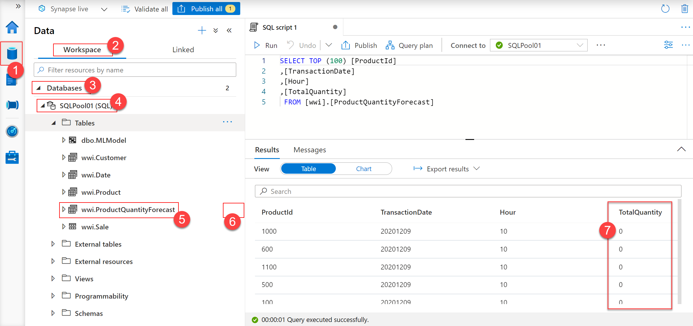](../media/explore-table-productquantityforecast.png#ligthbox)

Notice that `TotalQuantity` **(7)** is zero in all rows as this is the placeholder for the predicted values we are looking to get.

To use the model you just trained in Azure Machine Learning, activate the context menu of the `wwi.ProductQuantityForecast`, and then select `Machine Learning > Enrich with existing model`. This will open the `Enrich with existing model` dialog to select your model **(1)**. Select the most recent model and then select `Continue` **(2)**.

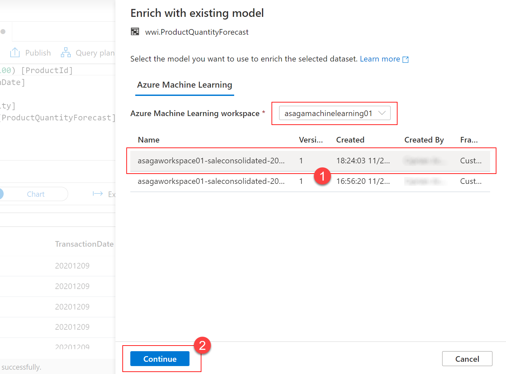

Next, you will manage the input and output column mappings. Because the column names from the target table and the table used for model training match, you can leave all mappings as suggested by default. Select `Continue` to advance.

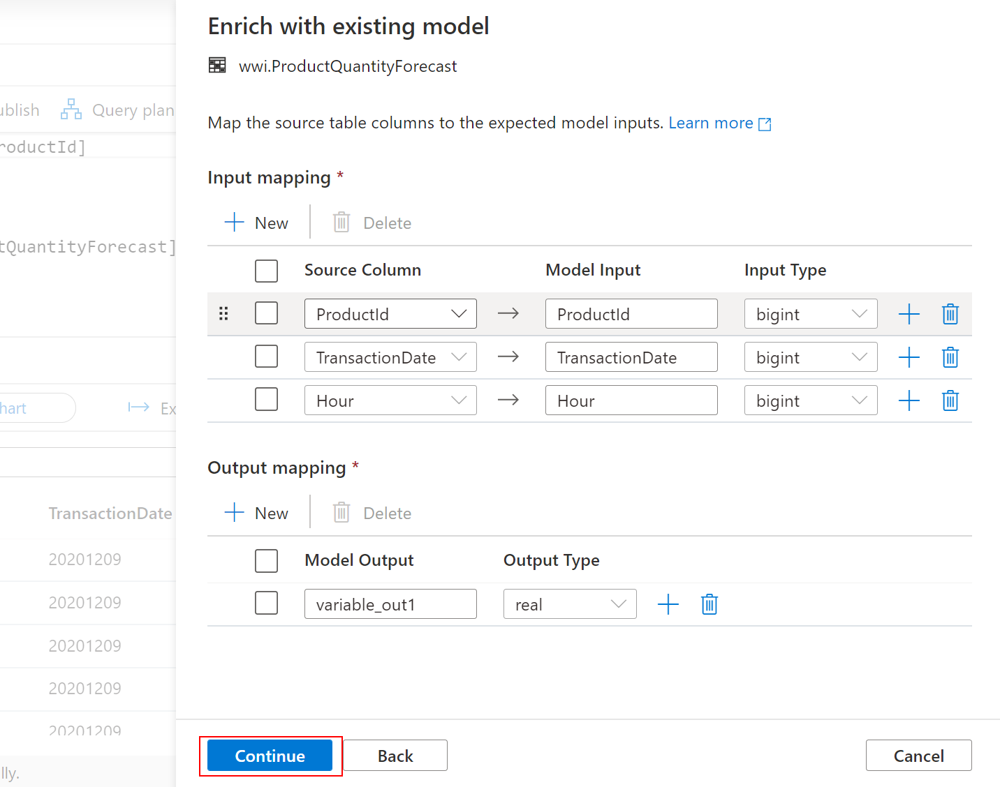

The final step presents you with options to name the stored procedure that will perform the predictions and the table that will store the serialized form of your model. Provide the following values:

* **Stored procedure name (1)**: `[wwi].[ForecastProductQuantity]`
* **Select target table**: `Create new` **(2)**
* **New table**: `[wwi].[Model]` **(3)**

Select `Deploy model + open script` **(4)** to deploy your model into the SQL pool.

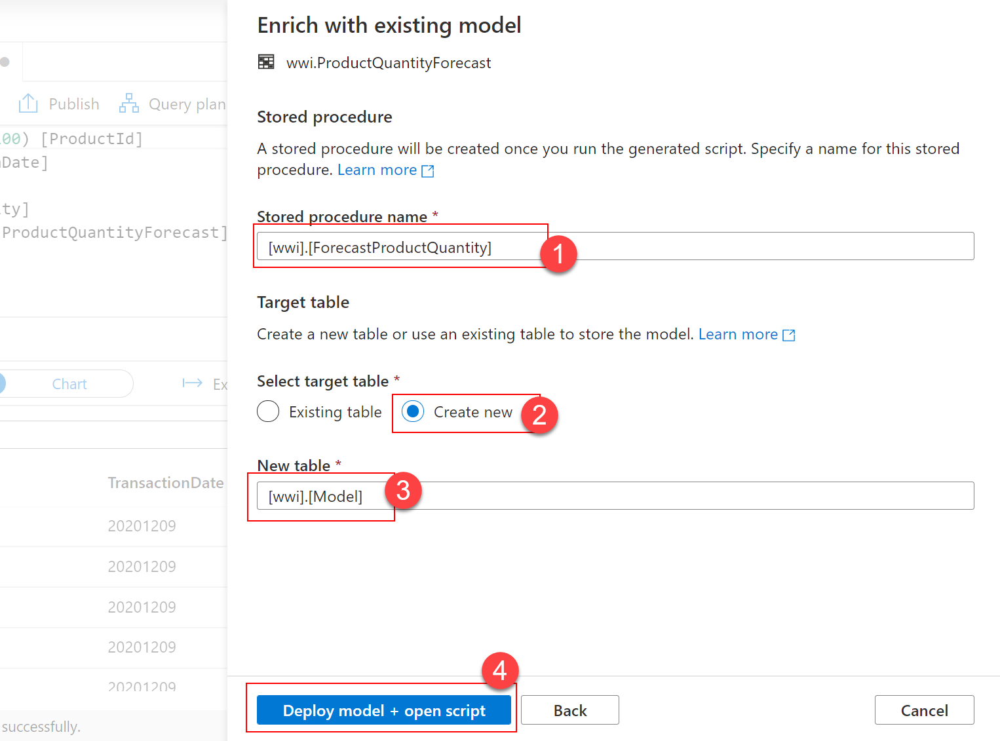

From the new SQL script that is created for you, copy the ID of the model:

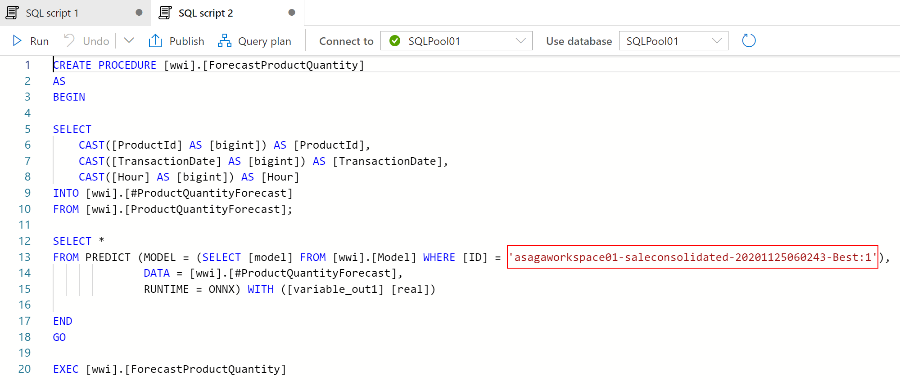

The T-SQL code that is generated will only return the results of the prediction without actually saving them. To save the results of the prediction directly into the `[wwi].[ProductQuantityForecast]` table, replace the generated code with the following:

```sql
CREATE PROC [wwi].[ForecastProductQuantity] AS
BEGIN

SELECT
    CAST([ProductId] AS [bigint]) AS [ProductId],
    CAST([TransactionDate] AS [bigint]) AS [TransactionDate],
    CAST([Hour] AS [bigint]) AS [Hour]
INTO #ProductQuantityForecast
FROM [wwi].[ProductQuantityForecast]
WHERE TotalQuantity = 0;

SELECT
    ProductId
    ,TransactionDate
    ,Hour
    ,CAST(variable_out1 as INT) as TotalQuantity
INTO
    #Pred
FROM PREDICT (MODEL = (SELECT [model] FROM wwi.Model WHERE [ID] = '<your_model_id>'),
            DATA = #ProductQuantityForecast,
            RUNTIME = ONNX) WITH ([variable_out1] [real])

MERGE [wwi].[ProductQuantityForecast] AS target  
    USING (select * from #Pred) AS source (ProductId, TransactionDate, Hour, TotalQuantity)  
ON (target.ProductId = source.ProductId and target.TransactionDate = source.TransactionDate and target.Hour = source.Hour)  
    WHEN MATCHED THEN
        UPDATE SET target.TotalQuantity = source.TotalQuantity;
END
GO
```

In the code above, make sure you replace `<your_model_id>` with the model's actual ID (the one you copied in the previous step).

>[!NOTE]
>
>Our version of the stored procedure uses the `MERGE` command to update the values of the `TotalQuantity` field in-place, in the `wwi.ProductQuantityForecast` table. The `MERGE` command has been recently added to Azure Synapse Analytics. For more details, read [New MERGE command for Azure Synapse Analytics](https://azure.microsoft.com/updates/new-merge-command-for-azure-synapse-analytics/).

You are now ready to perform the forecast on the `TotalQuantity` column. Open a new SQL script and run the following statement:

```sql
EXEC
    wwi.ForecastProductQuantity

SELECT  
    *
FROM
    wwi.ProductQuantityForecast
```

Notice how the values in the `TotalQuantity` column have changed from zero to non-zero predicted values:

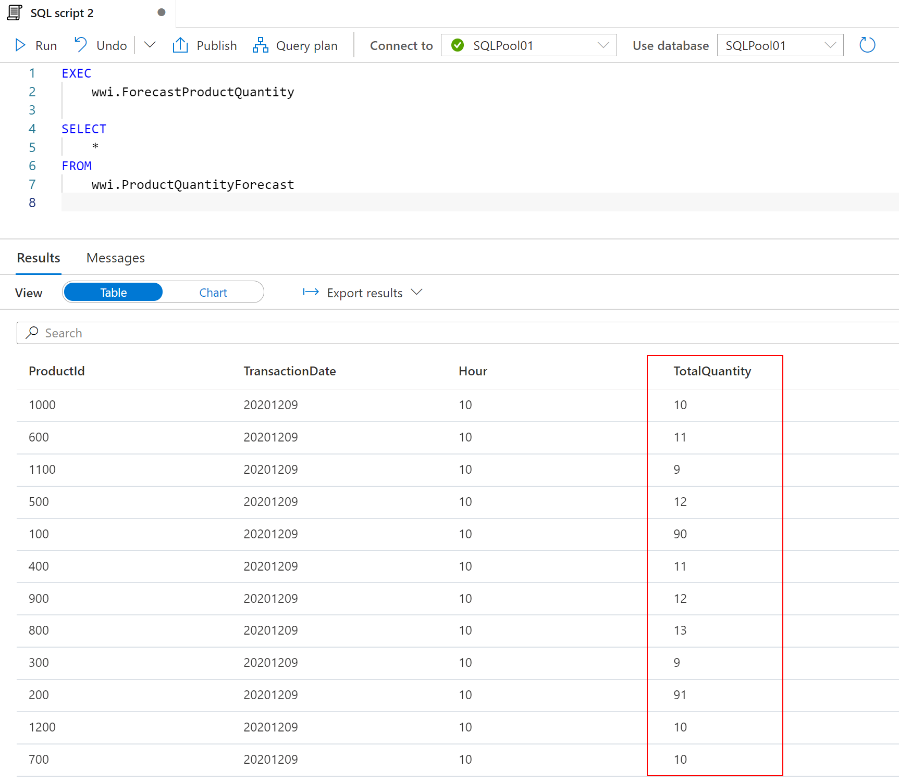

### Task 2 - Enrich data in a Spark table using a trained model from Azure Cognitive Services

First, we need to create a Spark table to be used as the input for the Cognitive Services model. In Synapse Studio, select the `Data` hub **(1)** and then the `Linked` **(2)** section. In the primary `Azure Data Lake Storage Gen 2` **(3)** account, select the `wwi-02` **(5)** file system, and then select the `ProductReviews.csv` **(7)** file under `wwi-02\sale-small-product-reviews` **(6)**. Right click the file and select `New notebook -> New Spark table` **(8-9)**.

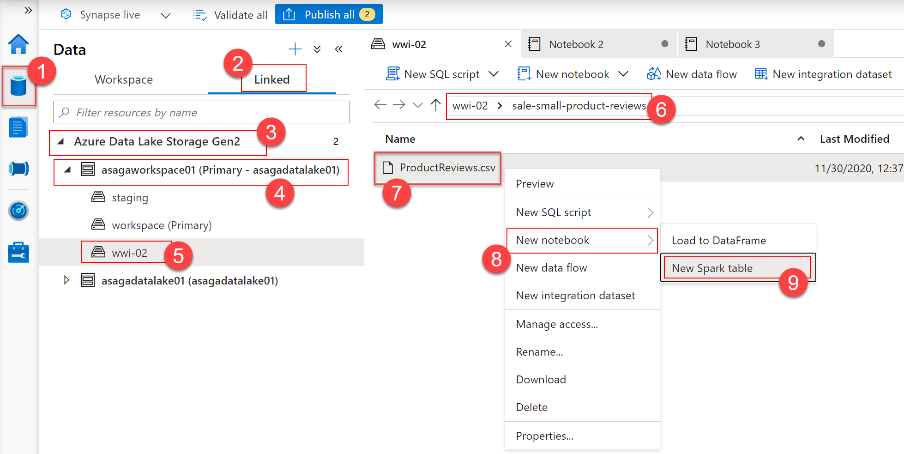

Replace the content of the notebook cell with the following code and then run the cell:

```python
%%pyspark
df = spark.read.load('abfss://wwi-02@<data_lake_account_name>.dfs.core.windows.net/sale-small-product-reviews/ProductReviews.csv', format='csv'
,header=True
)
df.write.mode("overwrite").saveAsTable("default.ProductReview")
```

>[!NOTE]
>
>Replace `<data_lake_account_name>` with the actual name of your Synapse Analytics primary data lake account.

To view the table in the `Data` hub, expand the `default (Spark)` database in the `Workspace` section. Your table will show up in the `Tables` folder. Select the three dots at the right of the table name to view the `Machine Learning` option in the context menu and then select `Machine Learning > Enrich with existing model`.

In the `Enrich with existing model` dialog, select `Text Analytics - Sentiment Analysis` **(2)** under `Azure Cognitive Services` **(1)** and then select `Continue` **(3)**.

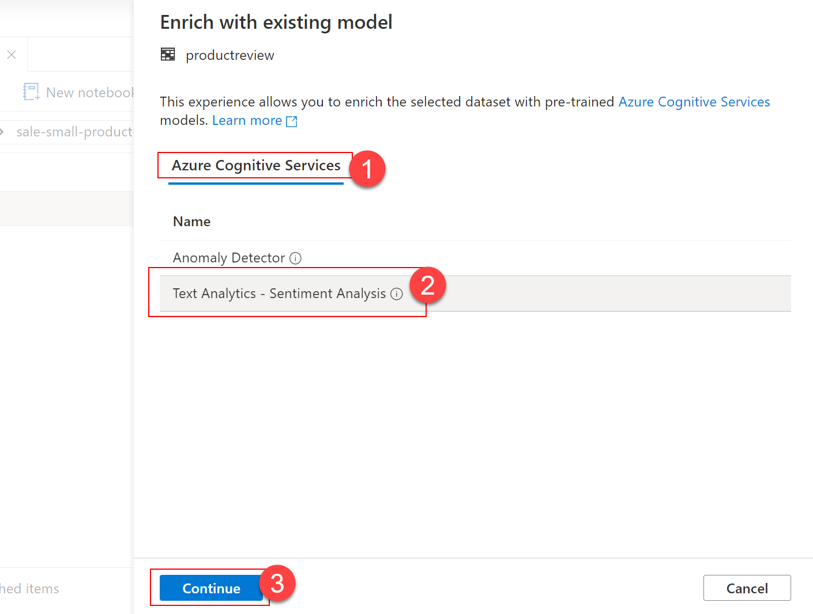

Next, provide values as follows:

* **Azure subscription (1)**: select the Azure subscription of your resource group.
* **Cognitive Services account (2)**: select the Cognitive Services account that has been provisioned in your resource group. The name should be `asagacognitiveservices<unique_suffix>`, where `<unique_suffix>` is the unique suffix you provided when deploying the Synapse Analytics workspace.
* **Azure Key Vault linked service (3)**: select the Azure Key Vault linked service that has been provisioned in your Synapse Analytics workspace. The name should be `asagakeyvault<unique_suffix>`, where `<unique_suffix>` is the unique suffix you provided when deploying the Synapse Analytics workspace.
* **Secret name (4)**: enter `ASA-GA-COGNITIVE-SERVICES` (the name of the secret that contains the key for the specified Cognitive Services account).

Select `Continue` **(5)** to move next.

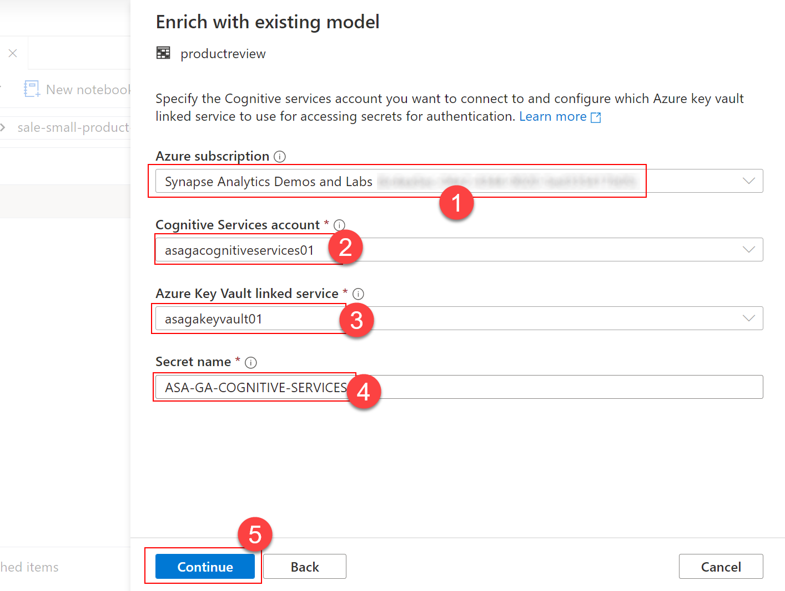

Next, provide values as follows:

* **Language**: select `English`.
* **Text column**: select `ReviewText (string)`

Select `Open notebook` to view the generated code.

>[!NOTE]
>
>When you created the `ProductReview` Spark table by running the notebook cell, you started a Spark session on that notebook. The default settings on your Synapse Analytics workspace will not allow you to start a new notebook that runs in parallel with that one.
You will need to copy the contents of the two cells that contain to Cognitive Services integration code into that notebook and run them on the Spark session that you have already started. After copying the two cells, you should see a screen similar to this:
>
>[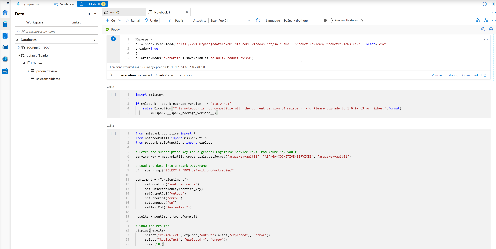](../media/data-enrichment-text-analytics-code.png#lightbox)

>[!NOTE]
>To run the notebook generated by Synapse Studio without copying its cells, you can use the `Apache Spark applications` section of the `Monitor` hub, where you can view and cancel the running Spark session. For more details on this, see [Use Synapse Studio to monitor your Apache Spark applications](https://docs.microsoft.com/azure/synapse-analytics/monitoring/apache-spark-applications). In this lab, we used to copy cells approach to avoid the extra time required to cancel the running Spark session and start a new one afterward.

Run cells 2 and 3 in the notebook to get the sentiment analysis results for your data.

[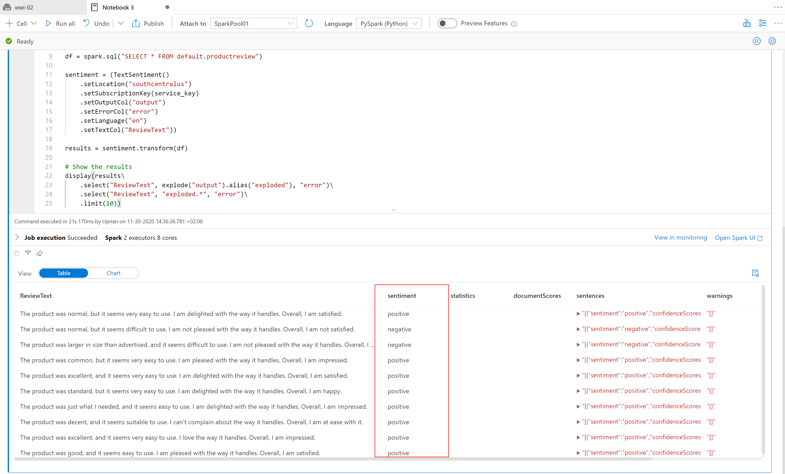](../media/data-enrichment-text-analytics-results.png#lightbox)
