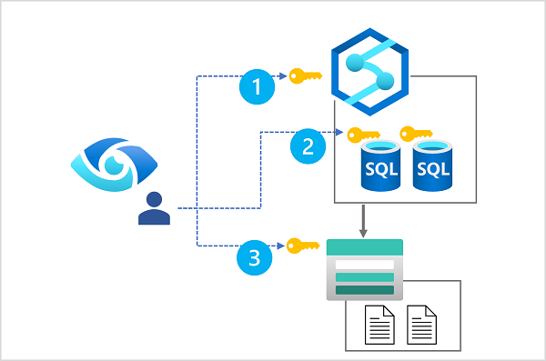

Azure Synapse Analytics is a platform for cloud-scale analytics workloads that process data in multiple sources; including:

- Relational databases in serverless and dedicated SQL pools
- Files in Azure Data Lake Storage Gen2

A comprehensive data analytics solution can include many folders and files in a data lake, and multiple databases that each contain many tables, each with multiple fields. For a data analyst, finding and understanding the data assets associated with a Synapse Analytics workspace can present a significant challenge before any analysis or reporting can even begin.

Microsoft Purview can help in this scenario by cataloging the data assets in a *data map*, and enabling data stewards to add metadata, categorization, subject matter contact details, and other information that helps data analysts identify and understand data.

## Configure data access for Microsoft Purview

In order to scan the data assets in the data lake storage and databases used in your Azure Synapse Workspace, Microsoft Purview must have appropriate permissions to read the data. In practice, this means that the account used by your Microsoft Purview account (usually a system-assigned managed identity that is created when Microsoft Purview is provisioned) needs to be a member of the appropriate role-based access control (RBAC) and database roles.

The diagram shows that Microsoft Purview requires role membership that permits the following access:

1. Read access to the Azure Synapse workspace (achieved through membership of the **Reader** role for the Azure Synapse Workspace resource in the Azure subscription).
2. Read access to each SQL database that will be scanned (achieved through membership of the **db_datareader** fixed database role in each database).
3. Read access to data lake storage (achieved through membership of the **Storage Blob Data Reader** role for the Azure Storage account hosting the Azure Data Lake Storage Gen2 container for the data lake).

> [!TIP]
> Learn more:
>
> - For more information about RBAC in Microsoft Azure, see [What is Azure role-based access control (Azure RBAC)?](/azure/role-based-access-control/overview?azure-portal=true)
> - For more information about database-level roles in Azure Synapse Analytics SQL pools, see [Database-level roles](/sql/relational-databases/security/authentication-access/database-level-roles?azure-portal-true).
>
> You'll get a chance to assign RBAC and SQL database role membership to support Microsoft Purview data access for yourself in the exercise later in this module.

## Register and scan data sources

Microsoft Purview supports the creation of a *data map* that catalogs data assets in *collections* by scanning registered *sources*. Collections form a hierarchy of logical groupings of related data assets, under a root collection that is created when you provision a Microsoft Purview account. You can use the Microsoft Purview Governance Portal to create and manage collections in your account.

To include assets from a particular data source, you need to register the source in a collection. Microsoft Purview supports many kinds of source, including:

- **Azure Synapse Analytics** - One or more SQL databases in a Synapse Analytics workspace.
- **Azure Data Lake Storage Gen2** - Blob containers used to host folders and files in a data lake.

To catalog assets used in an Azure Synapse Analytics workspace, you can register one or both of these sources in a collection, as shown here:

After registering the sources where your data assets are stored, you can scan each source to catalog the assets it contains. You can scan each source interactively, and you can schedule period scans to keep the data map up to date.

> [!TIP]
> To learn more about registering and scanning sources, see [Scans and ingestion in Microsoft Purview](/azure/purview/concept-scans-and-ingestion?azure-portal=true).
>
> You'll get a chance to register and scan sources for an Azure Synapse Analytics workspace in the exercise later in this module.

## View and manage cataloged data assets

As each scan finds data assets in the registered sources, they're added to the associated collection in the data catalog. You can query the data catalog in the Microsoft Purview Governance Portal to view and filter the data assets, as shown here:

Data assets include items in the registered data stores at multiple levels. For example, assets from an Azure Synapse Analytics source include databases, schemas, tables, and individual fields; and assets from an Azure Data Lake Storage Gen 2 source include containers, folders, and files.

You can view and edit the properties of each asset to add contextual information such as descriptions, contacts for expert help, and other useful metadata. Data assets can also be classified using built-in or custom classifications that match specific patterns of data field to common types of data - for example, passport numbers, credit card numbers, and others.

> [!TIP]
> To learn more about data asset classification, see [Data classification in the Microsoft Purview governance portal](/azure/purview/concept-classification?azure-portal=true).
