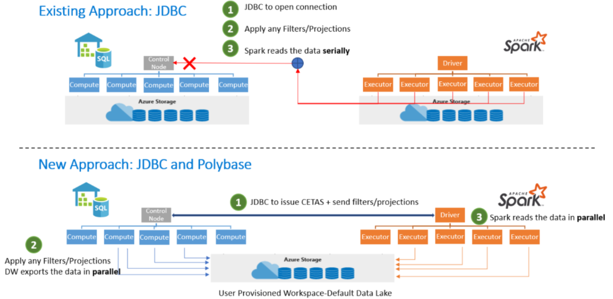

Synapse Analytics removes the barrier of setting up multiple different services for Spark or SQL. 
Therefore, it removes the traditional thinking about these technologies. 
It enables you to use both technologies within one platform, which allowed you to switch between Spark or SQL based on the needs and expertise you have in-house. 

A spark orientated data engineer can now easily communicate with a SQL based data engineer and communicate together on the same platform. 

The interoperability between Spark and SQL helps you achieve as follows:

* A shared Hive-compatible metadata system enables you to define tables on files in the data lake such that it can be consumed by either Spark or Hive.
* Both SQL and Spark can directly explore, and analyze Parquet, CSV, TSV, and JSON files stored in the data lake.
* The enablement of fast scalable load and unload for data transferring between SQL and Spark databases

The question might raise as how would that SQL and Spark integration then work. 

That's when the Azure Synapse Apache Spark to Synapse SQL connector comes in place. 
It is designed to efficiently transfer data between serverless Apache Spark pools (preview) and SQL pools in Azure Synapse.
However, at the moment, the Azure Synapse Apache Spark to Synapse SQL connector works on dedicated SQL pools only, it doesn't work with serverless SQL pools.

So, let's look at the following design:

In the commonly used existing approach, you often see the use of the JDBC. 
The JDBC would open the connection. 
Then, filters and projections would be applied and spark would read the data serially. 
Given two distributed systems such as Spark and SQL pools, JDBC could become a bottleneck with serial data transfer.

Therefore the New Approach we would take is JDBC and PolyBase. 
First, the JDBC issues CETAS and send filters and projections. 
Then filters and projections would be applied and the DataWarehouse exports the data in parallel. 
Spark reads the data in parallel all based on the user provisioned workspace default data lake storage. 

The Azure Synapse Apache Spark Pool to Synapse SQL connector would then be a data source implementation for apache spark where the ADLS Gen 2 is used as well as PolyBase in the dedicated SQL Pools to transfer data between the Spark instance and SQL pool efficiently. 

