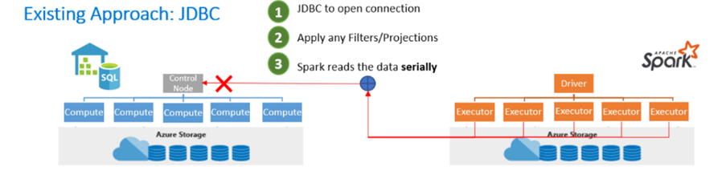
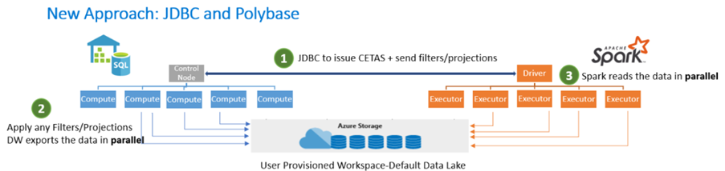

By creating analytical solutions within Azure Synapse Analytics, the need for setting up multiple services to connect an Apache Spark cluster to a SQL database is no longer required. The Azure Synapse Analytics environment enables you to use both technologies within one integrated platform. The integrated platform experience allows you to switch between Apache Spark and SQL based data engineering tasks applicable to the expertise you have in-house. As a result, an Apache Spark-orientated data engineer can easily communicate and work with a SQL-based data engineer on the same platform.

The interoperability between Apache Spark and SQL helps you achieve as follows:
-	Work with SQL and Apache Spark to directly explore and analyze Parquet, CSV, TSV, and JSON files stored in the data lake.
-	Enable fast, scalable loads for data transferring between SQL and Apache Spark databases.
-	Make use of a shared Hive-compatible metadata system that enables you to define tables on files in the data lake such that it can be consumed by either Apache Spark or Hive.

It raises the question of how SQL and Apache Spark integration works. That's where the Azure Synapse Apache Spark to Synapse SQL connector comes into play.

The Azure Synapse Apache Spark to Synapse SQL connector is designed to efficiently transfer data between serverless Apache Spark pools and dedicated SQL pools in Azure Synapse. At the moment, the Azure Synapse Apache Spark to Synapse SQL connector works on dedicated SQL pools only, it doesn't work with serverless SQL pools.

In the existing approach, you often see the use of the JavaDataBaseConnectivity (JDBC) Application Programming Interface (API). The JDBC API opens the connection, filters, and applies projections, and Apache Spark reads the data serially. Given that two distributed systems such as Apache Spark and SQL pools are being used, using the JDBC API becomes a bottleneck with serial transfer of data.

Therefore, a new approach is to use both JDBC and PolyBase. First, the JDBC opens a connection and issues Create External Tables As Select (CETAS) statements and sends filters and projections. The filters and projections are then applied to the data warehouse and exports the data in parallel using PolyBase. Apache Spark reads the data in parallel based on the user-provisioned workspace and the default data lake storage.

As a result, you can use the Azure Synapse Apache Spark Pool to Synapse SQL connector to transfer data between a Data Lake store via Apache Spark and dedicated SQL Pools efficiently.