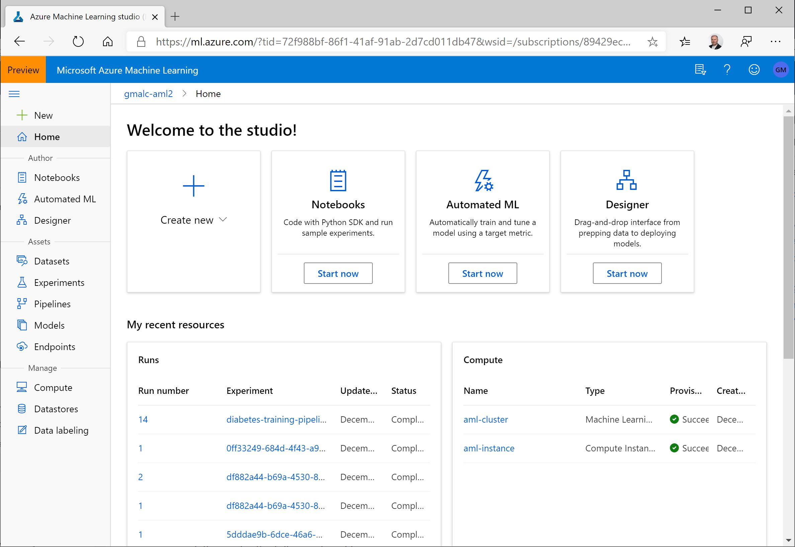
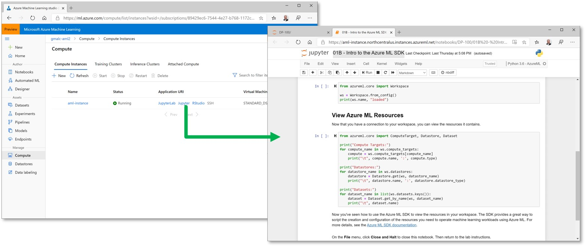
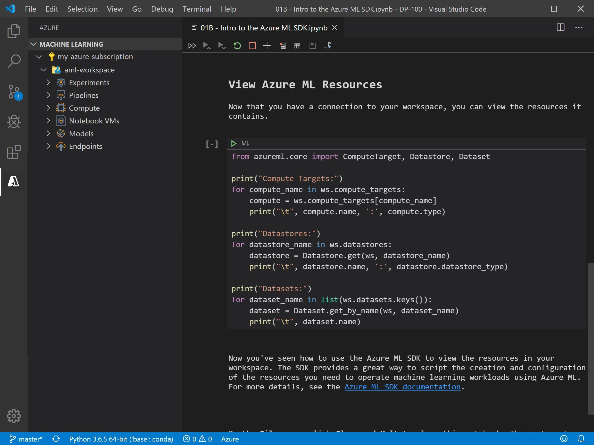

Azure Machine Learning provides a cloud-based service that offers flexibility in how you use it. There are user interfaces specifically designed for Azure Machine Learning, or you can use a programmatic interface to manage workspace resources and run machine learning operations.

## Azure Machine Learning studio

You can manage the assets in your Azure Machine Learning workspace in the Azure portal, but as this is a general interface for managing all kinds of resources in Azure, data scientists and other users involved in machine learning operations may prefer to use a more focused, dedicated interface.



Azure Machine Learning studio is a web-based tool for managing an Azure Machine Learning workspace. It enables you to create, manage, and view all of the assets in your workspace and provides the following graphical tools:

- *Designer*: A drag and drop interface for "no code" machine learning model development.
- *Automated Machine Learning*: A wizard interface that enables you to train a model using a combination of algorithms and data preprocessing techniques to find the best model for your data.

> [!NOTE]
> A previously released tool named Azure Machine Learning Studio provided a free service for drag and drop machine learning model development. The studio interface for the Azure Machine Learning service includes this capability in the *designer* tool, as well as other workspace asset management capabilities.

To use Azure Machine Learning studio, use a a web browser to navigate to [https://ml.azure.com](https://ml.azure.com) and sign in using credentials associated with your Azure subscription. You can then select the subscription and workspace you want to manage.

## The Azure Machine Learning SDK

While graphical interfaces like Azure Machine Learning studio make it easy to create and manage machine learning assets, it is often advantageous to use a code-based approach to managing resources. By writing scripts to create and manage resources, you can:

- Run machine learning operations from your preferred development environment.
- Automate asset creation and configuration to make it repeatable.
- Ensure consistency for resources that must be replicated in multiple environments (for example, development, test, and production)
- Incorporate machine learning asset configuration into developer operations (*DevOps*) workflows, such as continuous integration / continuous deployment (CI/CD) pipelines.

Azure Machine Learning provides software development kits (SDKs) for Python and R, which you can use to create, manage, and use assets in an Azure Machine Learning workspace.

> [!NOTE]
> This course focuses on the Python SDK because it has broader capabilities than the R SDK, which is in preview at the time of writing.

### Installing the Azure Machine Learning SDK for Python

You can install the Azure Machine Learning SDK for Python by using the `pip` package management utility, as shown in the following code sample:

```bash
pip install azureml-sdk
```

The SDK includes optional *extras* that aren't required for core operations, but can be useful in some scenarios. For example, the **notebooks** extra include widgets for displaying detailed output in Jupyter Notebooks, the **AutoML** extra includes packages for automated machine learning training, and the **explain** extra includes packages for generating model explanations. To install extras, specify them in brackets as shown here:

```bash
pip install azureml-sdk[notebooks,automl,explain]
```

> **More Information**: For more information about installing the Azure Machine Learning SDK for Python, see the [SDK documentation](https://aka.ms/AA70rq7). Also, you should be aware that the SDK is updated on a regular basis, and review the [release notes for the latest release](https://aka.ms/AA70zel).

### Connecting to a Workspace

After installing the SDK package in your Python environment, you can write code to connect to your workspace and perform machine learning operations. The easiest way to connect to a workspace is to use a workspace configuration file, which includes the Azure subscription, resource group, and workspace details as shown here:

```json
{
    "subscription_id": "1234567-abcde-890-fgh...",
    "resource_group": "aml-resources",
    "workspace_name": "aml-workspace"
}
```

> [!TIP]
> You can download a configuration file for a workspace from the **Overview** page of its blade in the Azure portal or from Azure Machine Learning studio.

To connect to the workspace using the configuration file, you can use the **from_config** method of the **Workspace** class in the SDK, as shown here:

```python
from azureml.core import Workspace

ws = Workspace.from_config()
```

By default, the **from_config** method looks for a file named **config.json** in the folder containing the Python code file, but you can specify another path if necessary.

As an alternative to using a configuration file, you can use the **get** method of the **Workspace** class with explicitly specified subscription, resource group, and workspace details as shown here - though the configuration file technique is generally preferred due to its greater flexibility when using multiple scripts:

```python
from azureml.core import Workspace

ws = Workspace.get(name='aml-workspace',
                   subscription_id='1234567-abcde-890-fgh...',
                   resource_group='aml-resources')
```

Whichever technique you use, if there is no current active session with your Azure subscription, you will be prompted to authenticate.

### Working with the Workspace Class

The **Workspace** class is the starting point for most code operations. For example, you can use its **compute_targets** attribute to retrieve a dictionary object containing the compute targets defined in the workspace, like this:

```python
for compute_name in ws.compute_targets:
    compute = ws.compute_targets[compute_name]
    print(compute.name, ":", compute.type)
```

The SDK contains a rich library of classes that you can use to create, manage, and use many kinds of asset in an Azure Machine Learning workspace.

>**More Information**: For more information about the Azure Machine Learning SDK, see the [SDK documentation](https://aka.ms/AA70zeq).

## The Azure Machine Learning CLI Extension

The Azure command-line interface (CLI) is a cross-platform command-line tool for managing Azure resources. The Azure Machine Learning CLI extension is an additional package that provides commands for working with Azure Machine Learning.

To install the Azure Machine Learning CLI extension, you must first install the Azure CLI. See the [full installation instructions for all supported platforms](https://aka.ms/AA70zet) for more details.

After installing the Azure CLI, you can add the Azure Machine Learning CLI extension by running the following command:

```bash
az extension add -n azure-cli-ml
```

To use the Azure Machine Learning CLI extension, run the `az ml` command with the appropriate parameters for the action you want to perform. For example, to list the compute targets in a workspace, run the following command:

```bash
az ml computetarget list -g 'aml-resources' -w 'aml-workspace'
```

> [!NOTE]
> In the code sample above, the **-g** parameter specifies the name of the resource group in which the Azure Machine Learning workspace specified in the **-w** parameter is defined. These parameters are shortened aliases for **--resource-group** and **--workspace-name**.
>
> **More Information**: For more information about the Azure Machine Learning CLI Extension, see the [documentation](https://aka.ms/AA70zeu).

## Compute Instances

Azure Machine Learning includes the ability to create *Compute Instances* in a workspace to provide a development environment that is managed with all of the other assets in the workspace.



Compute Instances include Jupyter Notebook and JupyterLab installations that you can use to write and run code that uses the Azure Machine Learning SDK to work with assets in your workspace.

You can choose a compute instance image that provides the compute specification you need, from small CPU-only VMs to large GPU-enabled workstations. Because compute instances are hosted in Azure, you only pay for the compute resources when they are running; so you can create a compute instance to suit your needs, and stop it when your workload has completed to minimize costs.

You can store notebooks independently in workspace storage, and open them in any compute instance.

## Visual Studio Code

Visual Studio Code is a lightweight code editing environment for Microsoft Windows, Apple macOS, and Linux. It provides a visual interface for many kinds of code, including Microsoft C#, JavaScript, Python and others; as well as intellisense and syntax formatting for common data formats such as JSON and XML.

Visual Studio Code's flexibility is based on the ability to install modular *extensions* that add syntax checking, debugging, and visual management interfaces for specific workloads. For example, the Microsoft Python extension for Visual Studio Code adds support for writing and running Python code in scripts or notebooks within the Visual Studio Code interface.



The Azure Machine Learning Extension for Visual Studio Code provides a graphical interface for working with assets in an Azure Machine Learning workspace. You can combine the capabilities of the Azure Machine Learning and Python extensions to manage a complete end-to-end machine learning workload in Azure Machine Learning from the Visual Studio Code environment.

> **More Information**: For more information about using the Azure Machine Learning extension for Visual Studio Code, see the [documentation](https://docs.microsoft.com/azure/machine-learning/how-to-manage-resources-vscode).
 