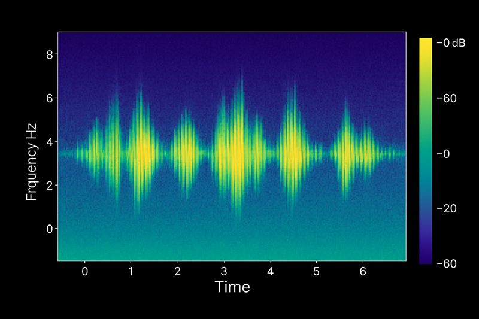
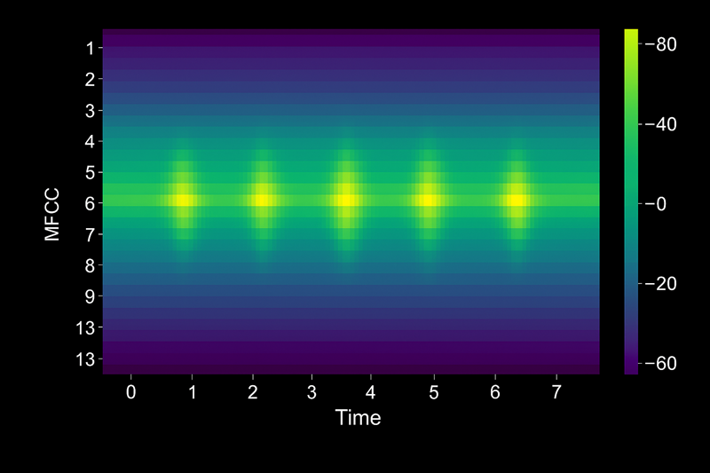

::: zone pivot="video"

>[!VIDEO https://learn-video.azurefd.net/vod/player?id=973358fc-8fdc-436b-805e-08e191c5ea07]

> [!NOTE]
> See the **Text and images** tab for more details!

::: zone-end

::: zone pivot="text"

Speech recognition, also called speech-to-text, enables applications to convert spoken language into written text. The journey from sound wave to text involves six coordinated stages: capturing audio, preparing features, modeling acoustic patterns, applying language rules, decoding the most likely words, and refining the final output.

## Audio capture: Convert analog audio to digital 

Speech recognition begins when a microphone converts sound waves into a digital signal. The system samples the analog audio thousands of times per second—typically 16,000 samples per second (16 kHz) for speech applications—and stores each measurement as a numeric value.



> [!NOTE]
> Why sampling rate matters:
>
> - Higher rates (like 44.1 kHz for music) capture more detail but require more processing.
> - Speech recognition balances clarity and efficiency at 8 kHz to 16 kHz.
> - Background noise, microphone quality, and distance from the speaker directly impact downstream accuracy.

Before moving to the next stage, the system often applies basic filters to remove hums, clicks, or other background noise that could confuse the model.

## Pre-processing: Extract meaningful features

Raw audio samples contain too much information for efficient pattern recognition. Pre-processing transforms the waveform into a compact representation that highlights speech characteristics while discarding irrelevant details like absolute volume.

### Mel-Frequency Cepstral Coefficients (MFCCs)

MFCC is the most common feature extraction technique in speech recognition. It mimics how the human ear perceives sound by emphasizing frequencies where speech energy concentrates and compressing less important ranges.

#### How MFCC works:

1. **Divide audio into frames:** Split the signal into overlapping 20–30 millisecond windows.
2. **Apply Fourier transform:** Convert each frame from time domain to frequency domain, revealing which pitches are present.
3. **Map to Mel scale:** Adjust frequency bins to match human hearing sensitivity—we distinguish low pitches better than high ones.
4. **Extract coefficients:** Compute a small set of numbers (often 13 coefficients) that summarize the spectral shape of each frame.



The result is a sequence of feature vectors—one per frame—that captures what the audio sounds like without storing every sample. These vectors become the input for acoustic modeling.

The vectors are extracted column-wise, with each vector representing the 13 MFCC feature coefficient values for each time-frame:

```
Frame 1: [ -113.2,  45.3,  12.1,  -3.4,  7.8,  ... ]  # 13 coefficients
Frame 2: [ -112.8,  44.7,  11.8,  -3.1,  7.5,  ... ]
Frame 3: [ -110.5,  43.9,  11.5,  -2.9,  7.3,  ... ]
```

## Acoustic modeling: Recognize phonemes

Acoustic models learn the relationship between audio features and **phonemes**—the smallest units of sound that distinguish words. English uses about 44 phonemes; for example, the word "cat" comprises three phonemes: /k/, /æ/, and /t/.

### From features to phonemes

Modern acoustic models use **transformer architectures**, a type of deep learning network that excels at sequence tasks. The transformer processes the MFCC feature vectors and predicts which phoneme is most likely at each moment in time.

Transformer models achieve effective phoneme prediction through: 

- **Attention mechanism:** The model examines surrounding frames to resolve ambiguity. For example, the phoneme /t/ sounds different at the start of "top" versus the end of "bat."
- **Parallel processing:** Unlike older recurrent models, transformers analyze multiple frames simultaneously, improving speed and accuracy.
- **Contextualized predictions:** The network learns that certain phoneme sequences occur frequently in natural speech.

The output of acoustic modeling is a probability distribution over phonemes for each audio frame. For instance, frame 42 might show 80% confidence for /æ/, 15% for /ɛ/, and 5% for other phonemes.

> [!NOTE]
> Phonemes are language-specific. A model trained on English phonemes can't recognize Mandarin tones without retraining.

## Language modeling: Predict word sequences

Phoneme predictions alone don't guarantee accurate transcription. The acoustic model might confuse "their" and "there" because they share identical phonemes. Language models resolve ambiguity by applying knowledge of vocabulary, grammar, and common word patterns. Some ways in which the model guides word sequence prediction include:

- **Statistical patterns:** The model knows "The weather is nice" appears more often in training data than "The whether is nice."
- **Context awareness:** After hearing "I need to," the model expects verbs like "go" or "finish," not nouns like "table."
- **Domain adaptation:** Custom language models trained on medical or legal terminology improve accuracy for specialized scenarios.

## Decoding: Select the best text hypothesis

Decoding algorithms search through millions of possible word sequences to find the transcription that best matches both acoustic and language model predictions. This stage balances two competing goals: staying faithful to the audio signal while producing readable, grammatically correct text.

### Beam search decoding:

The most common technique, *beam search*, maintains a shortlist (the "beam") of top-scoring partial transcriptions as it processes each audio frame. At every step, it extends each hypothesis with the next most likely word, prunes low-scoring paths, and keeps only the best candidates.

For a three-second utterance, the decoder might evaluate thousands of hypotheses before selecting "Please send the report by Friday" over alternatives like "Please sent the report buy Friday."

> [!CAUTION]
> Decoding is computationally intensive. Real-time applications balance accuracy and latency by limiting beam width and hypothesis depth.

## Post-processing: Refine the output

The decoder produces raw text that often requires cleanup before presentation. Post-processing applies formatting rules and corrections to improve readability and accuracy.

### Common post-processing tasks:

- **Capitalization:** Convert "hello my name is sam" to "Hello my name is Sam."
- **Punctuation restoration:** Add periods, commas, and question marks based on prosody and grammar.
- **Number formatting:** Change "one thousand twenty three" to "1,023."
- **Profanity filtering:** Mask or remove inappropriate words when required by policy.
- **Inverse text normalization:** Convert spoken forms like "three p m" to "3 PM."
- **Confidence scoring:** Flag low-confidence words for human review in critical applications like medical transcription.

Azure AI Speech returns the final transcription along with metadata like word-level timestamps and confidence scores, enabling your application to highlight uncertain segments or trigger fallback behaviors.

## How the pipeline works together

Each stage builds on the previous one:

1. **Audio capture** provides the raw signal.
2. **Pre-processing** extracts MFCC features that highlight speech patterns.
3. **Acoustic modeling** predicts phoneme probabilities using transformer networks.
4. **Language modeling** applies vocabulary and grammar knowledge.
5. **Decoding** searches for the best word sequence.
6. **Post-processing** formats the text for human readers.

By separating concerns, modern speech recognition systems achieve high accuracy across languages, accents, and acoustic conditions. When transcription quality falls short, you can often trace the issue to one stage—poor audio capture, insufficient language model training, or overly aggressive post-processing—and adjust accordingly.

::: zone-end
