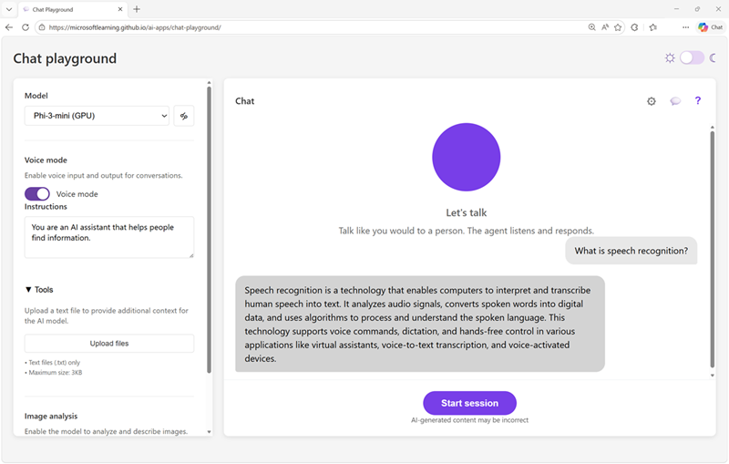

Now it's your chance to explore speech in an AI application! In this exercise, you'll use *voice mode* to interact with a model in the chat playground.

*Use the following button to start the exercise*

