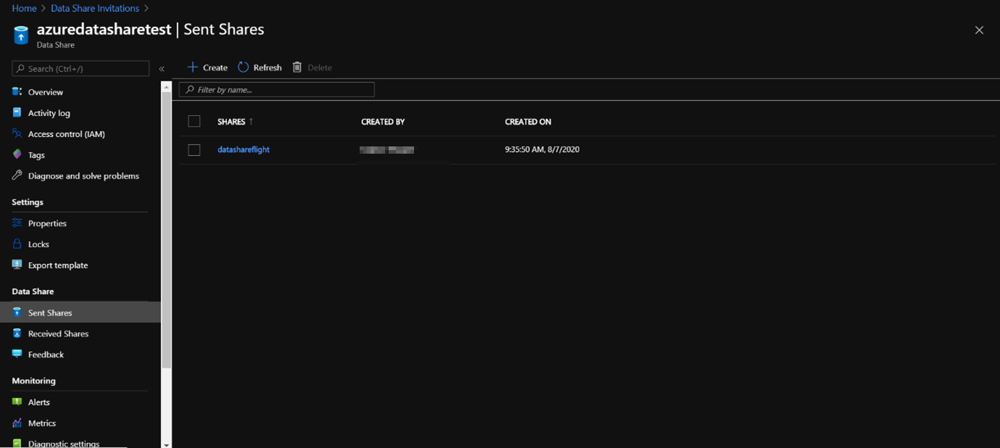
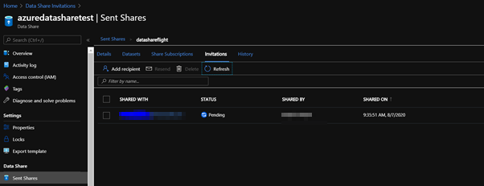
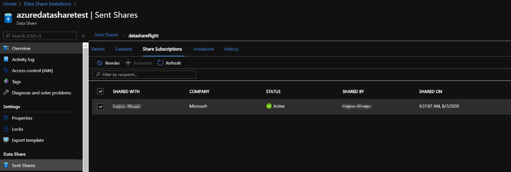
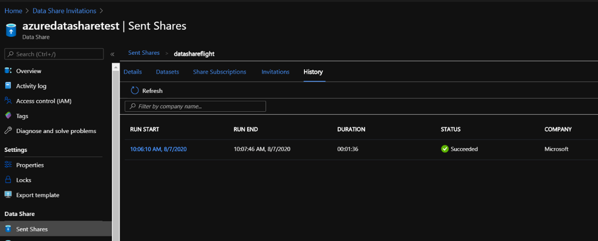
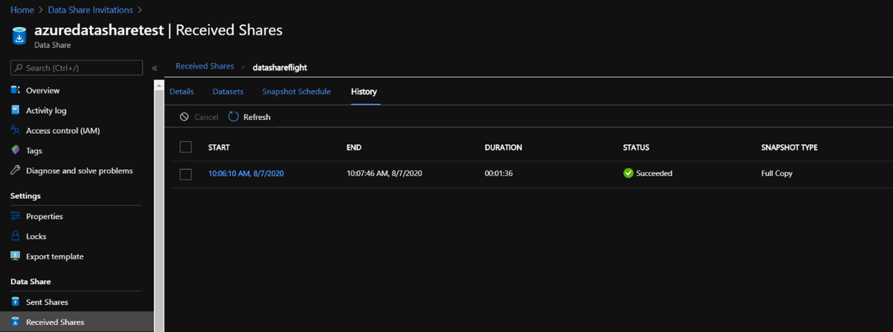
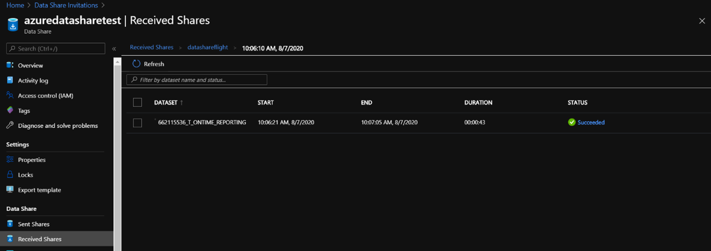
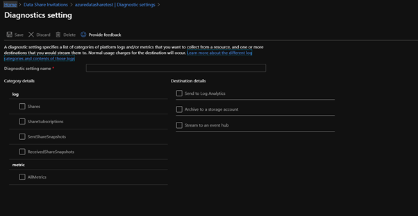
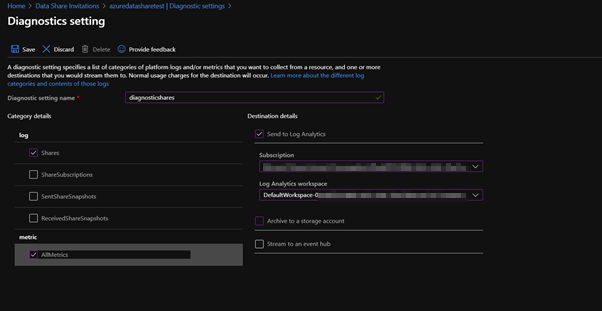

Now you’ve set up a data share, sent a data share and received a data share, it’s important to monitor the Data shares. 

If you want to view the status of the invitations that have been sent out,  navigate to ‘Sent Shares’:

Click on the share you want to see the invitation status of and go to invitations:

If you want to monitor and see the status of the share subscriptions (for example if the subscription is active), you navigate again to ‘Sent Shares’ and click on the Share Subscriptions tab:

If you want to revoke the future updates of the dataset that you’ve shared, you select the share subscription you want to revoke access to and select revoke:

If you’ve shared a snapshot-based Data share, you can monitor by navigating to the ‘sent shares’ and then history tab, to be able to check when data is copied, the frequency and duration/status of the snapshot. 

You can check the same history for the received shares by navigating to ‘Received Shares’ and select the History tab. 

If you click on the run start date, you have the possibility to view more details about the snapshot:

If you want to save log data or event,  configure diagnostic setting. 

Navigate to ‘Monitoring’ and click on Diagnostic Settings, which will redirect you to the following page:

Select ‘Add diagnostic setting’ and select the log data or events that are of your interest including the storage of where to save or sent them. 

Specify the Diagnostic setting name (the name of the file you’re going to save for the diagnostics) In addition, specify the category of what you want to save, and specify the destination details of where to save/sent it. 

Navigate to save, and the settings are saved and you will be able to view the saved diagnostic settings in the ‘Diagnostic’ tab:

