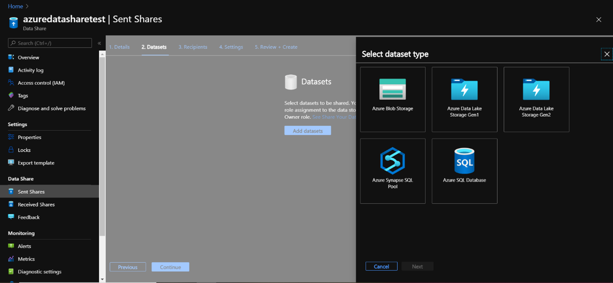
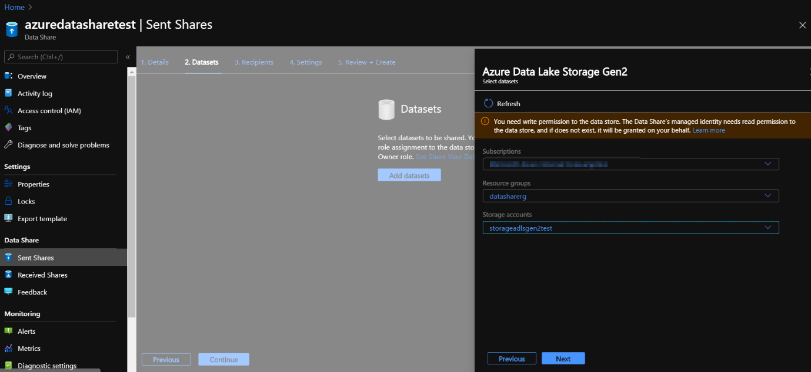
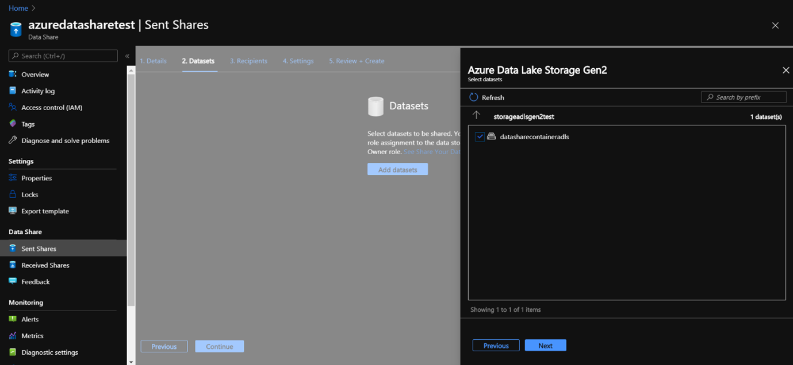
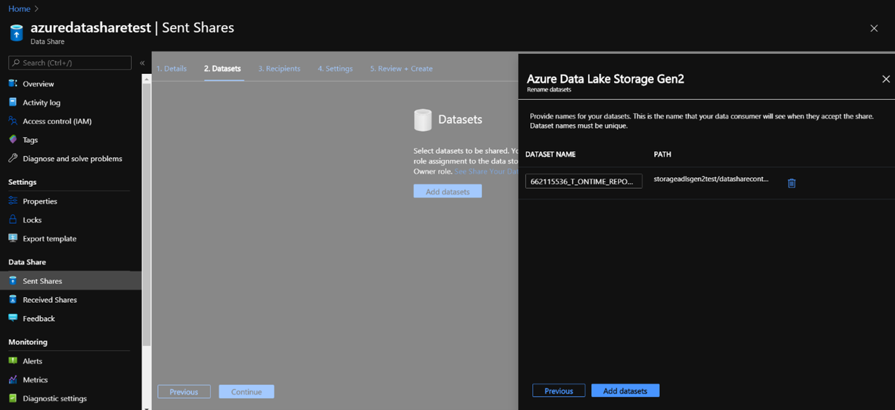
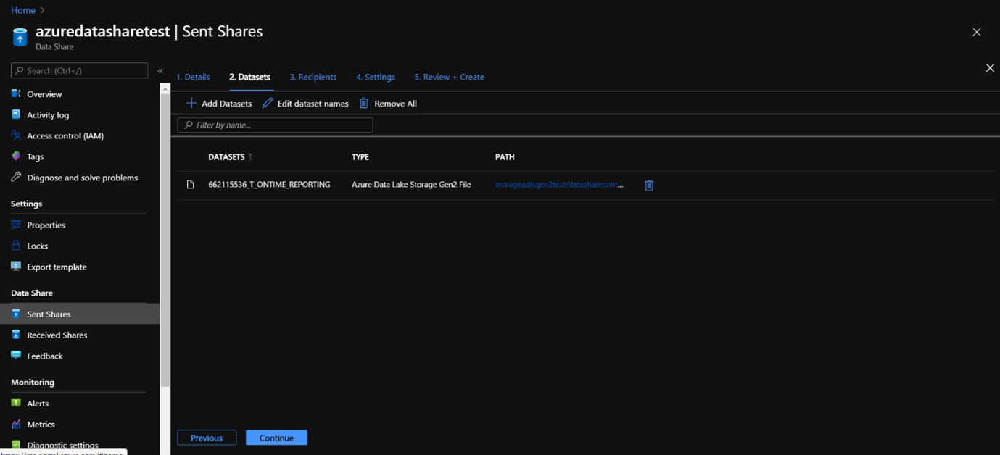
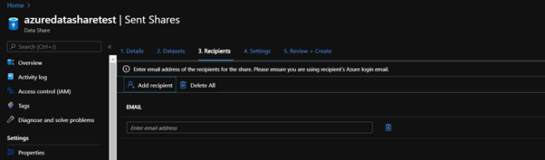
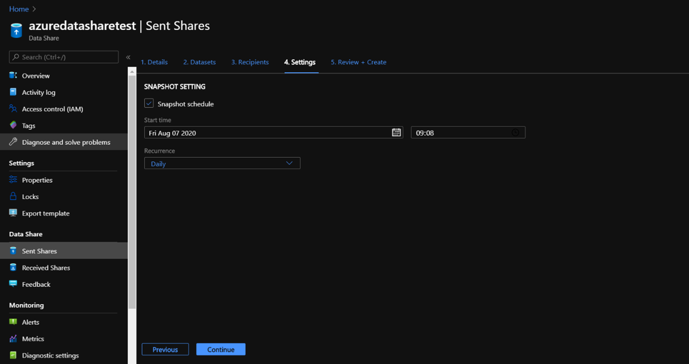
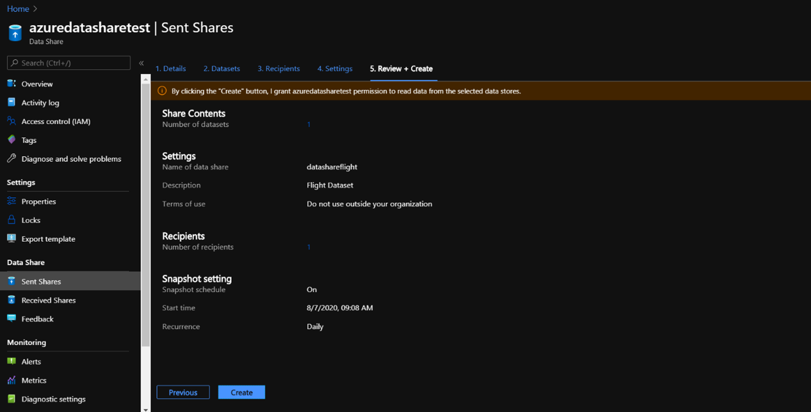

The next step is to share a dataset with Azure Data Share to an organization that Is the data consumer. 

1.	Navigate to the Data share resource to the ‘Overview’ page:

    

2.	In the overview page, select ‘Start sharing your data’  and you’ll be redirected to the following page:

    

3.	If you want to create a dataset that you want to share  select ‘+Create’, which lands you into this screen:
    
    

    There are a couple of settings you need to specify:

    *Share name:*

    Fill out a name for the share you’re going to send to your data consumer

    *Share type:*

    Specify what type of share you want to use which determines how your data will be shared: that is Snapshot or In-Place.

    *Description:*

    Describe the dataset that will be shared and note that this description will be visible to whom you’re sending the data share. 

    *Term of use:*

    Specify the terms of use the data consumer needs to adhere to.
    Consumers will need to consent to the specified terms, in order to accept the share invitation.

    

4.	Then select continue to go to the dataset page

    

5.	Navigate to ‘Add Datasets’ to add datasets to the data share, which you’ll then be directed to:
 
    

    Here you can select the type of dataset that you would like to add. 
    Depending on if you choose Snapshot or In-Place sharing, you’ll see different dataset type possibilities.

6.	In this exercise, we are going to share a dataset from an Azure Data Lake Storage Gen 2 account. 

    Therefore, select Azure Data Lake Storage Gen 2. 

    For using Azure Data Lake Storage Gen 2,  select the subscription the ADLS Gen 2 account is aligned to, the resource group in which you’ve deployed the ADLS Gen 2 as well as the ADLS Gen 2 Storage account that you’ve named the ADLS Gen 2. 

7.	Select ‘Next’. 

    

8.	Select the container in which the files are located in your ADLS Gen 2 of the dataset that you would like to share. You can choose to share the whole container, or if you double-click on the container itself, you can specify the file you’d like to share.

    

9.	Once you’ve specified the file you would like to share, click on ‘next’:

    

    If you are certain that the dataset that you’ve specified can be added as a dataset to your Azure Data Share, then navigate to Add Datasets. 

10.	Once the dataset is added, you’ll be redirected to the following screen:

    

11.	Navigate to the recipients tab where you can navigate to add recipients, and specify the email addresses of the data consumer that you want to share the dataset with. 

    

12.	Select continue to move to the Settings tab. 

    Since we have selected a snapshot type share, the snapshot schedule can be configured in this tab, if you want to provide regular updates of the dataset to your data consumer

    In this tab, you can select a start time and a recurrence interval. It will specify how many times and at what time the dataset will be snapshotted to your data consumer. 

    

13.	Navigate to ‘Continue’, which will land you into the Review + Create Tab page, where you can review the package content, settings, recipients, and synchronization settings. 

    

14.	Select ‘Create’ and you have officially created an Azure Data Share that is sent to the recipient that you’ve specified whom is then ready to accept the Data Share. 
