There are two ways to receive a shared dataset and accept the invitation. In this exercise, we are going to accept an invitation from your email. 

Once you’ve sent a data share to a recipient (i.e. data consumer), this recipient will have an email in their inbox with an invitation. 

The invitation looks like the following image:

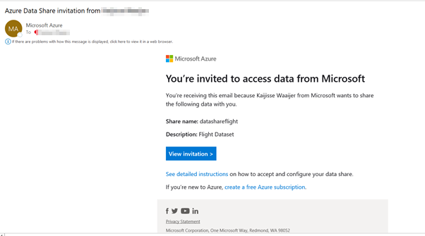

To open the invitation, click on ‘View invitation’ to see the invitation in Azure. 

You’ll be redirected to the following screen in the Azure portal:

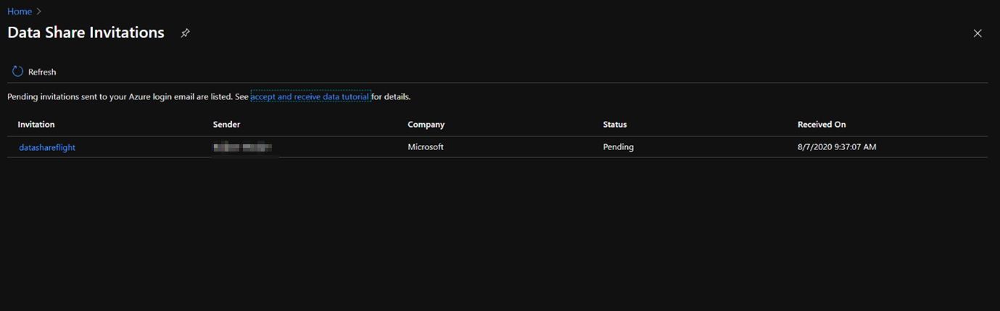

Select the share that you would like to view and you’ll be redirected to the following page:

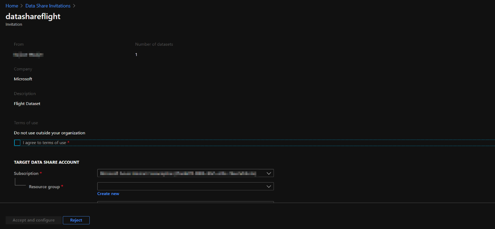

In order to accept this invitation you need to make sure that all the fields are reviewed, as well as to agree to the terms of use that you need to check as an indication for agreement. 

The other settings you need to specify are the Target Data Share Account. Here you’re asked to specify the Subscription and Resource Group in which you want to deploy the received Data Share. 
If you don’t have an existing Data Share account, you would need to create one, by selecting create new. However, in the previous exercise we have created an Azure Data Share account so we can select the Data Share that we set up previously. 

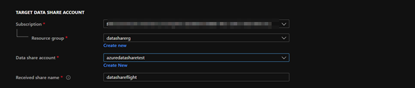

Once you’ve selected the data share account that you want to receive the data share into, you can specify the ‘Received Share Name’ field, in which you can leave it as default, or create a new name for the received share. 

Navigate to accept and configure:

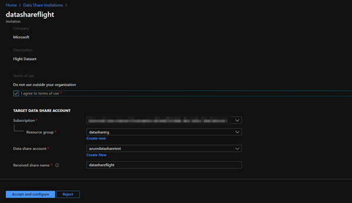

Once you’ve navigated to accept and configure, the agreement of terms of use are in place and the location of the share will be created. Since we have created a snapshot-based sharing, the screen also asks you to select a target storage account for the data to be copied into. If you don’t want to accept the share  navigate to reject, but for the purpose of this exercise we are going to accept and configure. 

You’ll be redirected to the following screen:
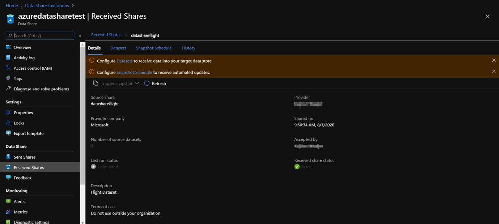

As you can see in the pop-up, we need to configure datasets to receive data into the target datastore, and since we used snapshot-based sharing, we can configure snapshot schedule for automation of updates. 

Navigate to ‘Configure Datasets to receive data into your target data store ‘ and click on Datasets.  You’ll be directed to the following place:

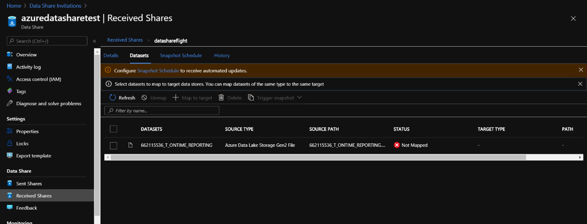

Select the dataset that you are going to map to the target store, and navigate to ‘+Map to target’, you’ll see the following screen:

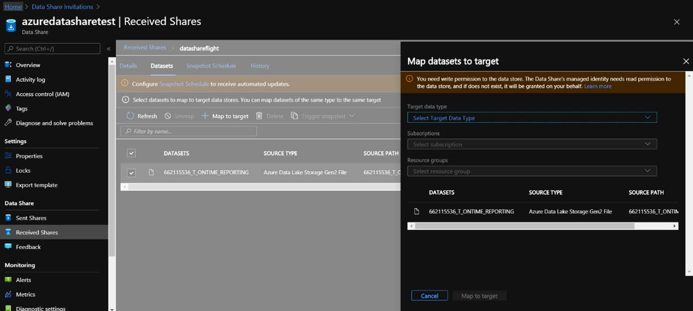

Under Map Datasets to target,  select the subscription, resource group, and storage account that you’d like to receive the dataset into. For this purpose, we are going to receive the dataset into an Azure Data Lake Storage Account Gen 2:

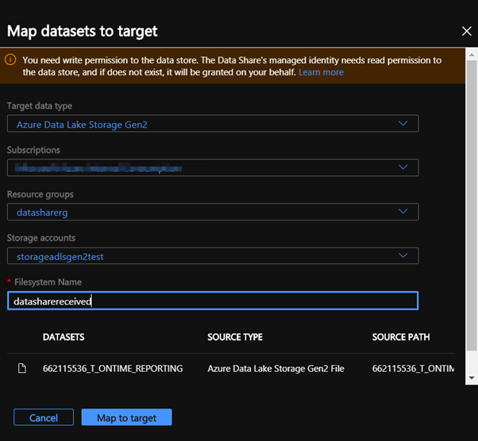

As the Target Data Type, select Azure Data Lake Storage Gen2. Make sure you have selected the subscription you want to receive the dataset into, as well as the resource group, and storage account with a filesystem name. 

Navigate to: ‘Map to Target’. 

You’ll be redirected to the following screen:

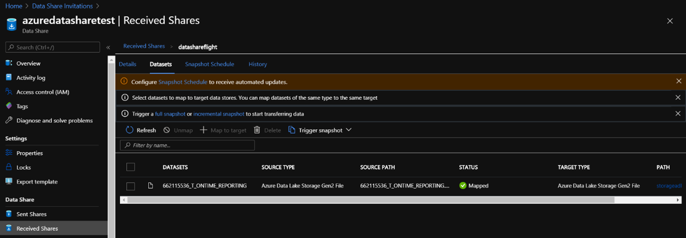

Now that you have set up a target storage account in which you’re going to receive the dataset into it’s important to set up a regular update schedule of the data since we have enabled snapshot-based sharing. 

Navigate to Configure Snapshot Schedule to receive automated updates. 

You’ll be redirected to the following page where you would need to navigate to ‘+Enable’ and set the recurrence interval as you would like. 

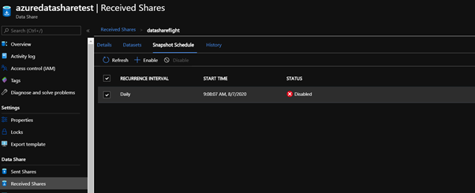

If you want to trigger a snapshot, navigate to ‘Received Shares’ to the ‘Details tab’ and click on ‘Trigger snapshot’

You have two possibilities for triggering snapshots, either Full snapshot, or incremental snapshot of the data. 

When you haven’t triggered a snapshot before, and it is the first time receiving data from the data provider, select a full copy:

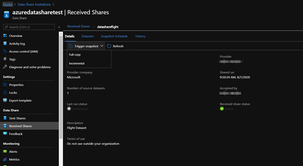

Once the run is successful,  navigate to the target data store to view the dataset that has been received. 

Select ‘ Datasets’ and click on the hyperlink of the ‘Target Path’ that will redirect you to the target datastore where the dataset has now been fully copied into. 

Now you’ve successfully accepted a data share invitation, set up a target storage account and triggered a snapshot of the data into your target storage account. 
