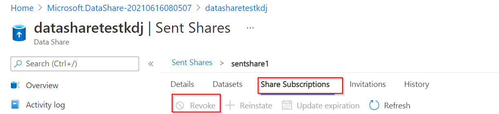

When you have set up an Azure Data Share, you need to monitor the shares that you’ve sent out. 

There are different aspects you can monitor in relation to the data sharing relationships. Examples include monitoring the data consumer's acceptance of the invitation, and checking if the created shared subscription is in place to see if the data consumer used the data that you’ve shared. In relation to snapshot sharing, you might want to monitor triggers of the snapshots into your Azure subscription. 

To monitor the invitation status, you can check the Azure Data Share resource, by navigating to  **Sent Shares** and then **Invitations**.

There are three states of the invitation:

* *Pending:* The recipient of the shared dataset has not accepted the invitation (yet).
* *Accepted:* The Data Share recipient has accepted your invitation to start sharing data.
* *Rejected:* The Data Share recipient has declined the invitation. 

If you accidentally sent a dataset that needed to be shared with a different recipient, deleting the invitation after it has been accepted won’t revoke the access. If you need to revoke the access to the dataset, you should do so through **Revoke** in the **Share Subscriptions** tab. 

To monitor the share subscriptions, you can check the status in the Azure portal if you navigate to **Sent Shares** and then **Share Subscriptions**. In this tab, you can find details about active subscriptions created by the data consumers after they’ve accepted your invitation. If you want to stop updates to the data consumer, you should revoke the access to the share by selecting the share subscription and revoke. You can also check in the **History** tab of the share; when data is copied from you as a data provider, to the data consumer’s data store where parameters such as duration, frequency, and status of each snapshot can be monitored. 
If you’ve selected a snapshot-based share, you’re able to view more details if you check the run start date. You will be able to view the following extra details (for up to 30 days):

* The status for every dataset you’ve shared
* The amount of data that was transferred
* The number of files copied
* The duration of the snapshot
* The number of vCores used
* Error messages

To see and save more than the default 30 days of history, you can use the diagnostic setting in which you save log data and events that are of interest. 

Now you have learned about monitoring data shares, in the next topic you will perform an exercise to track and monitor shares. 
