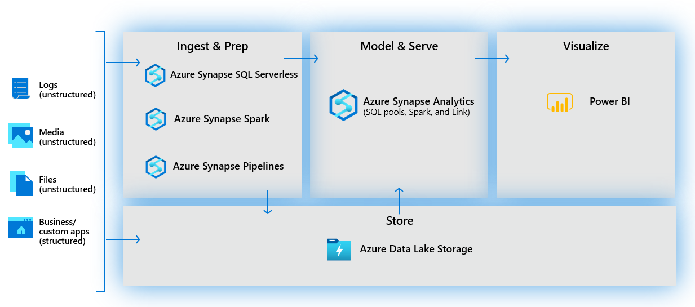
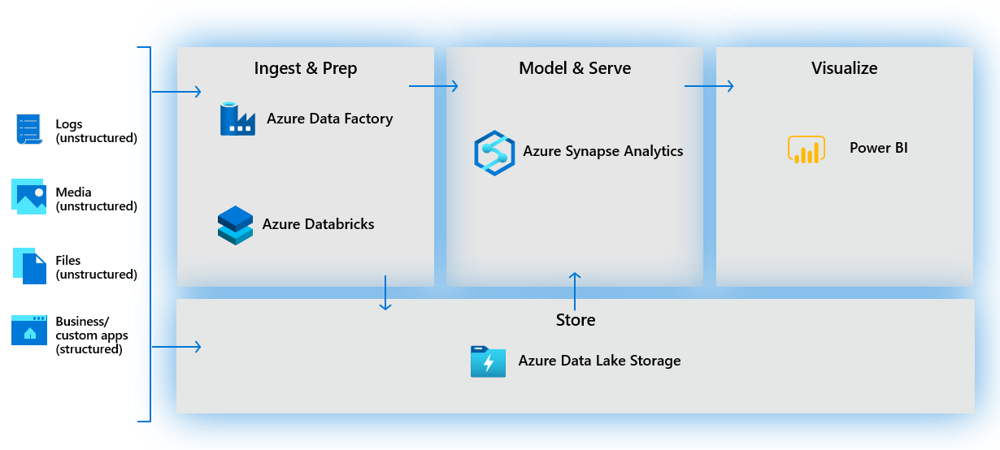

Across all organizations and industries, the common use cases for Azure Synapse Analytics are identified by the need for:

## Modern data warehousing

This involves the ability to integrate all data, including big data, to reason over data for analytics and reporting purposes from a descriptive analytics perspective, independent of its location or structure.

## Advanced analytics

Enables organizations to perform predictive analytics using both the native features of Azure Synapse Analytics, and integrating with other technologies such as Azure Databricks.

## Data exploration and discovery

The SQL serverless functionality provided by Azure Synapse Analytics enables Data Analysts, Data Engineers and Data Scientist alike to explore the data within your data estate. This capability supports data discovery, diagnostic analytics, and exploratory data analysis.

## Real time analytics

Azure Synapse Analytics can capture, store and analyze data in real-time or near-real time with features such as Azure Synapse Link, or through the integration of services such as Azure Stream Analytics and Azure Data Explorer.

## Data integration

Azure Synapse Pipelines enables you to ingest, prepare, model and serve the data to be used by downstream systems. This can be used by components of Azure Synapse Analytics exclusively.
 

It can also interact with existing Azure services that you may already have in place for your existing analytical solutions.
 

## Integrated analytics

With the variety of analytics that can be performed on the data at your disposal, putting together the services in a cohesive solution can be a complex operation. Azure Synapse Analytics removes this complexity by integrating the analytics landscape into on service. That way you can spend more time working with the data to bring business benefit, than spending much of your time provisioning and maintaining multiple systems to achieve the same outcomes. 
