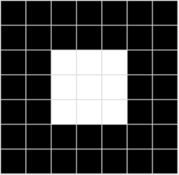
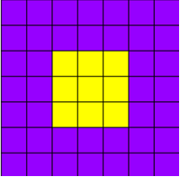

Computer vision capabilities can be categorized into a few main types: 

|**Type**|**Description**|
|-|-|
|**Image analysis**| The ability to detect, classify, caption, and generate insights.|
|**Spatial analysis**| The ability to understand people's presence and movements within physical areas in real time.|
|**Facial recognition**|The ability to recognize and verify human identity.|
|**Optical character recognition (OCR)**| The ability to extract printed and handwritten text from images with varied languages and writing styles.|

To understand these computer vision capabilities, it's useful to consider what an image actually *is* in the context of data for a computer program.

## Images as pixel arrays

To a computer, an image is an array of numeric *pixel* values. For example, consider the following array:

```
 0   0   0   0   0   0   0  
 0   0   0   0   0   0   0
 0   0  255 255 255  0   0
 0   0  255 255 255  0   0
 0   0  255 255 255  0   0
 0   0   0   0   0   0   0
 0   0   0   0   0   0   0
```

The array consists of seven rows and seven columns, representing the pixel values for a 7x7 pixel image (which is known as the image's *resolution*). Each pixel has a value between 0 (black) and 255 (white); with values between these bounds representing shades of gray. The image represented by this array looks similar to the following (magnified) image:



The array of pixel values for this image is two-dimensional (representing rows and columns, or *x* and *y* coordinates) and defines a single rectangle of pixel values. A single layer of pixel values like this represents a grayscale image. In reality, most digital images are multidimensional and consist of three layers (known as *channels*) that represent red, green, and blue (RGB) color hues. For example, we could represent a color image by defining three channels of pixel values that create the same square shape as the previous grayscale example:

```
Red:
 150  150  150  150  150  150  150  
 150  150  150  150  150  150  150
 150  150  255  255  255  150  150
 150  150  255  255  255  150  150
 150  150  255  255  255  150  150
 150  150  150  150  150  150  150
 150  150  150  150  150  150  150

Green:
 0    0    0    0    0    0    0          
 0    0    0    0    0    0    0
 0    0   255  255  255   0    0
 0    0   255  255  255   0    0
 0    0   255  255  255   0    0
 0    0    0    0    0    0    0
 0    0    0    0    0    0    0

Blue:
 255  255  255  255  255  255  255  
 255  255  255  255  255  255  255
 255  255   0    0    0   255  255
 255  255   0    0    0   255  255
 255  255   0    0    0   255  255
 255  255  255  255  255  255  255
 255  255  255  255  255  255  255
```

Here's the resulting image:



The purple squares are represented by the combination: 
```
Red: 150 
Green: 0 
Blue: 255 
```

The yellow squares in the center are represented by the combination: 
```
Red: 255
Green: 255
Blue: 0
```

Next, let's explore how images are processed.