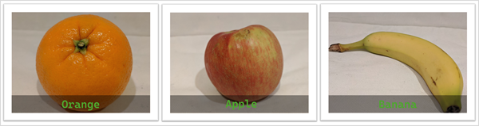
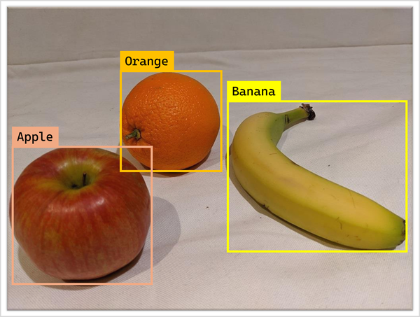
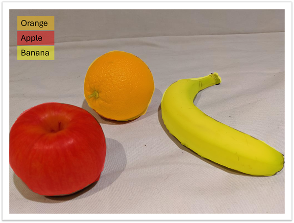

::: zone pivot="video"

>[!VIDEO https://learn-video.azurefd.net/vod/player?id=7a48f6b9-958e-49eb-9db0-8a8f4f9b6727]

> [!NOTE]
> See the **Text and images** tab for more details!

::: zone-end

::: zone pivot="text"

The term "computer vision" refers to a range of tasks and techniques in which AI software processes visual input; typically from images, videos, or live camera streams. Computer vision is a well-established field of AI, and the techniques used to extract information from visual input have evolved significantly over the years.

## Image classification

One of the oldest computer vision solutions is a technique called *image classification*, in which a model that has been trained with a large number of images is used to predict a text label based on an image's contents.

For example, suppose a grocery store wants to implement smart checkout system that identifies produce automatically. For example, the customer could place fruits or vegetables on a scale at the checkout, and an AI application connected to a camera could automatically identify the types of produce (apple, orange, banana, and so on) and charge the appropriate amount based on its weight. For this solution to work, a model would need to be trained with a large volume of images, each labeled with the correct name. The result is a model that can use the visual features of an image to predict its main subject.

## Object detection

Suppose the grocery store wants a more sophisticated system, in which the checkout can scan multiple items on the checkout and identify each of them. A common approach to this type of problem is called "object detection". Object detection models examine multiple regions in an image to find individual objects and their locations. The resulting prediction from the model includes which objects were detected, and the specific regions of the image in which they appear - indicated by the coordinates of the rectangular bounding box.

## Semantic segmentation

Another, more sophisticated way to detect objects in an image, is called "semantic segmentation". In this approach, a model is trained to find objects, and classify individual pixels in the image based on the object to which they belong. The result of this process is a much more precise prediction of the location of objects in the image.

## Contextual image analysis

The latest *multimodal* computer vision models are trained to find contextual relationships between objects in images and the text that describes them. The result is an ability to semantically interpret an image to determine what objects and activities it depicts; and generate appropriate descriptions or suggest relevant tags.

***A person eating an apple.***

::: zone-end