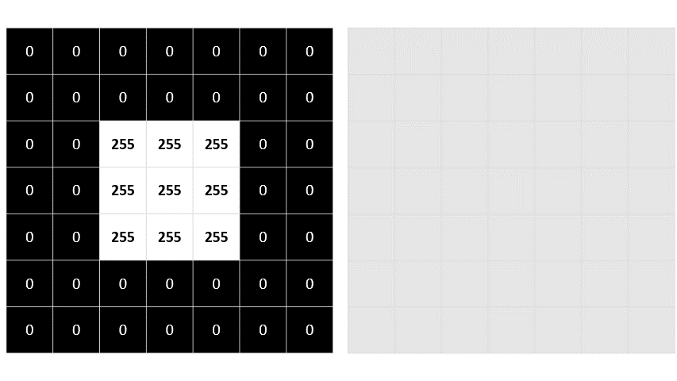
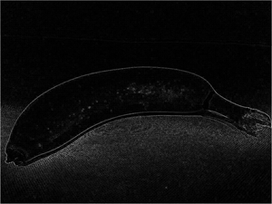

A common way to perform image processing tasks is to apply *filters* that modify the pixel values of the image to create a visual effect. A filter is defined by one or more arrays of pixel values, called filter *kernels*. For example, you could define filter with a 3x3 kernel as shown in this example:

```
-1 -1 -1
-1  8 -1
-1 -1 -1
```

The kernel is then *convolved* across the image, calculating a weighted sum for each 3x3 patch of pixels and assigning the result to a new image. It's easier to understand how the filtering works by exploring a step-by-step example.

Let's start with the grayscale image we explored previously:

```
 0   0   0   0   0   0   0  
 0   0   0   0   0   0   0
 0   0  255 255 255  0   0
 0   0  255 255 255  0   0
 0   0  255 255 255  0   0
 0   0   0   0   0   0   0
 0   0   0   0   0   0   0
```

First, we apply the filter kernel to the top left patch of the image, multiplying each pixel value by the corresponding weight value in the kernel and adding the results:

```
(0 x -1) + (0 x -1) + (0 x -1) +
(0 x -1) + (0 x 8) + (0 x -1) +
(0 x -1) + (0 x -1) + (255 x -1) = -255
```

The result (-255) becomes the first value in a new array. Then we move the filter kernel along one pixel to the right and repeat the operation:

```
(0 x -1) + (0 x -1) + (0 x -1) +
(0 x -1) + (0 x 8) + (0 x -1) +
(0 x -1) + (255 x -1) + (255 x -1) = -510
```

Again, the result is added to the new array, which now contains two values:

```
-255  -510
```

The process is repeated until the filter has been convolved across the entire image, as shown in this animation:



The filter is convolved across the image, calculating a new array of values. Some of the values might be outside of the 0 to 255 pixel value range, so the values are adjusted to fit into that range. Because of the shape of the filter, the outside edge of pixels isn't calculated, so a padding value (usually 0) is applied. The resulting array represents a new image in which the filter has transformed the original image. In this case, the filter has had the effect of highlighting the *edges* of shapes in the image.

To see the effect of the filter more clearly, here's an example of the same filter applied to a real image:

| Original Image | Filtered Image |
|--|--|
|| |

Because the filter is convolved across the image, this kind of image manipulation is often referred to as *convolutional filtering*. The filter used in this example is a particular type of filter (called a *laplace* filter) that highlights the edges on objects in an image. There are many other kinds of filter that you can use to create blurring, sharpening, color inversion, and other effects.

Next, let's connect concepts of convolutional filtering to modern vision models. 