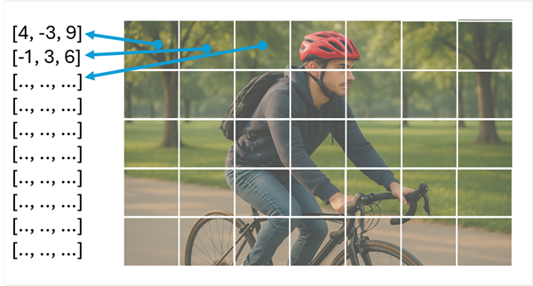
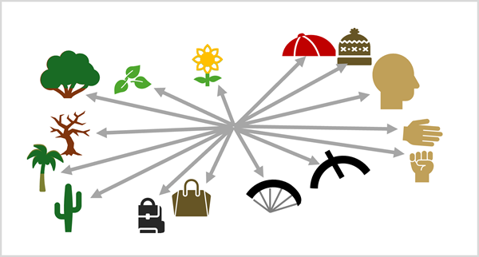

::: zone pivot="video"

>[!VIDEO https://learn-video.azurefd.net/vod/player?id=610f7e89-2441-4e57-adf8-5bda0d2157bb]

> [!NOTE]
> See the **Text and images** tab for more details!

::: zone-end

::: zone pivot="text"

CNNs have been at the core of computer vision solutions for many years. While they're commonly used to solve image classification problems as described previously, they're also the basis for more complex computer vision models. For example, *object detection* models combine CNN feature extraction layers with the identification of *regions of interest* in images to locate multiple classes of object in the same image. Many advances in computer vision over the decades have been driven by improvements in CNN-based models.

However, in another AI discipline - *natural language processing* (NLP), another type of neural network architecture, called a *transformer* has enabled the development of sophisticated models for language. 

## Semantic modeling for language - Transformers

Transformers work by processing huge volumes of data, and encoding language *tokens* (representing individual words or phrases) as vector-based *embeddings* (arrays of numeric values). A technique called *attention* is used to assign embedding values that reflect different aspects of how each token is used in the context of other tokens. You can think of the embeddings as vectors in multidimensional space, in which each dimension embeds a linguistic attribute of a token based on its context in the training text, creating semantic relationships between tokens. Tokens that are commonly used in similar contexts define vectors that are more closely aligned than unrelated words.

Tokens that are semantically similar are encoded in similar directions, creating a semantic language model that makes it possible to build sophisticated NLP solutions for text analysis, translation, language generation, and other tasks.

> [!NOTE]
> In reality, encoders in transformer networks create vectors with many more dimensions, defining complex semantic relationships between tokens based on linear algebraic calculations. The math involved is complex, as is the architecture of a transformer model. Our goal here is just to provide a *conceptual* understanding of how encoding creates a model that encapsulates relationships between entities.

## Semantic model for images - Vision transformers

The success of transformers as a way to build language models has led AI researchers to consider whether the same approach would be effective for image data. The result is the development of *vision transformer* (ViT) models, in which a model is trained using a large volume of images. Instead of encoding text-based tokens, the transformer extracts *patches* of pixel values from the image, and generates a linear vector from the pixel values.

The same *attention* technique that's used in language models to embed contextual relationships between tokens, is used to determine contextual relationships between the patches. The key difference is that instead of encoding linguistic characteristics into the embedding vectors, the embedded values are based on visual features, like color, shape, contrast, texture, and so on. The result is a set of embedding vectors that creates a multidimensional "map" of visual features based on how they are commonly seen in the training images.

As with language models, the embeddings result in visual features that are used in similar context being assigned similar vector directions. For example, the visual features common in a *hat* may be contextually related to the visual features that are common in a *head*; because the two things are often seen together. The model has no understanding of what a "hat" or a "head" *is*; but it can infer a semantic relationship between the visual characteristics.

## Bringing it all together - Multimodal models

A language transformer creates embeddings that define a linguistic vocabulary that encode semantic relationships between words. A vision transformer creates a visual vocabulary that does the same for visual features. When the training data includes images with associated text descriptions, we can combine the encoders from both of these transformers in a *multimodal* model; and use a technique called *cross-model attention* to define a unified spatial representation of the embeddings, like this.

This combination of language and vision embeddings enables the model to discern semantic relationships between language and visual features. This capability in turn enables the model to predict complex descriptions for images it hasn't previously seen, by recognizing visual features and searching the shared vector space for associated language.

***A person in a park with a hat and a backpack***

::: zone-end