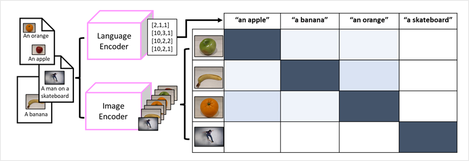
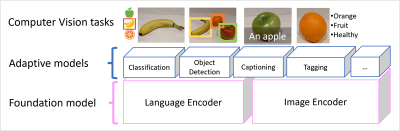

CNNs have been at the core of computer vision solutions for many years. While they're commonly used to solve image classification problems as described previously, they're also the basis for more complex computer vision models. For example, *object detection* models combine CNN feature extraction layers with the identification of *regions of interest* in images to locate multiple classes of object in the same image.

### Transformers

Most advances in computer vision over the decades have been driven by improvements in CNN-based models. However, in another AI discipline - *natural language processing* (NLP), another type of neural network architecture, called a *transformer* has enabled the development of sophisticated models for language. Transformers work by processing huge volumes of data, and encoding language *tokens* (representing individual words or phrases) as vector-based *embeddings* (arrays of numeric values). You can think of an embedding as representing a set of dimensions that each represent some semantic attribute of the token. The embeddings are created such that tokens that are commonly used in the same context define vectors that are more closely aligned than unrelated words.

As a simple example, the following diagram shows some words encoded as three-dimensional vectors, and plotted in a 3D space:

Tokens that are semantically similar are encoded in similar directions, creating a semantic language model that makes it possible to build sophisticated NLP solutions for text analysis, translation, language generation, and other tasks.

> [!NOTE]
> We've used only three dimensions, because that's easy to visualize. In reality, encoders in transformer networks create vectors with many more dimensions, defining complex semantic relationships between tokens based on linear algebraic calculations. The math involved is complex, as is the architecture of a transformer model. Our goal here is just to provide a *conceptual* understanding of how encoding creates a model that encapsulates relationships between entities.

### Multi-modal models

The success of transformers as a way to build language models has led AI researchers to consider whether the same approach would be effective for image data. The result is the development of *multi-modal* models, in which the model is trained using a large volume of captioned images, with no fixed *labels*. An image encoder extracts features from images based on pixel values and combines them with text embeddings created by a language encoder. The overall model encapsulates relationships between natural language token embeddings and image features, as shown here:

## Bringing it all together 

Modern vision models are trained with huge volumes of captioned images from the internet and include both a language encoder and an image encoder. Often users will interact with and adapted *foundation* models. Foundation models are pre-trained general models on which you can build multiple *adaptive* models for specialist tasks. For example, you can adapt a foundation model to perform:

- *Image classification*: Identifying to which category an image belongs.
- *Object detection*: Locating individual objects within an image.
- *Captioning*: Generating appropriate descriptions of images.
- *Tagging*: Compiling a list of relevant text tags for an image.

Multi-modal models are at the cutting edge of computer vision and AI in general, and are expected to drive advances in the kinds of solution that AI makes possible.