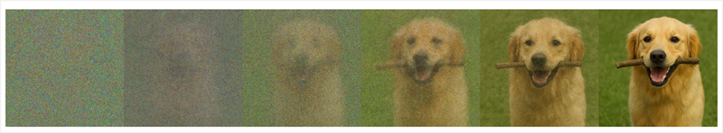

::: zone pivot="video"

>[!VIDEO https://learn-video.azurefd.net/vod/player?id=2f73654c-1e2d-4965-9ad9-acd870573c2f]

> [!NOTE]
> See the **Text and images** tab for more details!

::: zone-end

::: zone pivot="text"

The same multimodal model architecture that enables AI to create natural language responses to visual input, can also be used to enable it to create images in response to natural language prompts. By identifying the visual features associated with language, an image synthesis model can take a description of a desired image or video and generate it.

Most modern image-generation models use a technique called *diffusion*, in which a prompt is used to identify a set of related visual features that can be combined to create an image. The image is then created iteratively, starting with a random set of pixel values and removing "noise" to create structure. After each iteration, the model evaluates the image so far to compare it to the prompt, until a final image that depicts the desired scene is produced.

For example, the prompt *"A dog carrying a stick in its mouth"* might result in a diffusion process with the following iterations:

Some models can apply a similar process to generating video. The video generation process uses the same technique to identify visual features that are associated with language tokens, but also takes into account factors like the physical behavior of objects in the real world (such as ensuring that a dog walks with its feet on the ground) and the temporal progression (so that the video depicts a logical sequence of activity).

::: zone-end