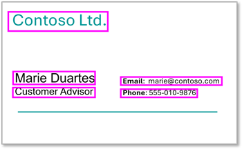

::: zone pivot="video"

>[!VIDEO https://learn-video.azurefd.net/vod/player?id=3605f75b-d90c-4e11-a627-1f6632f52547]

::: zone-end

::: zone pivot="text"

AI information extraction solutions are commonly used extract structured data fields from unstructured media such as documents, images, and even videos and audio recordings.

> [!NOTE]
> While we'll focus on information extraction from documents and images in this module, AI solutions are emerging that use speech recognition and other advanced techniques to extract information from different media formats, such as videos and audio recordings.

Scenarios for information extraction range from simple apps that can read contact information from a photograph of a business card, to highly complex business workflow automation systems that analyze and process financial and legal documents.

Some common examples of information extraction scenarios include:

### Financial document processing

**Invoice processing** solutions can analyze invoices to extract:

- **Vendor information**: Company names, addresses, and contact details.
- **Transaction details**: Invoice numbers, dates, and payment terms.
- **Line items**: Product descriptions, quantities, unit prices, and totals.
- **Tax information**: Tax rates, amounts, and exempt items.

**Receipt processing** solutions might need to read receipts to extract:

- **Merchant details**: Store names, locations, and transaction IDs.
- **Purchase information**: Items purchased, prices, and discounts.
- **Payment details**: Payment methods, change amounts, and loyalty points.

**Financial statements** can be processed to extract:

- **Account information**: Account numbers, balances, and transaction histories.
- **Performance metrics**: Revenue, expenses, and profit margins.
- **Compliance data**: Regulatory reporting fields, and audit trail information.

### Legal and compliance documents

**Contract processing** solutions can be used to extract:

- **Party information**: Contracting parties, signatories, and witnesses.
- **Terms and conditions**: Effective dates, renewal terms, and termination clauses.
- **Financial terms**: Payment schedules, penalties, and insurance requirements.

**Regulatory forms** that might need to be processed include:

- **Tax documents**: W-2s, 1099s, and other tax forms.
- **Insurance forms**: Policy numbers, claim amounts, and incident details.
- **Government forms**: Application data and certification requirements.

### Healthcare documentation

**Medical records** can be processed to retrieve:

- **Patient information**: Demographics, medical record numbers, and insurance details.
- **Clinical data**: Diagnoses, treatments, medication lists, and vital signs.
- **Administrative data**: Appointment schedules, billing codes, and provider information.

### Supply chain and logistics

**Shipping documents** often contain vital details such as:

- **Shipment details**: Tracking numbers, weights, and dimensions.
- **Address information**: Sender and recipient details, and delivery instructions.
- **Customs documentation**: Commodity codes, values, and geographical origin.

**Purchase Orders** are commonly processed to extract:

- **Vendor information**: Supplier details and contact information.
- **Product specifications**: Item codes, descriptions, and quantities.
- **Delivery requirements**: Schedules, locations, and special instructions.

Using AI to extract information can be the foundation of workload automation systems for these scenarios, and many more.

::: zone-end

> [!NOTE]
> We recognize that different people like to learn in different ways. You can choose to complete this module in video-based format or you can read the content as text and images. The text contains greater detail than the videos, so in some cases you might want to refer to it as supplemental material to the video presentation.