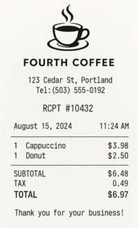

::: zone pivot="video"

>[!VIDEO https://learn-video.azurefd.net/vod/player?id=86f5598a-6f4c-423e-86ab-28325df6e4d4]

> [!NOTE]
> See the **Text and images** tab for more details!

::: zone-end

::: zone pivot="text"

Information extraction is a workload that combines multiple AI techniques to extract data from content - often digital documents. A comprehensive information extraction solution involves elements of computer vision to detect text in image-based data; and machine learning, or increasingly generative AI, to semantically map the extracted text to specific data fields.

1. Text detection and extraction from images using optical character recognition (OCR).
1. Value identification and mapping from the OCR results to data fields.

For example, an AI-powered expense claim processing solution might automatically extract the relevant fields from receipts to process claims more efficiently.

| Scanned receipt | Extracted data |
| -- |--|
| |<ul><li>**Vendor**: Fourth Coffee</li><li>**Date**: 2024-08-15</li><li>**Subtotal**: $6.48</li><li>**Tax**: $0.49</li><li>**Total Claim**: $6.97</li></ul> |

## Choosing the right approach

When planning an information extraction solution, it's important to consider the requirements and constraints that the system must address. Some key considerations include:

- **Document characteristics**. The documents from which you need to extract data are the basis of the whole solution. Consider factors like:
    - **Layout consistency**: Standardized forms favor template-based approaches, while a need to process multiple formats and layouts might require a more complex machine learning based solution.
    - **Volume requirements**: High-volume processing benefits from automated machine learning models that run on optimized system hardware.
    - **Accuracy requirements**: Critical applications might need human-in-the-loop validation.

- **Technical infrastructure requirements and constraints**. Your solution will require hardware and software infrastructure to run. Consider factors like:
    - **Security and privacy**: The documents you're processing might contain sensitive or confidential data. Your solution must include adequate measures to secure access to the data and compliance with any industry requirements for storing and processing protected data.
    - **Processing power**: Deep learning and generative AI models commonly used in information extraction solutions require significant computational resources.
    - **Latency requirements**: Real-time processing might limit model complexity.
    - **Scalability needs**: Cloud-based solutions offer better scalability for variable workloads.
    - **Integration complexity**: Consider API compatibility and data format requirements.

> [!TIP]
> In many cases, information extraction solutions can be built using software services, such as Azure Document Intelligence in Microsoft Foundry Tools and Azure Content Understanding in Microsoft Foundry Tools. Using services such as these as the foundation for your solution can greatly reduce the development effort required while providing highly scalable, industry-proven performance, accuracy, and integration capabilities.

::: zone-end