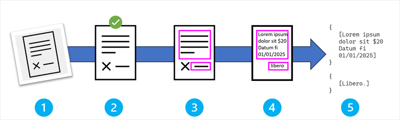

::: zone pivot="video"

>[!VIDEO https://learn-video.azurefd.net/vod/player?id=46c2f551-20e9-4584-8350-7fd7fa4bea67]

> [!NOTE]
> See the **Text and images** tab for more details!

::: zone-end

::: zone pivot="text"

Optical Character Recognition (OCR) is a technology that automatically converts visual text in images - whether from scanned documents, photographs, or digital files—into editable, searchable text data. Rather than manually transcribing information, OCR enables automated data extraction from:

- Scanned invoices and receipts
- Digital photographs of documents
- PDF files containing images of text
- Screenshots and captured content
- Forms and handwritten notes

## The OCR pipeline: A step-by-step process

The OCR pipeline consists of five essential stages that work together to transform visual information into text data.

The stages in the OCR process are:

1. Image acquisition and input.
1. Preprocessing and image enhancement.
1. Text region detection.
1. Character recognition and classification.
1. Output generation and post-processing.

Let's examine each stage in more depth.

### Stage 1: Image acquisition and input

The pipeline begins when an image containing text enters the system. This could be:

- A photograph taken with a smartphone camera.
- A scanned document from a flatbed or document scanner.
- A frame extracted from a video stream.
- A PDF page rendered as an image.

> [!TIP]
> Image quality at this stage significantly impacts the final accuracy of text extraction.

### Stage 2: Preprocessing and image enhancement

Before text detection begins, the following techniques are used to optimize the image for better recognition accuracy:

- **Noise reduction** removes visual artifacts, dust spots, and scanning imperfections that could interfere with text detection. The specific techniques used to perform noise reduction include:

    - **Filtering and image processing algorithms**: Gaussian filters, median filters, and morphological operations.
    - **Machine learning models**: Denoising autoencoders and convolutional neural networks (CNNs) trained specifically for document image cleanup.

- **Contrast adjustment** enhances the difference between text and background to make characters more distinct. Again, there are multiple possible approaches:

    - **Classical methods**: Histogram equalization, adaptive thresholding, and gamma correction.
    - **Machine learning**: Deep learning models that learn optimal enhancement parameters for different document types.

- **Skew correction** detects and corrects document rotation, ensuring text lines are properly aligned horizontally. Techniques for skew correction include:

    - **Mathematical techniques**: Hough transform for line detection, projection profiles, and connected component analysis.
    - **Neural network models**: Regression CNNs that predict rotation angles directly from image features.

- **Resolution optimization** adjusts image resolution to the optimal level for character recognition algorithms. You can optimize image resolution with:

    - **Interpolation methods**: Bicubic, bilinear, and Lanczos resampling algorithms.
    - **Super-resolution models**: Generative adversarial networks (GANs) and residual networks that intelligently upscale low-resolution text images.

### Stage 3: Text region detection

The system analyzes the preprocessed image to identify areas that contain text by using the following techniques:

- **Layout analysis** distinguishes between text regions, images, graphics, and white space areas. Techniques for layout analysis include:

    - **Traditional approaches**: Connected component analysis, run-length encoding, and projection-based segmentation.
    - **Deep learning models**: Semantic segmentation networks like U-Net, Mask R-CNN, and specialized document layout analysis models (for example, LayoutLM, or PubLayNet-trained models).

- **Text block identification** groups individual characters into words, lines, and paragraphs based on spatial relationships. Common approaches include:

    - **Classical methods**: Distance-based clustering, white space analysis, and morphological operations
    - **Neural networks**: Graph neural networks and transformer models that understand spatial document structure

- **Reading order determination** establishes the sequence in which text should be read (left-to-right, top-to-bottom for English). The correct order can be determined by:

    - **Rule-based systems**: Geometric algorithms using bounding box coordinates and spatial heuristics.
    - **Machine learning models**: Sequence prediction models and graph-based approaches that learn reading patterns from training data.

- **Region classification** identifies different types of text regions (headers, body text, captions, tables).

    - **Feature-based classifiers**: Support vector machines (SVMs) using handcrafted features like font size, position, and formatting
    - **Deep learning models**: Convolutional neural networks and vision transformers trained on labeled document datasets

### Stage 4: Character recognition and classification

This is the core of the OCR process where individual characters are identified:

- **Feature extraction**: Analyzes the shape, size, and distinctive characteristics of each character or symbol.
    - **Traditional methods**: Statistical features like moments, Fourier descriptors, and structural features (loops, endpoints, intersections)
    - **Deep learning approaches**: Convolutional neural networks that automatically learn discriminative features from raw pixel data

- **Pattern matching**: Compares extracted features against trained models that recognize different fonts, sizes, and writing styles.
    - **Template matching**: Direct comparison with stored character templates using correlation techniques
    - **Statistical classifiers**: Hidden Markov Models (HMMs), Support Vector Machines, and k-nearest neighbors using feature vectors
    - **Neural networks**: Multi-layer perceptrons, CNNs, and specialized architectures like LeNet for digit recognition
    - **Advanced deep learning**: Residual networks (ResNet), DenseNet, and EfficientNet architectures for robust character classification

- **Context analysis**: Uses surrounding characters and words to improve recognition accuracy through dictionary lookups and language models.
    - **N-gram models**: Statistical language models that predict character sequences based on probability distributions.
    - **Dictionary-based correction**: Lexicon lookup with edit distance algorithms (such as *Levenshtein distance*) for spelling correction.
    - **Neural language models**: LSTM and transformer-based models (like BERT variants) that understand contextual relationships.
    - **Attention mechanisms**: Transformer models that focus on relevant parts of the input when making character predictions.

- **Confidence scoring**: Assigns probability scores to each recognized character based on how certain the system is about its identification.
     - **Bayesian approaches**: Probabilistic models that quantify uncertainty in character predictions.
    - **Softmax outputs**: Neural network final layer activations converted to probability distributions.
    - **Ensemble methods**: Combining predictions from multiple models to improve confidence estimates.

### Stage 5: Output generation and post-processing

The final stage converts recognition results into usable text data:

- **Text compilation**: Assembles individual character recognitions into complete words and sentences.
    - **Rule-based assembly**: Deterministic algorithms that combine character predictions using spatial proximity and confidence thresholds.
    - **Sequence models**: Recurrent neural networks (RNNs) and Long Short-Term Memory (LSTM) networks that model text as sequential data.
    - **Attention-based models**: Transformer architectures that can handle variable-length sequences and complex text layouts.

- **Format preservation**: Maintains document structure including paragraphs, line breaks, and spacing.
    - **Geometric algorithms**: Rule-based systems using bounding box coordinates and white space analysis.
    - **Layout understanding models**: Graph neural networks and document AI models that learn structural relationships.
    - **Multi-modal transformers**: Models like LayoutLM that combine text and layout information for structure preservation.

- **Coordinate mapping**: Records the exact position of each text element within the original image.
    - **Coordinate transformation**: Mathematical mapping between image pixels and document coordinates.
    - **Spatial indexing**: Data structures like R-trees and quad-trees for efficient spatial queries.
    - **Regression models**: Neural networks trained to predict precise text positioning coordinates.

- **Quality validation**: Applies spelling and grammar checks to identify potential recognition errors.
    - **Dictionary-based validation**: Lookup against comprehensive word lists and specialized domain vocabularies.
    - **Statistical language models**: N-gram models and probabilistic parsers for grammar and context validation.
    - **Neural language models**: Pre-trained models like GPT or BERT fine-tuned for OCR error detection and correction.
    - **Ensemble validation**: Combining multiple validation approaches to improve error detection accuracy.

::: zone-end