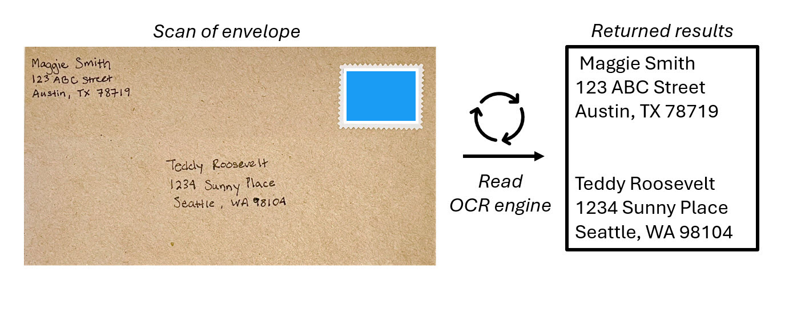

AI-powered information extraction replaces the need to manually inspect each piece of content for insights. Computer vision can extract insights from images to describe the people, places, things, and words they depict. 

Computer vision is made possible by machine learning models that are trained to recognize features based on large volumes of existing images. Machine learning models process images by transforming the images into numerical information. At its core, vision models perform calculations on the numerical information, which result in predictions of what's in the images. 

 

**Optical Character Recognition (OCR)** helps computers recognize that an element in an image contains text. OCR is the foundation of processing text in images and uses machine learning models that are trained to recognize individual shapes as letters, numerals, punctuation, or other elements of text. Much of the early work on implementing this kind of capability was performed by postal services to support automatic sorting of mail based on postal codes. Since then, the state-of-the-art for reading text has moved on, and we have models that detect printed or handwritten text in an image and digitize it line-by-line and word-by-word.

> [!NOTE]
> The machine learning concepts associated with vision are covered in-depth in [Introduction to computer vision concepts](/training/modules/analyze-images-computer-vision/).  

Next, let's see how data is extracted from forms with techniques that build upon OCR. 