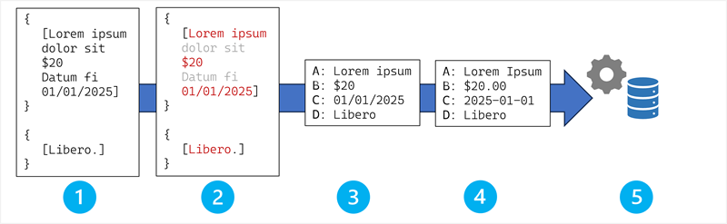

::: zone pivot="video"

>[!VIDEO https://learn-video.azurefd.net/vod/player?id=3ac1e2df-d9a9-4ce5-a538-82f73e70b4f2]

> [!NOTE]
> See the **Text and images** tab for more details!

::: zone-end

::: zone pivot="text"

Field extraction is the process of taking text output from OCR and mapping individual text values it to specific, labeled data fields that correspond to meaningful business information. While OCR tells you *what* text exists in a document, field extraction tells you *what that text means* and *where it belongs* in your business systems.

## The field extraction pipeline

Field extraction follows a systematic pipeline that transforms OCR output into structured data.

The stages in the field extraction process are:

1. OCR output ingestion.
1. Field detection and candidate identification.
1. Field mapping and association.
1. Data normalization and standardization.
1. Integration with business processes and systems.

Let's explore these stages in more detail.

### Stage 1: OCR output ingestion

The process begins with the structured output from the OCR pipeline, which can include:

- **Raw text content**: The actual characters and words extracted from the document
- **Positional metadata**: Bounding box coordinates, page locations, and reading order information
- **Confidence scores**: OCR engine confidence levels for each text element
- **Layout information**: Document structure, line breaks, paragraph boundaries

> [!NOTE]
> Unlike simple text processing, field extraction heavily relies on *where* text appears in the document, not just what it says. The position of "12345" might help determine whether it's an invoice number, customer ID, or phone number.

### Stage 2: Field detection and candidate identification

This stage identifies potential field value in the OCR output. There are multiple approaches that can be used, independently or in combination, to determine the likely fields in the OCR results.

#### Template-based detection

Templates for field detection rely on rule-based pattern matching. Field identification can be accomplished using techniques such as:

- Predefined document layouts with known field positions and anchor keywords.
- Searches for label-value pairs like "Invoice Number:", "Date:", "Total:".
- Regular expressions and string matching algorithms.

**Advantages** of a template-based approach include high accuracy for known document types, fast processing, and explainable results.

**Limitations** of the approach include the requirement for manual template creation, and complexity caused by layout variations or field naming inconsistencies.

#### Machine learning-based detection

Instead of hard-coded logic to extract fields based on known names and locations, you can use a corpus of example documents to train a machine learning model that extracts the fields based on learned relationships. *Transformer*-based models in particular are good at applying contextual cues to identify patterns, and so are often the basis of a field detection solution.

Training approaches for field detection machine learning models include:

- **Supervised learning**: Trained on labeled datasets with known field locations.
- **Self-supervised learning**: Pre-trained on large document corpora to understand layout patterns.
- **Multi-modal learning**: Combines text, visual, and positional features.
- **Advanced model architectures**, such as:
    - **Graph Neural Networks (GNNs)** that model spatial relationships between text elements as graph connections.
    - **Attention mechanisms** that focus on relevant document regions when predicting field values.
    - **Sequence-to-sequence models** that transform unstructured text sequences into structured field assignments.

#### Generative AI for schema-based extraction

Recent advances in large language models (LLMs) have led to the emergence of generative AI-based field detection techniques, which enable more efficient and effective field detection through:

- **Prompt-based extraction** in which you provide the LLM with document text and a schema definition, and it matches the text to the fields in the schema.
- **Few-shot learning** in which you can train models with minimal examples to extract custom fields.
- **Chain-of-thought reasoning** that guides models through step-by-step field identification logic.

### Stage 3: Field mapping and association

After candidate values are identified, they must be mapped to specific schema fields:

#### Key-value pairing techniques

In many cases, data fields in a document or form are discrete values that can be mapped to keys - for example, the vendor name, date, and total amount in a receipt or invoice. Common techniques used for key-value pairing include:

- **Proximity analysis**:
    - **Spatial clustering**: Group nearby text elements using distance algorithms.
    - **Reading order analysis**: Follow natural text flow to associate labels with values.
    - **Geometric relationships**: Use alignment, indentation, and positioning patterns.

- **Linguistic pattern recognition**:
    - **Named entity recognition (NER)**: Identify specific entity types (dates, amounts, names).
    - **Part-of-speech tagging**: Understand grammatical relationships between labels and values.
    - **Dependency parsing**: Analyze syntactic relationships in text.

#### Table and structured content processing

Some documents include more complex structures of text, such as tables. For example, a receipt or invoice might include a table of line items with columns for the item name, price, and the quantity purchased.

The presence of a table can be determined using several techniques, including:

- Specialized convolutional neural network (CNN) architectures for table structure recognition.
- Object detection approaches adapted for table cell identification.
- Graph-based parsing approaches that model table structure as graph relationships between cells.

To map the values in the cells in a table to fields, the field extraction solution might employ one or more of the following techniques:

- **Row-column association** to map table cells to specific field schemas.
- **Header detection** to identify column headers to understand field meanings.
- **Hierarchical processing** to handle nested table structures and sub-totals.

#### Confidence scoring and validation

Field extraction accuracy depends on many factors, and the algorithms and models used to implement the solution are subject to potential misidentification or value interpretation errors. To account for this, various techniques are employed to evaluate the accuracy of the predicted field values; including:

- **OCR confidence**: Inheriting confidence scores from the underlying text recognition.
- **Pattern matching confidence**: Scoring based on how well extraction matches expected patterns.
- **Context validation**: Verifying that field values make sense in document context.
- **Cross-field validation**: Checking relationships between extracted fields (for example, verifying that line item subtotals sum to the overall invoice total).

### Stage 4: Data normalization and standardization

Raw extracted values are generally transformed into consistent formats (for example to ensure that all extracted dates are expressed in the same date format) and checked for validity.

#### Format standardization

Examples of format standardization that can be implemented include:

- **Date normalization**:
    - **Format detection**: Identify various date formats (MM/DD/YYYY, DD-MM-YYYY, etc.).
    - **Parsing algorithms**: Convert to standardized ISO formats.
    - **Ambiguity resolution**: Handle cases where date format is unclear.

- **Currency and numeric processing**:
    - **Symbol recognition**: Handle different currency symbols and thousand separators.
    - **Decimal normalization**: Standardize decimal point representation across locales.
    - **Unit conversion**: Convert between different measurement units as needed.

- **Text standardization**:
    - **Case normalization**: Apply consistent capitalization rules.
    - **Encoding standardization**: Handle different character encodings and special characters.
    - **Abbreviation expansion**: Convert common abbreviations to full forms.

#### Data Validation and Quality Assurance

As well as formatting the extracted fields, the standardization process enables further validation of the values that have been extracted through techniques like:

- **Rule-based validation**:
    - **Format checking**: Verify extracted values match expected patterns (phone numbers, email addresses).
    - **Range validation**: Ensure numeric values fall within reasonable bounds.
    - **Required field checking**: Confirm all mandatory fields are present.

- **Statistical validation**:
    - **Outlier detection**: Identify unusually high or low values that might indicate extraction errors.
    - **Distribution analysis**: Compare extracted values against historical patterns.
    - **Cross-document validation**: Check consistency across related documents.

### Stage 5: Integration with business processes and systems

The final stage of the process usually involves integrating the extracted field values into a business process or system:

#### Schema mapping

The extracted fields might need to be further transformed or reformatted so they align with application schemas used for data ingestion into downstream systems. For example:

- **Database schemas**: Map extracted fields to specific database columns and tables.
- **API payloads**: Format data for REST API consumption by downstream systems.
- **Message queues**: Prepare structured messages for asynchronous processing.

The schema-mapping process might involve transformations such as:

- **Field renaming**: Map extracted field names to target system conventions.
- **Data type conversion**: Ensure values match expected data types in target systems.
- **Conditional logic**: Apply business rules for field transformation and derivation.

#### Quality metrics and reporting

Another common task after the extraction process has finished is to evaluate and report on the quality of the extracted data. The report can include information such as:

- **Field-level confidence scores**: Individual confidence ratings for each extracted field.
- **Document-level quality assessment**: Overall extraction success metrics.
- **Error categorization**: Classify extraction failures by type and cause.

::: zone-end