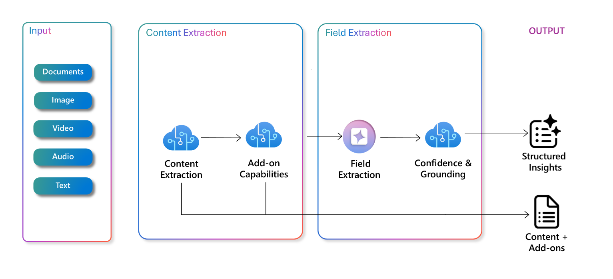

AI-powered information extraction techniques can be combined to perform data extraction on multiple modalities of content, from documents to video and audio. Using multimodal data extraction can help with digital asset management, workflow automation, generating further insights, and more. 

The orchastration of techniques can include vision and document intelligence, and others including:

- **Natural language processing** can be used to find key phrases, entities, sentiment, etc. in written or spoken language.

> [!NOTE] 
> The machine learning concepts associated with NLP are covered in-depth in [Introduction to natural language processing concepts](https://learn.microsoft.com/training/modules/analyze-text-with-text-analytics-service).

- **Speech recognition** takes the spoken word and converts it into data that can be processed - often by transcribing it into text. The spoken words can be in the form of a recorded voice in an audio file, or live audio from a microphone. 

> [!NOTE] 
> Speech recognition is covered in [Get started with speech on Azure](https://learn.microsoft.com/training/modules/recognize-synthesize-speech)

- **Generative AI** can add to the data extraction process by allowing users to identify their own fields and field descriptions. It can be particularly useful when dealing with unstructured content. One example is the user-added *field* of "summary". The *value* associated with the field must be generated based on the data in the content.

>[!NOTE]
> Generative AI concepts are covered in-depth in [Introduction to generative AI on Azure](https://learn.microsoft.com/training/modules/fundamentals-azure-ai-services/)

