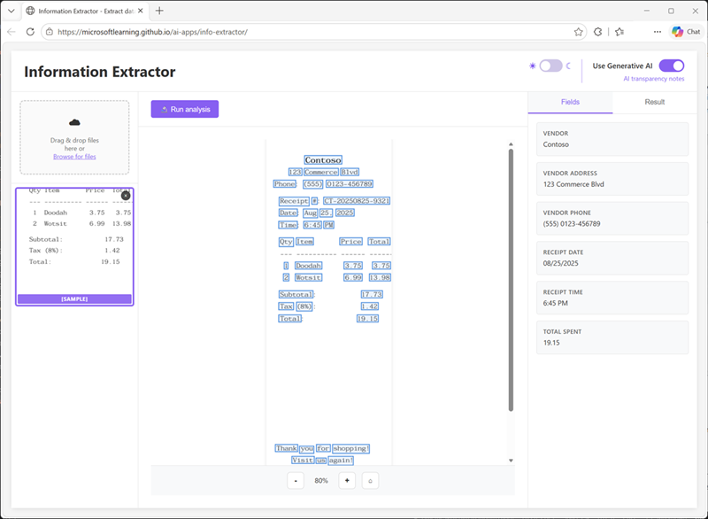

Now it's your chance to explore AI-powered information extraction! In this exercise, you'll use optical character recognition combined with a large language model to extract and interpret fields from receipts.

*Use the following button to start the exercise*

