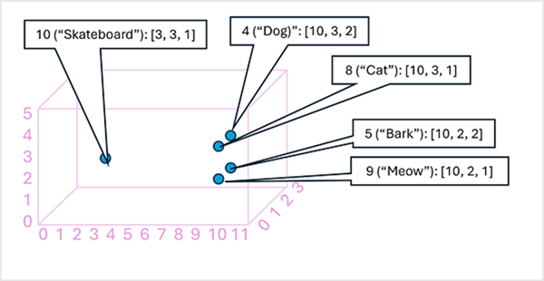
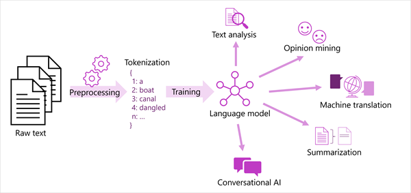

As the state of the art for NLP has advanced, the ability to train models that encapsulate the semantic relationship between tokens has led to the emergence of powerful language models. At the heart of these models is the encoding of language tokens as vectors (multi-valued arrays of numbers) known as *embeddings*.

It can be useful to think of the elements in a token embedding vector as coordinates in multidimensional space, so that each token occupies a specific "location." The closer tokens are to one another along a particular dimension, the more semantically related they are. In other words, related words are grouped closer together. As a simple example, suppose the embeddings for our tokens consist of vectors with three elements, for example:

```
- 4 ("dog"): [10.3.2]
- 5 ("bark"): [10,2,2]
- 8 ("cat"): [10,3,1]
- 9 ("meow"): [10,2,1]
- 10 ("skateboard"): [3,3,1]
```

We can plot the location of tokens based on these vectors in three-dimensional space, like this:



The locations of the tokens in the embeddings space include some information about how closely the tokens are related to one another. For example, the token for `"dog"` is close to `"cat"` and also to `"bark"`. The tokens for `"cat"` and `"bark"` are close to `"meow"`. The token for `"skateboard"` is further away from the other tokens.

The language models we use in industry are based on these principles but have greater complexity. For example, the vectors used generally have many more dimensions. There are also multiple ways you can calculate appropriate embeddings for a given set of tokens. Different methods result in different predictions from natural language processing models.

A generalized view of most modern natural language processing solutions is shown in the following diagram. A large corpus of raw text is tokenized and used to train language models, which can support many different types of natural language processing task.



Common NLP tasks supported by language models include:
- Text analysis, such as extracting key terms or identifying named entities in text.
- Sentiment analysis and opinion mining to categorize text as *positive* or *negative*.
- Machine translation, in which text is automatically translated from one language to another.
- Summarization, in which the main points of a large body of text are summarized.
- Conversational AI solutions such as *bots* or *digital assistants* in which the language model can interpret natural language input and return an appropriate response.

Next, let's learn more about the capabilities made possible by language models.