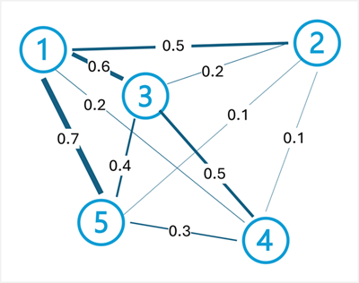

::: zone pivot="video"

>[!VIDEO https://learn-video.azurefd.net/vod/player?id=fd1108ae-61a0-4b39-a277-fcb0be6c5af6]

> [!NOTE]
> See the **Text and images** tab for more details!

::: zone-end

::: zone pivot="text"

Having broken down a text corpus into its constituent tokens, and prepared them for analysis; there are some common statistical analysis techniques you can use to infer meaning from the text.

## Frequency Analysis

Perhaps the most obvious way to ascertain the topics discussed in a document is to simply count the number of times each normalized token appears. The assumption is that terms that are used more frequently in the document can help identify the subjects or themes discussed. Put simply, if you can determine the most commonly used words in a given document, you can often get a good idea of what the document is about.

For example, consider the following text:

> *:::no-loc text="AI in modern business delivers transformative benefits by enhancing efficiency, decision-making, and customer experiences. Businesses can leverage AI to automate repetitive tasks, freeing employees to focus on strategic work, while predictive analytics and machine learning models enable data-driven decisions that improve accuracy and speed. AI-powered tools like Copilot streamline workflows across marketing, finance, and operations, reducing costs and boosting productivity. Additionally, intelligent applications personalize customer interactions, driving engagement and loyalty. By embedding AI into core processes, businesses benefit from the ability to innovate faster, adapt to market changes, and maintain a competitive edge in an increasingly digital economy.":::*

After tokenizing, normalizing, and applying lemmatization to the text, the frequency of each term can be counted and tabulated; producing the following partial results:

|Term|Frequency|
|-|-|
|:::no-loc text="ai":::|4|
|:::no-loc text="business":::|3|
|:::no-loc text="benefit":::|2|
|:::no-loc text="customer":::|2|
|:::no-loc text="decision":::|2|
|:::no-loc text="market":::|2|
|:::no-loc text="ability":::|1|
|:::no-loc text="accuracy":::|1|
|...|...|

From these results, the most frequently occurring terms indicate that the text discusses AI and its business benefits.

## Term Frequency - Inverse Document Frequency (TF-IDF)

Simple frequency analysis in which you count the number of occurrences of each token can be an effective way to analyze a single document, but when you need to differentiate across multiple documents within the same corpus, you need a way to determine which tokens are most relevant in each individual document.

For example, consider the following two text samples:

> **Sample A:**
>
> *:::no-loc text="Microsoft Copilot Studio enables declarative AI agent creation using natural language, prompts, and templates. With this declarative approach, an AI agent is configured rather than programmed: makers define intents, actions, and data connections, then publish the agent to channels. Microsoft Copilot Studio simplifies agent orchestration, governance, and lifecycles so an AI agent can be iterated quickly. Using Microsoft Copilot Studio helps modern businesses deploy Microsoft AI agent solutions fast.":::*

> **Sample B:**
>
> *:::no-loc text="Microsoft Foundry enables code‑based AI agent development with SDKs and APIs. Developers write code to implement agent conversations, tool calling, state management, and custom pipelines. In Microsoft Foundry, engineers can use Python or Microsoft C#, integrate Microsoft AI services, and manage CI/CD to deploy the AI agent. This code-first development model supports extensibility and performance while building Microsoft Foundry AI agent applications.":::*

The top three most frequent terms in these samples are shown in the following tables:

**Sample A**:

|Term | Frequency |
|-|-|
|:::no-loc text="agent":::| 6|
|:::no-loc text="ai":::| 4|
|:::no-loc text="microsoft":::|4|

**Sample B**:

|Term | Frequency |
|-|-|
|:::no-loc text="microsoft":::|5|
|:::no-loc text="agent":::| 4|
|:::no-loc text="ai":::| 4|

As you can see from the results, the most common words in both samples are the same (:::no-loc text=""agent"":::, :::no-loc text=""Microsoft"":::, and :::no-loc text=""AI"":::). This tells us that both documents cover a similar overall theme, but doesn't help us discriminate between the individual documents. Examining the counts of less frequently used terms might help, but you can easily imagine an analysis of a corpus based on Microsoft's AI documentation, which would result in a large number of terms that are common across all documents; making it hard to determine the specific topics covered in each document.

To address this problem, *Term Frequency - Inverse Document Frequency* (TF-IDF) is a technique that calculates scores based on how often a word or term appears in one document compared to its more general frequency across the entire collection of documents. Using this technique, a high degree of relevance is assumed for words that appear frequently in a particular document, but relatively infrequently across a wide range of other documents. To calculate TF-IDF for terms in an individual document, you can use the following three-step process:

1. **Calculate Term Frequency (TF)**: This is simply how many times a word appears in a document. For example, if the word :::no-loc text=""agent""::: appears 6 times in a document, then `tf(agent) = 6`.

2. **Calculate Inverse Document Frequency (IDF)**: This checks how common or rare a word is across all documents. If a word appears in every document, it’s not special. The formula used to calculate IDF is `idf(t) = log(N / df(t))` (where `N` is total number of documents and `df(t)` is the number of documents that contain the word `t`)

3. **Combine them to calculate TF-IDF**: Multiply TF and IDF to get the score: `tfidf(t, d) = tf(t, d) * log(N / df(t))`

A high TF-IDF score indicates that a word appears often in one document but rarely in others. A low score indicates that word is common in many documents. In two samples about AI agents, because :::no-loc text=""AI"":::, :::no-loc text=""Microsoft"":::, and :::no-loc text=""agent""::: appear in both samples (`N = 2, df(t) = 2`), their IDF is `log(2/2) = 0`, so they carry no discriminative weight in TF‑IDF. The top three TF-IDF results for the samples are:

**Sample A:**

|Term|TF-IDF|
|-|-|
|:::no-loc text="copilot":::|2.0794|
|:::no-loc text="studio":::|2.0794|
|:::no-loc text="declarative":::|1.3863|

**Sample B:**

|Term|TF-IDF|
|-|-|
|:::no-loc text="code":::|2.0794|
|:::no-loc text="develop":::|2.0794|
|:::no-loc text="foundry":::|2.0794|

From these results, it's clearer that sample A is about declarative agent creation with Copilot Studio, while sample B is about code-based agent development with Microsoft Foundry.

## "Bag-of-words" machine learning techniques

*Bag-of-words* is the name given to a feature extraction technique that represents text tokens as a vector of word frequencies or occurrences, ignoring grammar and word order. This representation becomes the input for machine learning algorithms like Naive Bayes, a probabilistic classifier that applies Bayes’ theorem to predict the probable class of a document based on word frequency.

For example, you might use this technique to train a machine learning model that performs email spam filtering. The words :::no-loc text=""miracle cure"":::, :::no-loc text=""lose weight fast"":::, and :::no-loc text=""anti-aging`"::: may appear more frequently in spam emails about dubious health products than your regular emails, and a trained model might flag messages containing these words as potential spam.

You can implement *sentiment analysis* by using the same method to classify text by emotional tone. The bag-of-words provides the features, and model uses those features to estimate probabilities and assign sentiment labels like "positive" or "negative".

## TextRank

TextRank is an unsupervised graph-based algorithm that models text as a network of connected *nodes*. For example, each sentence in a document could be considered a node, and the connections (*edges*) between them are scored based on the similarity of the words they contain. TextRank is commonly used to summarize text based on identifying a subset of sentences within a document that best represent its overall subject.

The TextRank algorithm applies the same principle as Google's PageRank algorithm (which ranks web pages based on links between them) to text. The key idea is that a sentence is important if it's similar to many other important sentences. The algorithm works through the following steps:

1. **Build a graph**: Each sentence becomes a node, and edges that connect them are weighted by similarity (often measured using word overlap or cosine similarity between sentence vectors).

2. **Calculate ranks iteratively**: Each node's score is calculated based on the scores of the nodes connected to it. The formula is: `TextRank(Sᵢ) = (1-d) + d * Σ(wⱼᵢ / Σwⱼₖ) * TextRank(Sⱼ)` (where `d` is a damping factor, typically 0.85, `wⱼᵢ` is the weight of the edge from sentence `j` to sentence `i`, and the sum iterates over all sentences connected to `i`).

3. **Extract top-ranked sentences**: After convergence, the sentences with the highest scores are selected as the summary.

For example, consider the following document about cloud computing:

> *:::no-loc text="Cloud computing provides on-demand access to computing resources. Computing resources include servers, storage, and networking. Azure is Microsoft's cloud computing platform. Organizations use cloud platforms to reduce infrastructure costs. Cloud computing enables scalability and flexibility.":::*

To generate a summary of this document, the TextRank process begins by splitting this document into sentences:

1. *:::no-loc text="Cloud computing provides on-demand access to computing resources.":::*
1. *:::no-loc text="Computing resources include servers, storage, and networking.":::*
1. *:::no-loc text="Azure is Microsoft's cloud computing platform.":::*
1. *:::no-loc text="Organizations use cloud platforms to reduce infrastructure costs.":::*
1. *:::no-loc text="Cloud computing enables scalability and flexibility.":::*

Next, edges are created between sentences with weights based on similarity (word overlap). For this example, the edge weights might be:

- Sentence 1 <-> Sentence 2: 0.5 (shares :::no-loc text=""computing resources"":::)
- Sentence 1 <-> Sentence 3: 0.6 (shares :::no-loc text=""cloud computing"":::)
- Sentence 1 <-> Sentence 4: 0.2 (shares :::no-loc text=""cloud"":::)
- Sentence 1 <-> Sentence 5: 0.7 (shares :::no-loc text=""cloud computing"":::)
- Sentence 2 <-> Sentence 3: 0.2 (limited overlap)
- Sentence 2 <-> Sentence 4: 0.1 (limited overlap)
- Sentence 2 <-> Sentence 5: 0.1 (shares :::no-loc text=""computing"":::)
- Sentence 3 <-> Sentence 4: 0.5 (shares :::no-loc text=""cloud platforms"":::)
- Sentence 3 <-> Sentence 5: 0.4 (shares :::no-loc text=""cloud computing"":::)
- Sentence 4 <-> Sentence 5: 0.3 (limited overlap)

After calculating TextRank scores iteratively using these weights, sentences 1, 3, and 5 might receive the highest scores because they connect well to other sentences through shared terminology and concepts. These sentences would be selected to form a concise summary: *:::no-loc text=""Cloud computing provides on-demand access to computing resources. Azure is Microsoft's cloud computing platform. Cloud computing enables scalability and flexibility."":::*

> [!NOTE]
> Generating a document summary by selecting the most relevant sentences is a form of *extractive* summarization. In this approach, no new text is generated - the summary consists of a subset of the original text. More recent developments in semantic modeling also enable *abstractive* summarization, in which new language that summarizes the key themes of the source document is generated.

TextRank can also be applied at the word level for *keyword extraction*, where words (rather than sentences) become nodes, and edges represent co-occurrence within a fixed window. The highest-ranked words are extracted as key terms representing the document's main topics.

::: zone-end