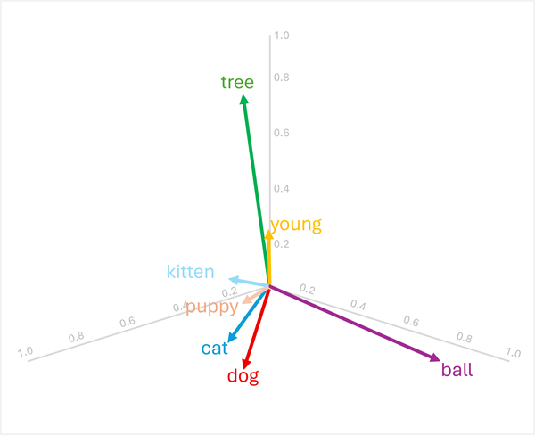
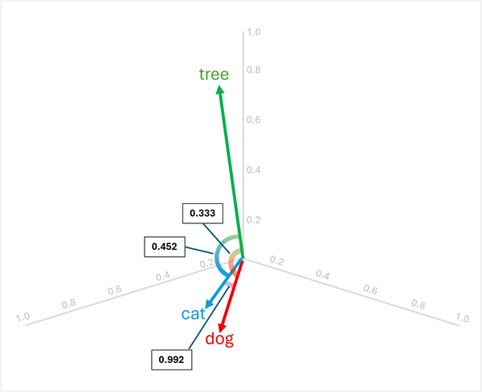
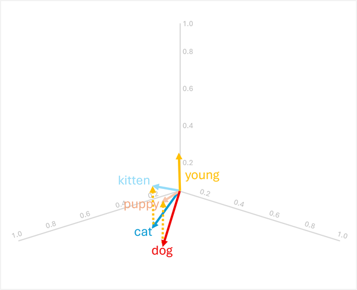
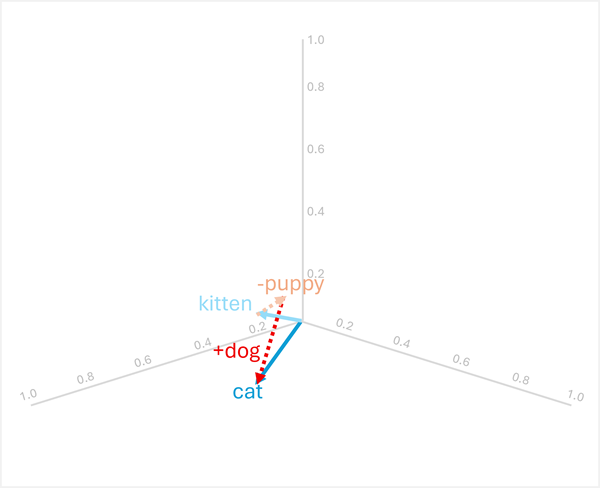

::: zone pivot="video"

>[!VIDEO https://learn-video.azurefd.net/vod/player?id=d980b3a3-6119-453c-aa7d-4af40e8bc914]

> [!NOTE]
> See the **Text and images** tab for more details!

::: zone-end

::: zone pivot="text"

As the state of the art for NLP has advanced, the ability to train models that encapsulate the semantic relationship between tokens has led to the emergence of powerful deep learning language models. At the heart of these models is the encoding of language tokens as vectors (multi-valued arrays of numbers) known as *embeddings*.

This vector-based approach to modeling text became common with techniques like *Word2Vec* and *GloVe*, in which text tokens are represented as dense vectors with multiple dimensions. During model training, the dimension values are assigned to reflect semantic characteristics of each token based on their usage in the training text. The mathematical relationships between the vectors can then be exploited to perform common text analysis tasks more efficiently than older purely statistical techniques. A more recent advancement in this approach is to use a technique called *attention* to consider each token in context, and calculate the influence of the tokens around it. The resulting *contextualized* embeddings, such as those found in the GPT family of models, provide the basis of modern generative AI.

## Representing text as vectors

Vectors represent points in multidimensional space, defined by coordinates along multiple axes. Each vector describes a direction and distance from the origin. Semantically similar tokens should result in vectors that have a similar orientation – in other words they point in similar directions.

For example, consider the following three-dimensional embeddings for some common words:

|Word|Vector|
|-|-|
|`dog`|[0.8, 0.6, 0.1]|
|`puppy`|[0.9, 0.7, 0.4]|
|`cat`|[0.7, 0.5, 0.2]|
|`kitten`|[0.8, 0.6, 0.5]|
|`young`|[0.1, 0.1, 0.3]|
|`ball`|[0.3, 0.9, 0.1]|
|`tree`|[0.2, 0.1, 0.9]|

We can visualize these vectors in three-dimensional space as shown here:

The vectors for `"dog"` and `"cat"` are similar (both domestic animals), as are `"puppy"` and `"kitten"` (both young animals). The words `"tree"`, `"young"`, and `ball"` have distinctly different vector orientations, reflecting their different semantic meanings.

The semantic characteristic encoded in the vectors makes it possible to use vector-based operations that compare words and enable analytical comparisons.

### Finding related terms

Since the orientation of vectors is determined by their dimension values, words with similar semantic meanings tend to have similar orientations. This means you can use calculations such as the *cosine similarity* between vectors to make meaningful comparisons.

For example, to determine the "odd one out" between `"dog"`, `"cat"`, and `"tree"`, you can calculate the cosine similarity between pairs of vectors. The cosine similarity is calculated as:

`cosine_similarity(A, B) = (A · B) / (||A|| * ||B||)`

Where `A · B` is the dot product and `||A||` is the magnitude of vector A.

Calculating similarities between the three words:

- **`dog`** [0.8, 0.6, 0.1] and **`cat`** [0.7, 0.5, 0.2]:
  - Dot product: (0.8 × 0.7) + (0.6 × 0.5) + (0.1 × 0.2) = 0.56 + 0.30 + 0.02 = 0.88
  - Magnitude of `dog`: √(0.8² + 0.6² + 0.1²) = √(0.64 + 0.36 + 0.01) = √1.01 ≈ 1.005
  - Magnitude of `cat`: √(0.7² + 0.5² + 0.2²) = √(0.49 + 0.25 + 0.04) = √0.78 ≈ 0.883
  - Cosine similarity: 0.88 / (1.005 × 0.883) ≈ **0.992** (high similarity)

- **`dog`** [0.8, 0.6, 0.1] and **`tree`** [0.2, 0.1, 0.9]:
  - Dot product: (0.8 × 0.2) + (0.6 × 0.1) + (0.1 × 0.9) = 0.16 + 0.06 + 0.09 = 0.31
  - Magnitude of `tree`: √(0.2² + 0.1² + 0.9²) = √(0.04 + 0.01 + 0.81) = √0.86 ≈ 0.927
  - Cosine similarity: 0.31 / (1.005 × 0.927) ≈ **0.333** (low similarity)

- **`cat`** [0.7, 0.5, 0.2] and **`tree`** [0.2, 0.1, 0.9]:
  - Dot product: (0.7 × 0.2) + (0.5 × 0.1) + (0.2 × 0.9) = 0.14 + 0.05 + 0.18 = 0.37
  - Cosine similarity: 0.37 / (0.883 × 0.927) ≈ **0.452** (low similarity)

The results show that `"dog"` and `"cat"` are highly similar (0.992), while `"tree"` has lower similarity to both `"dog"` (0.333) and `"cat"` (0.452). Therefore, **`tree`** is clearly the odd one out.

### Vector translation through addition and subtraction

You can add or subtract vectors to produce new vector-based results; which can then be used to find tokens with matching vectors. This technique enables intuitive arithmetic-based logic to determine appropriate terms based on linguistic relationships.

For example, using the vectors from earlier:

- **`dog`** + **`young`** = [0.8, 0.6, 0.1] + [0.1, 0.1, 0.3] = [0.9, 0.7, 0.4] = **`puppy`**
- **`cat`** + **`young`** = [0.7, 0.5, 0.2] + [0.1, 0.1, 0.3] = [0.8, 0.6, 0.5] = **`kitten`**

These operations work because the vector for `"young"` encodes the semantic transformation from an adult animal to its young counterpart.

> [!NOTE]
> In practice, vector arithmetic rarely produces exact matches; instead, you would search for the word whose vector is *closest* (most similar) to the result.

The arithmetic works in reverse as well:

- **`puppy`** - **`young`** = [0.9, 0.7, 0.4] - [0.1, 0.1, 0.3] = [0.8, 0.6, 0.1] = **`dog`**
- **`kitten`** - **`young`** = [0.8, 0.6, 0.5] - [0.1, 0.1, 0.3] = [0.7, 0.5, 0.2] = **`cat`**

### Analogical reasoning

Vector arithmetic can also answer analogy questions like "*`puppy`* is to *`dog`* as *`kitten`* is to *?*"

To solve this, calculate: **`kitten`** - **`puppy`** + **`dog`**

- [0.8, 0.6, 0.5] - [0.9, 0.7, 0.4] + [0.8, 0.6, 0.1]
- = [-0.1, -0.1, 0.1] + [0.8, 0.6, 0.1]
- = [0.7, 0.5, 0.2]
- = **`cat`**

These examples demonstrate how vector operations can capture linguistic relationships and enable reasoning about semantic patterns.

## Using semantic models for text analysis

Vector-based semantic models provide powerful capabilities for many common text analysis tasks.

### Text summarization

Semantic embeddings enable *extractive* summarization by identifying sentences with vectors that are most representative of the overall document. By encoding each sentence as a vector (often by averaging or pooling the embeddings of its constituent words), you can calculate which sentences are most central to the document's meaning. These central sentences can be extracted to form a summary that captures the key themes.

### Keyword extraction

Vector similarity can identify the most important terms in a document by comparing each word's embedding to the document's overall semantic representation. Words whose vectors are most similar to the document vector, or most central when considering all word vectors in the document, are likely to be key terms that represent the main topics.

### Named entity recognition

Semantic models can be fine-tuned to recognize named entities (people, organizations, locations, etc.) by learning vector representations that cluster similar entity types together. During inference, the model examines each token's embedding and its context to determine whether it represents a named entity and, if so, what type.

### Text classification

For tasks like sentiment analysis or topic categorization, documents can be represented as aggregate vectors (such as the mean of all word embeddings in the document). These document vectors can then be used as features for machine learning classifiers, or compared directly to class prototype vectors to assign categories. Because semantically similar documents have similar vector orientations, this approach effectively groups related content and distinguishes different categories.

::: zone-end
