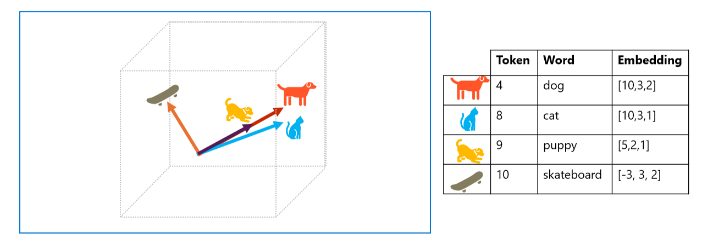

As the state of the art for NLP has advanced, the ability to train models that encapsulate the semantic relationship between tokens has led to the emergence of powerful deep learning language models. At the heart of these models is the encoding of language tokens as vectors (multi-valued arrays of numbers) known as *embeddings*.

Vectors represent lines in multidimensional space, describing direction and distance along multiple axes. Overall, the vector describes the direction and distance of the path from origin to end. Semantically similar tokens should result in vectors that have a similar orientation – in other words they point in the same direction. As a simple example, suppose the embeddings for our tokens consist of vectors with three elements, for example:

```
- 4 ("dog"): [10.3.2]
- 5 ("bark"): [10,2,2]
- 8 ("cat"): [10,3,1]
- 9 ("meow"): [10,2,1]
- 10 ("skateboard"): [3,3,1]
```

In three-dimensional space, these vectors look like this:



The embedding vectors for "dog" and "puppy" describe a path along an almost identical direction, which is also fairly similar to the direction for "cat". The embedding vector for "skateboard" however describes journey in a very different direction.

The language models we use in industry are based on these principles but have greater complexity. For example, the vectors used generally have many more dimensions. There are also multiple ways you can calculate appropriate embeddings for a given set of tokens. Different methods result in different predictions from natural language processing models.

A generalized view of most modern natural language processing solutions is shown in the following diagram. A large corpus of raw text is tokenized and used to train language models, which can support many different types of natural language processing task.


## Machine learning for text classification

Another useful text analysis technique is to use a classification algorithm, such as *logistic regression*, to train a machine learning model that classifies text based on a known set of categorizations. A common application of this technique is to train a model that classifies text as *positive* or *negative* in order to perform *sentiment analysis* or *opinion mining*.

For example, consider the following restaurant reviews, which are already labeled as **0** (*negative*) or **1** (*positive*):

```
- *The food and service were both great*: 1
- *A really terrible experience*: 0
- *Mmm! tasty food and a fun vibe*: 1
- *Slow service and substandard food*: 0
```

With enough labeled reviews, you can train a classification model using the tokenized text as *features* and the sentiment (0 or 1) a *label*. The model will encapsulate a relationship between tokens and sentiment - for example, reviews with tokens for words like `"great"`, `"tasty"`, or `"fun"` are more likely to return a sentiment of **1** (*positive*), while reviews with words like `"terrible"`, `"slow"`, and `"substandard"` are more likely to return **0** (*negative*).