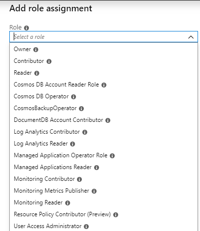

A business system running on-premises can have an architecture that's coupled to other services operating within the same environment. It's important to understand the relationships between a system you wish to migrate, and the other applications and services your organization is currently using.

In your IoT technology company, you've identified Azure Cosmos DB as a database system that can host all your telemetry databases with the minimum of software recoding. Now, you want to plan the migration project to Cosmos DB.

Here, you'll learn how to decide key aspects of a migration project, such as whether to perform an offline or online migration, how to fall back if problems arise, and how to maintain security.

### Investigate dependencies

In a complex system, a component rarely functions entirely independently. Instead, it makes calls to other processes and components. Databases, for example, might depend on directory services that host user accounts. When you move a database into the cloud, can you access that directory service? If not, how will users sign in? When you overlook a dependency like this, there might be a total failure of the database.

To mitigate risks, check whether your database depends on services such as the following:

- Directory services, such as Active Directory.
- Other stores of security principals.
- Other databases.
- Web APIs or other network services.

Also remember that other components might depend on your database. If you move the database without reconfiguring the dependent components, what are the consequences? For example, if you move a product catalog database, and the public-facing website depends on it to determine what products to present to users, will the move cause an interruption in service?

Check to see if any of these types of component depend on your database:

- Websites and web APIs.
- Client apps, such as mobile apps and desktop software.
- Other databases.
- Reports.
- Data warehouses.

To make these checks, talk to the stakeholders, administrators, and developers involved with each database and system component. Consult the documentation then, if you're not confident that you understand the behavior of the systems, consider running tests, such as network captures to observe behavior.

### Prepare to fall back

In any migration project, you should always be prepared for a failure. In a database migration project to the cloud, the worst eventuality is that the new database becomes unavailable and users can't do their jobs. It's common to mitigate this risk, which might have a large impact on your company's profitability, by planning to roll back to the original, unmodified database on-premises.

For the fall-back plan, consider:

- How to ensure you can fall back to a database that's untouched by the failed migration? For example, it's highly recommended to take a full database backup, just before you begin the migration.
- How long is it acceptable for the database to be offline, if you need to fall back?
- How much budget do you have for the fall-back plan? For example, can you afford to replicate the database to a dedicated fall-back server? If so, you can switch this server off just before the migration. To fall back, you boot up this server. You would immediately have a database that's unaffected by the migration, without having to restore it from backup.

## Offline versus online migration

To migrate a database, you have at least two options:

- Halt the system, transfer the database, then reconfigure and restart the system to use the new database. This is an offline migration.
- Keep the system running while you move the database to its new location, roll forward transactions being performed against the original database to the new database while the migration is proceeding, and then switch your applications to connect to the new database. This is an online migration.

It's simpler to perform an offline migration, where users can't change the data while the migration takes place. However, if your database is busy or critical to the success of your organization, that might not be possible.

### Offline migrations

Suppose that your database supports a team of analysts who all work in a single time zone during normal business hours. The team usually doesn't work at weekends. Between 6:00 PM on Friday and 9:00 AM on Sunday, the database isn't often used.

In this situation, you could do an offline migration over the weekend, by following these steps:

1. Take the database offline, after all transactions have completed on Friday evening.
2. Take a full backup or export of the database.
3. Shut down the on-premises server and keep it in case you need to fall back.
4. Restore the database on the target cloud system.
5. Bring the target system online.
6. Reconfigure clients to connect to the cloud database.

In this case, an offline migration is possible because there's a long period when an interruption in service has little effect on users. During this time, you can do a complete backup and restore of the database, knowing that you won't miss any changes.

### Online migrations

Now consider another database that supports a sales app. Sales staff are distributed around the world and also work at weekends. There isn't a period of low activity, the database is always busy and, if you take the database offline for a significant period, it will impact users. Sales activity is business-critical, so an interruption in service will have a direct affect on the organization's bottom line.

In cases like this, consider performing an online migration. In an online migration, downtime is limited to the time it takes to switch to the new database. Use a tool such as the Azure Database Migration Service to execute an online migration. Online migrations have the following differences to offline migrations:

- You don't move the original database offline before taking a backup or export.
- While the migration is in progress, changes apply to the old database.
- The migration tool ensures that these changes are copied to the new database before the switch over. This is often achieved by reconfiguring the old database to replicate changes to the new one.

## Application migration

After you've migrated a database, how (and when) should you cut over to the new system and update applications to use the new database? You might:

- Move applications one-by-one to the new database.
- Move subsets of users.
- Adopt a combination of both approaches.

The intention is that you perform application migration in small stages that can be easily rolled back if something goes awry. Regardless of whether you've followed an offline or online approach to database migration, you should still have a working configuration located at the original source. In theory, you'll be able to switch back to the original source quickly. But if the data is constantly changing, you need to consider where these changes have been made.

- In an offline migration, the source and destinations are independent of each other. Users and applications might no longer see a consistent view of the data. In a transactional system, this situation is likely to be unacceptable. In this case, you would need to maintain some form of bidirectional replication between databases while both systems remain live. Alternatively, if the purpose of an application is to generate monthly or weekly reports, generate sales projections, or perform other statistical operations, this lack of consistency might not be so worrying. Such applications take a "long view" of the data, rather than being dependent on up-to-date data. In this latter case, transactional applications use the new database, whereas reporting applications are moved more slowly.
- In an online migration, the new database is kept synchronized with the old, usually by some form of replication. The replication process might be asynchronous, so there could be a lag. However, changes made to data in the new database won't be propagated back to the old, resulting in possible conflicts. An application running against the old database might make a conflicting change to data that's been modified in the new database. Replication will blindly overwrite the change in the new database, resulting in a "lost update".

### Approaches to testing

If the database plays a critical role in your business, the consequences of a failure might be extensive. To increase your confidence that this won't happen, consider running performance tests against the migrated database to ensure that it copes with the load users might place upon it and respond quickly. Remember that there could be periods of peak activity, when demand is much higher than normal. You must be sure that your migrated system handles the expected workload.

Always perform some type of regression testing against the new database before allowing access to users. These tests will verify that the behavior and functionality of the system are correct.

Additionally, you should consider running a "soak test". A soak test is a load test designed to see how the system as a whole operates under pressure. A soak test stresses the new database and determines whether it's stable under high demand. A soak test runs over a significant time period to see what happens when high demand persists.

When you've established that the new system is stable, you can start to migrate users. However, you might need additional assurance that users will find the new system acceptable. At this point, you might consider "canary testing". A canary test transparently directs a small subset of users to the new system, but they aren't aware that they're accessing it. It's a form of blind test, intended to enable you to find any problems or issues with the new system. Monitor the responses from these users, and make any adjustments required.

## Maintaining parallel systems

There are several reasons why you might choose to run the old on-premises database in parallel with the new cloud database:

- **Testing periods**. As you saw in the previous topic, it's a good idea to run canary tests against the migrated database to assess its functionality, stability, and capacity before using it to support people. Maintaining the on-premises system in parallel gives you a quick way to revert users to the old system if there are issues with the new system.

- **Phased migrations**. One way to mitigate the impact of unexpected failures on production is to move a small number of users to the new system first, and monitor the results. If all runs smoothly, you could move other groups of users as you gain confidence in the new database. You can move users alphabetically, by department, by location, or by role, until they're all on the new database.

- **Piecemeal migrations**. Another approach is to segment the migration not by user, but by workload. For example, you could migrate the database tables that support human resources, before those that support sales.

In all these cases, there's a period when the old on-premises database runs in parallel with the new cloud database. You must ensure that changes made to the old database are also applied to the new database and that they flow in the opposite direction. You could script this synchronization, or use a tool like Azure Data Migration Service.

If you decide to maintain parallel databases and synchronize changes, ask yourself these questions:

- **Conflict resolution**. Is it likely that a change to a row on-premises happens at a similar time to a different change to the same row in the cloud? This would create a conflict, where it's unclear which change should be retained. How would you resolve such conflicts?

- **Network traffic**. How much network traffic will be generated while changes are synchronized between databases? Do you have enough network capacity for this traffic?

- **Latency**. When there's a change in one of the databases, what lag (if any) is acceptable before that change reaches the other database? For example, in a product catalog, you might be able to wait for up to a day before new products are visible to all users. However, if the database includes critical transactional information, such as currency exchange rates, that data should be synchronized much more frequently, if not instantaneously.

## Piecemeal migration

A piecemeal migration is where you divide a complete system into workloads and migrate one workload at a time.

### Multiple databases

A complex system might include multiple databases that support several workloads. For example, human resources might use the *StaffDB* database, while the sales team could have mobile apps that query both the *ProductCatalogDB* database and the *OrdersDB* database.

Of course, you can choose to migrate the entire database system to the cloud in one go. This might be simpler, because you don't have to run databases both on-premises and in the cloud. You don't need to consider how those databases communicate during the migration. However, the risks of failure are higher. A single problem might affect both the human resources team and the sales team.

Consider mitigating these risks for medium and large database systems by performing a piecemeal migration, where you move one workload at a time. In this example, you might consider migrating the *StaffDB* database first, because the problems associated with a failure would be limited to the human resources team and wouldn't prevent you from taking orders. By solving any problems that arise with the *StaffDB* migration, you'll learn lessons that apply to other workload migrations.

Next, you could think about migrating the *Product Catalog* workload to the cloud. If you do, consider questions such as:

- How do you ensure that products newly added to the catalog, are available to order?
- Do you need to synchronize any data with the *OrdersDB* database, which remains on-premises?
- What latency is acceptable for new products to reach the *OrdersDB* database from the product catalog?

### Single database piecemeal migrations

Even if you only have a single database that supports all the workloads, you can still consider a piecemeal migration. For example, you could divide the database into pieces like this:

- Tables that support HR operations.
- Tables that support sales.
- Tables that support analysis and reporting.

If you migrate the HR operations tables first, any problem that arises only affects HR personnel. Sales and data analysts continue to work on the old database without interruption. 

Before you perform a piecemeal migration, you must fully understand the databases and how they're used by applications. For example, some tables in your database might support both sales and reporting. That means you can't cleanly divide workloads. You must synchronize these tables between on-premises and cloud databases, until all the workloads have been migrated.

## Security concerns

Your databases might contain sensitive data, such as product details, personal staff information, and payment details—so security is always a high priority. You must decide how to protect this data during the migration and in the new database.

### Firewall protection

In an internet-connected application, database servers are usually protected by at least two firewalls. The first firewall separates the internet from the front-end servers—if these servers host websites or web APIs, for example. Only TCP port 80 should be open on the outer firewall, but this port must be open for all source IP addresses, except blocked addresses.

The second firewall separates the front-end servers from the database servers. It's recommended to publish the database service on a private port number that's not known to the outside world. On the second firewall, open this port number only for the IP addresses of the front-end servers. This arrangement prevents any direct communication from a malicious internet user to the database servers.

If you plan to migrate database servers to Azure Cosmos DB, use a virtual network to replicate firewall rules. The virtual network will provide one layer of protection and the firewall settings of the Azure Cosmos DB account will provide another.

### Authentication and authorization

In most databases, you need to closely control who accesses and modifies which data. This control requires that users are positively identified when they connect to the database. This process is called **authentication** and can be performed in a number of ways with Azure Cosmos DB. Most authentication is for an individual user and is provided by Azure Active Directory. You can also grant access to service principals which can include objects such as apps and virtual machines.

Once a user is authenticated and you are certain of their identity, you can add **authorization** to resources. In Cosmos DB, authorization is applied by adding users, groups, or service principals to roles.

See [Role-based access control in Azure Cosmos DB](https://docs.microsoft.com/azure/cosmos-db/role-based-access-control) for more information.

### Encryption

As data is sent across the network, it might be intercepted by a so-called "man-in-the-middle" attack. To prevent this, **Azure Cosmos DB** requires Secure Sockets Layer (SSL) to encrypt communications.

You might need to amend your client applications' connection settings to use SSL encryption. Discuss this topic with your developers to determine the changes, if any, that are necessary.

## Monitoring and management

Part of planning to migrate a database is to consider how database administrators will continue to perform their tasks after migration.

### Monitoring

On-premises database administrators are used to monitoring regularly to spot problems such as hardware bottlenecks, or contention for network access. They monitor to ensure they can fix any problems before productivity is affected. You can expect any database that's not regularly monitored to begin causing problems sooner or later.

You should take exactly the same approach to cloud databases. It might be easier to solve problems in a PaaS system like Azure, because you can add resources without buying, setting up, and configuring any hardware. However, you still need to spot developing problems, so monitoring is a high priority among your daily tasks.

Azure includes a set of performance monitoring tools, and collects a wide variety of performance counters and log data. You display this data using dashboards and charts in the Azure portal.

### Management

Your database administrators use preferred tools to change the schema and content of the database on-premises. Start by assessing whether the existing set of tools is compatible with the proposed cloud-hosted database. If the current management tools won't work after migration, try to identify alternatives with your administrators.

Azure includes several tools that you could use to administer MySQL and PostgreSQL databases:

- **The Azure portal**. This website has powerful facilities that you use to configure, monitor, and manage databases—and all other resources that you might create in the Azure cloud.
  
- **Azure PowerShell**. This is a scripting execution environment and language that has a wide set of commands. Use PowerShell, which is available for Windows and Linux environments, to automate complex database administrative tasks.

- **Azure CLI**. This is a command-line interface to Azure. Use it to manage services and resources in Azure. You can use the CLI from the Windows and Linux shell environments, and from within Bash scripts.
